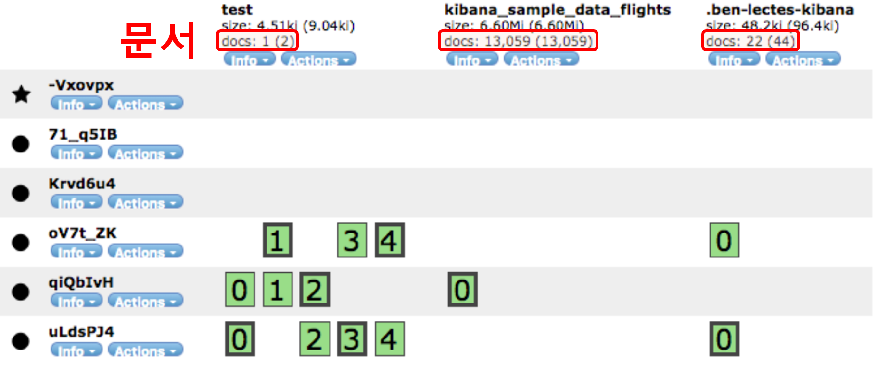
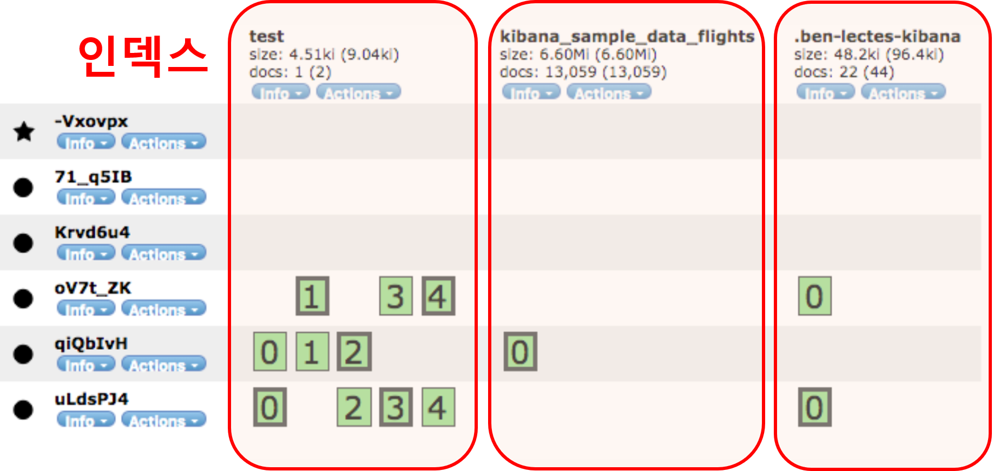
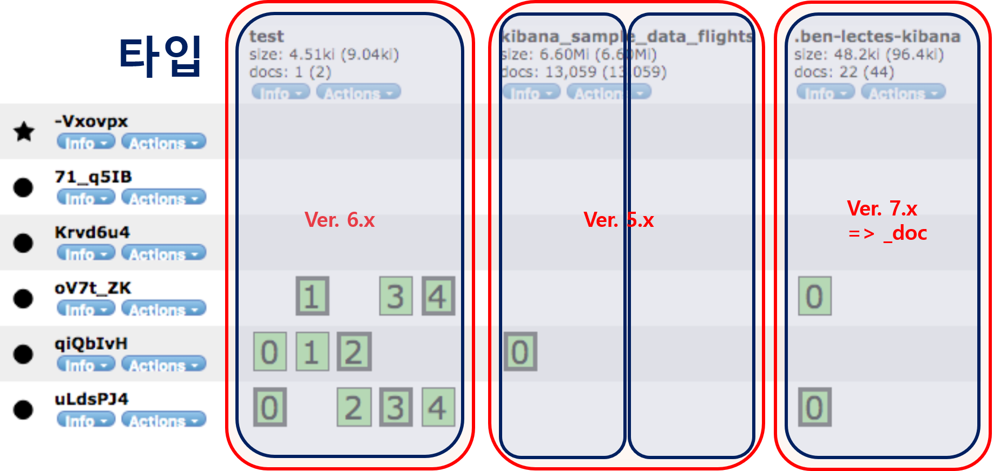
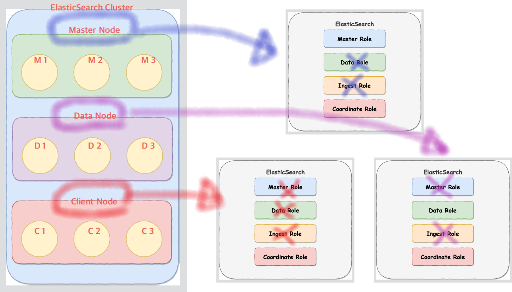
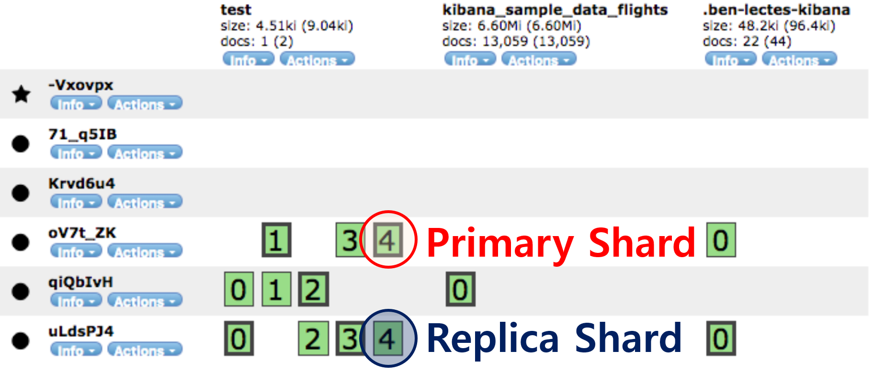
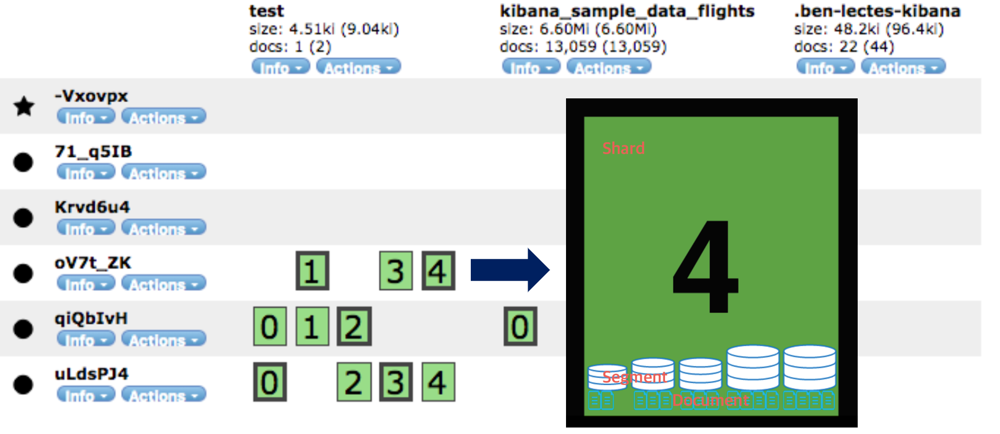

## 1. Elasticsearch에 대하여

### 1.1 Elasticsearch란?

- 고가용성의 확장 가능한 오픈소스 이면서 
  - Full-Text 검색엔진이고
  - 분석엔진임

   

### 1.2 Lucene

- Apache Software재단의 검색엔진 상위 프로젝트
- Java기반
- Free and Open-source Software
- Doug Cutting(Hadoop의 창시자)에 의해 개발
- Apache License 하에 배포

   

### **1.3** Full-Text 검색엔진으로서의 ES

- Shay Banon이 Lucene을 기반으로 만든 검색엔진
- Apache 2.0 License에 의거
- HTTP Web Interface와 Schema에 자유로운 JSON형태의 문서를 지원
- 준 실시간 분산형 검색엔진(NRT : Near Real Time)
- 검색엔진은 단독 서비스

   

### 1.4 분석 엔진으로서의 ES

- 준 실시간 분석이 가능한 분석엔진
- 분석엔진으로 사용하기 위해 Beats나 Logstash, Kibana를 활용
  - **Beats**: 웹서버/앱서버의 에이전트로 설치. 앱&웹에 로그가 남는 것을 스트리밍(매우 작은 파일)하는데 사용하거나 ES와 함께 사용하는 등 자유도가 높음
  - **Logstash** : 필터링 정형화를 수행해 ES로 문서를 저장함
    - Input, Filter, Output
  - **Kibana** : Beats나 Logstash가 데이터를 잘 저장하면 Kibana를 붙여서 다양한 비쥬얼라이징을 할 수 있는 대시보드를 만들어 사용할 수 있음.

     

## 2. ES의 용어 및 개념

### 2.1 ES Cluster

- 위의 그림은 Head 플러그인을 설치하고 확인할 수 있는 내용임

   

### 2.2 문서(Document)

- Document는 JSON형태의 의미있는 데이터 형태를 갖고 ES의 **저장 기본단위**임
- RDB의 row와 비슷한 개념
- 문서는 SE에 저장될 때 고유한 문서 ID를 갖음
- 문서 ID는 Random값 혹은 사용자에 의해 정의된 값으로 설정할 수 있음
- 문서 ID는 문서 데이터를 찾아가는 Meta Key의 역할을 함
- JSON형태
  - JSON은 사람이 읽고 쓰기 쉬운 형태의 경량 데이터 구조
  - Key:Value의 쌍으로 사용
  - Value내에 key:value 형태의 object나 list도 포함함

   

### 2.3 인덱스(Index)

- **문서가 저장되는 가장 큰 단위(논리적인 단위)**
- RDB의 데이터베이스와 비슷한 개념
- 하나의 인덱스에 여러개의 json으로 되어있는 문서를 저장함
- 최초 데이터를 클러스터에 저장(인덱싱)할 때 인덱스가 자동으로 생성
  - RDB에서 데이터를 insert하기 위해 데이터베이스를 미리 생성해야하는 것과는 차이점이 있음

   

### 2.4 타입(Type)

- 인덱스를 파티션한 것
- RDB의 테이블과 비슷한 개념
- ES 6.x 버전부터 Multi Type은 Deprecate됨
- 현재는 하나의 인덱스에 **Single Type**을 권고함(_doc)
- ES 7.X 버전부터는 _doc 로 고정
  - 5.X 버전에서는 멀티 타입
  - 6.X 버전부터는 싱글 타입
  - 7.X 버전부터는 싱글 타입에 **_doc**으로 고정함

   

### 2.5 클러스터&노드(Cluster&Node)

- **마스터 노드를 3대로 구성한 그림** 
  - 실제로 보고받는 녀석은 1대임(-Vxovpx). 
  - 여러대의 마스터 노드가 역할을 하게 되면 마스터 노드간의 유기적인 데이터 싱크가 필요하기 때문에 **실제 마스터 노드가 혼자 역할**을 하고 주기적으로 다른 마스터 노드에게 변경사항을 알려줌
  - 다른 마스터 노드들은 마스터가 될 준비를 하는 중. 클러스터가 크면 마스터 노드가 너무 많은 정보를 알고 있어야하는데 3대가 적당하다고 함

   

#### 2.5.1 클러스터(Cluster)

- ES는 클러스터로 구성됨
- 클러스터는 하나 이상의 노드로 구성
- 사용자는 클러스터를 대상으로 데이터를 저장(색인)하거나 검색 요청
- 여러 개의 노드를 합쳐서 하나의 노드처럼 보이게 하는 것이 클러스터
  - 클러스터로 되어있는 것은 노드1로 색인해도 되고 노드2로 색인해도 됨
- 클러스터 별 cluster_name과 cluster_uuid를 사용

#### 2.5.2 노드(Node)

- 클러스터를 구성하는 Elasticsearch의 **프로세스**
- 노드 간 헬스 체크, 문서를 색인하여 저장, 검색 요청에 데이터를 리턴
- 클러스터와 마찬가지로 노드 별 name과 UUID를 사용
- 노드의 역할 정의에 따라서 master, data, ingest, client 노드로 사용
  - **ES는 role을 설정하는 특징이 있음(매우 중요)**
    - ex) 코디네이터 role의 경우는 master, data, default, client 노드 모두에 적용됨 
  - **마스터(Master)** 노드
    - 클러스터 구성의 기준이 되는 노드
    - 클러스터 내 노드들의 **헬스 체크**를 담당
    - 클러스터 내에서 벌어지는 모든 업데이트 사항을 보고받음
  - **데이터(Data)** 노드
    - 사용자의 **문서가 저장**되는 노드
    - 사용자의 문서 요청에 데이터를 리턴해주는 노드
  - **디폴트(Default)** 노드
    - 마스터와 데이터 노드의 구분이 필요없을 때 사용
    - 데이터 노드 확장이 거의 필요없는 상태일 때 비용 절감을 위해 사용함
  - **클라이언트(Client)** 노드
    - 사용자의 쿼리를 받기 위한 노드
    - 사용자에게 받은 쿼리를 데이터 노드에게 전달
    - 데이터 노드가 리턴해 준 문서를 취합하여 사용자에게 리턴
    - 코디네이터 role을 제외한 나머지 role을 제거하면 client노드

### 2.6 샤드(Shard)

- 인덱스의 데이터를 나누는 단위
- 인덱스는 많은 데이터를 저장하기 때문에 데이터를 지속적으로 넣다보면
  - 1) 단일 노드의 디스크 볼륨 크기로 더 이상 문서 저장을 할 수 없는 순간이 옴
  - 2) 단일 노드의 유한한 CPU, Memory 자원으로 색인이나 검색 성능 저하
  - 이러한 문제점을 극복하기 위해 **샤딩**이 도입
- 단일 Lucene 인덱스가 포함할 수 있는 문서 수의 최대는 2,147,483,519건(약 21억건)
- 데이터 Role을 가진 노드들만 샤드를 가질 수 있음. 
  - default 노드의 경우 마스터, 데이터 노드의 2가지를 수행하므로 샤드를 가져갈 수 있음
- Replica 샤드가 있기 때문에 샤드/노드 오류가 발생하더라도 ES클러스터의 고가용성이 유지됨
- 모든 Replica 샤드에서 병렬 방식으로 검색을 실행할 수 있으므로 검색 처리량 확장이 가능함
- 색인할 때 Primary Shard에서 병렬 방식으로 검색을 실행할 수 있으므로 검색 처리량 확장 가능
- 색인할 때 Primary Shard의 복제를 하는 과정이 추가로 발생
  - I/O가 두 배로 발생하기 때문에 색인 성능 저하
  - 디스크 볼륨도 실제 문서 용량의 두배 필요

   

#### 2.6.1 Primary Shard와 Replica Shard

- **원본 샤드(Primary Share)**
  - Primary 샤드는 색인되어 저장되는 문서의 원본 Shard를 의미
  - 인덱스에 문서가 색인될 때 가장 처음에 생성되는 샤드
  - Primary 샤드에서는 Shard 번호가 할당되어 어느 노드에 어떤 샤드가 할당되어 있는지 식별이 가능
  - 한 번 저장한 샤드 갯수는 immutable하기 때문에 변경 못함
  - 6.X 버전에서는 5개의 Primary Shard를 기본으로 설정
  - 7.X 버전에서는 **1개의 Primary Shard를 기본으로 설정**(문제 발생..)
  

   

- **복제본 샤드(Replica Shard)**
  
  - Replica 샤드는 색인되어 들어온 문서의 복제본 Shard를 의미함
    - 데이터 유실을 막기 위해 사용
  - ES에 Primary 샤드가 색인된 후, Primary 샤드가 저장된 데이터 노드와 **무조건 다른 데이터 노드에 복제되는 샤드**
    - ex) 마스터 노드 한 개만 띄우는 경우 Replica 샤드는 unsigned됨
  - Replica 샤드도 마찬가지로 번호가 할당되어 어떤 Primary 샤드의 복제본인지 식별이 가능함
  - 1개의 Replica 샤드를 기본으로 설정
  

     

### 2.7 세그먼트(Segment)

- 샤드는 다시 Segment들로 구성
- **문서가 저장되는 최소 단위(파일로 존재, 물리적인 단위)**
  
  - 문서를 색인하면 디스크에 바로 쓰는 것이 아니라 데이터를 쓰면 그 때 세그먼트 파일이 생기고 그때 검색이 가능한 상태가 됨
    - 문서는 먼저 System OS Page Cache영역에 저장
    - Refresh 과정을 통해 문서를 디스크에 저장
    - 저장된 데이터는 곧바로 검색 가능한 상태가 됨
  - immutable 특성(update 불가)
  - data lock을 걸 필요없이 일관성을 유지
  - 6.X 버전까지는 **1초마다 refresh(준 실시간)**
  - 7.X 버전부터는 **30초 동안 검색 요청이 없으면 refresh disable**
- 세그먼트는 문서를 모아놓은 물리적인 형태의 파일
- 잘게 쪼개진 데이터는 단일 요청에 의해 많은 Segment들이 등답해야 한다는 단점이 있음
- 그래서 백그라운드에서 Segment 병합(Merge)를 진행

  - 지속적으로 병합을 하게되면 하나 혹은 그 이상의 적은 수의 segment로 병합된 데이터가 저비용으로 리턴 할 수 있음

     

## 3. QnA

### 3.1 마스터 노드가 Full이 되는 경우가 있는가?

- 마스터 노드가 용량이 Full찰 수 있음. 사용자가 색인을 잘못하면 순식간에 마스터 노드가 Full이 됨. 
  - 모아서 사용하고 싶은 니즈가 있다면 리소스를 좋게 설정하고 사용하면 된다
- 마스터 노드 운영시 아쉬운 점은 사용자가 마스터 노드를 지정할 수 없으며 ES가 알아서 지정함

   

### 3.2 샤드 갯수를 나누는 기준이 있는가?

- 있다. 나중에 천천히

   

### 3.3 노드를 하나의 서버라고 생각하면 되는가?

- 노드를 쉽게 생각해서 서버 1대라고 생각해도 된다. 예전에는 한 서버에 구축했지만 구축 외의 운영이 힘들어서 문제가 발생했었음

     

## 4. Elasticsearch설치

- 목적 : Azure에 ES, Kibana, Head플러그인을 설치하고 ES가 돌아가는지 확인해보기
  - Elasticsearch 7.5.1 버전 설치
  - Kibana  7.5.1
  - 싱글 가상머신을 배포(CentOS-based 7.7)
    - 마스터 노드 하나만 배포
  - Inbound 포트 설정
    - 9100, 9200, 5601

   

### 4.1 Azure 단일 가상머신을 배포

   

### 4.2 Azure Root 권한을 위한 비밀번호 재설정

- ssh로 원격접속하고 아래의 내용으로 변경함(그냥)

~~~
$ sudo passwd -u root
$ sudo passwd root 
$ su
~~~

   

### 4.3 다운로드 방법

- 다운로드 방법 3가지
  - 진행은 RPM으로 설치

   

#### 4.3.1 YUM Repository 등록으로 설치(root권한으로 실행)

~~~
$ vi /etc/yum.repos.d/elasticsearch.repo

[elasticsearch-7.x]
name=Elasticsearch repository for 7.x packages
baseurl=https://artifacts.elastic.co/packages/7.x/yum
gpgcheck=1
gpgkey=https://artifacts.elastic.co/GPG-KEY-elasticsearch
enabled=1
autorefresh=1
type=rpm-md

$ sudo yum install elasticsearch -y
$ sudo yum install git -y
~~~

   

#### 4.3.2 RPM Download 설치 방법(root권한으로 실행)

- RPM으로 설치했음

~~~
### 아래와 같이 실행함
$ sudo yum -y install wget
$ sudo wget -q https://artifacts.elastic.co/downloads/elasticsearch/elasticsearch-7.5.1-x86_64.rpm -O /usr/local/src/elasticsearch-7.5.1-x86_64.rpm

$ sudo rpm -ivh /usr/local/src/elasticsearch-7.5.1-x86_64.rpm
~~~

##### RPM설치 시 중요파일 디렉토리 위치

- /etc/elasticsearch
  - elasticsearch.keynote
  - **elasticsearch.yml**
  - **jvm.options**
  - **log4j2.properties**
  - role_mapping.yml
  - roles.yml
  - users
  - users_roles

- /etc/sysconfig 아래에는 ES 환경변수
- /usr/share/elasticsearch 밑에 실행파일
  - **bin**
  - jdk
  - lib
  - modules
  - NOTICE.txt
  - **plugins**
  - README.textile

   

#### 4.3.3 user권한으로 설치 방법

~~~
## 1) zip
$ wget https://artifacts.elastic.co/downloads/elasticsearch/elasticsearch-7.3.0.zip
$ unzip elasticsearch-7.3.0.zip

## 2) tar
$ wget https://artifacts.elastic.co/downloads/elasticsearch/elasticsearch-7.3.0.tar.gz
$ tar -xzf elasticsearch-7.3.0.tar.gz
~~~

##### user권한으로 설치할 때 디렉토리

- rpm과 비교하면 config, data가 추가로 생성됨
- config 폴더 아래의 파일들은 rpm 설치 때의 /etc/elasticsearch 밑의 파일
  - **bin**
  - **config** : 임마가 /etc/elasticsearch 밑의 파일을 갖고 있음
  - **data**
  - lib
  - LICENSE.txt
  - logs
  - modules
  - NOTICE.txt
  - plugins
  - README.textile

   

#### 4.4 elasticsearch.yml 설정 변경 및 실행

~~~
$ ifconfig | grep inet | grep -vE '127.0.0.1|inet6' | awk '{print $2}'

10.10.0.4 # private IP를 기억

$ hostname -s

ES-Tuto01-vm1 # 얘는 node.name에 사용하려고 그냥

$ sudo vi /etc/elasticsearch/elasticsearch.yml

cluster.name: mytuto-es # 고유한 이름으로 설정
node.name: master-ES-tuto6 # 노드 이름. hostname -s로 확인한 내용을 넣어줬음

### For Head 플러그인 때문에 아래와 같이 변경
http.cors.enabled: true
http.cors.allow-origin: "*"

### For Response by External Request
network.host: 0.0.0.0

### Discovery Settings
discovery.seed_hosts: [ "10.0.2.4:9300",  ] # [ IP:9300 ], 아까 확인한 private IP를 넣어줌
cluster.initial_master_nodes: [ "10.0.2.4:9300",  ] # [ IP:9300 ], 마찬가지

# Xms1g, Xmx1g를 물리 메모리의 절반으로 수정
$ sudo vi /etc/elasticsearch/jvm.options

-Xms2g
-Xmx2g

## systemd를 사용하는 경우
$ sudo systemctl daemon-reload
$ sudo systemctl enable elasticsearch.service 
$ sudo systemctl restart elasticsearch

## 프로세스 확인
$ ps -ef | grep elasticsearch

## 어플리케이션 반응확인
curl localhost:9200
~~~

   

#### 4.5 포트 설정

- Azure 가상머신의 네트워크 보안그룹에서 Inbound 포트 설정을 변경
  - 9100, 9200 : Elasticsearch
  - 5601 : Kibana

   

#### 4.6 Head Plugin설치

~~~
$ sudo yum install epel-release -y
$ sudo yum install npm -y

## head 설치 및 실행
$ cd ~
$ sudo yum install git -y
$ sudo git clone git://github.com/mobz/elasticsearch-head.git
$ cd elasticsearch-head
$ sudo npm install
$ sudo npm run start &
~~~

   

##### 4.6.1 Head Plugin 접속

~~~
{DNS}:9100/index.html?base_uri={FQDN}:9200
~~~

- 예시)
  - http://yckimelasticsearchazure.koreacentral.cloudapp.azure.com:9100/index.html?base_uri=http://52.231.12.36:9200
    - DNS, port(9100)
      - http://yckimelasticsearchazure.koreacentral.cloudapp.azure.com:9100
    - FQDN, port(9200) : 
      - /index.html?base_uri=http://52.231.12.36:9200
  - 하나의 가상머신에 올렸기 때문에 DNS, FQDN의 차이점이 없다. 그냥 설정한 것
  

   

#### 4.7 Kibana 설치/설정/실행

- server.host를 외부에서도 접근이 가능하게 0.0.0.0으로 설정
- elasticsearch.url은 localhost에 ES를 함께 설치하였으므로 localhost:9200 으로 설정함
- kibana.index는 기본이름인 "kibnana"로 설정함

~~~
$ sudo wget -q https://artifacts.elastic.co/downloads/kibana/kibana-7.5.1-x86_64.rpm -O /usr/local/src/kibana-7.5.1-x86_64.rpm

$ sudo rpm -ivh /usr/local/src/kibana-7.5.1-x86_64.rpm

## 키바나 설정
$ sudo vi /etc/kibana/kibana.yml

server.host: "0.0.0.0"
#E elasticsearch.hosts: "http://{ES_URL}:9200" 키바나와 마스터노드가 같기 때문에 localhost로 아래와 같이 설정
elasticsearch.hosts: "http://localhost:9200"
kibana.index: ".kibana"

## 키바나 실행
$ sudo systemctl daemon-reload
$ sudo systemctl enable kibana.service
$ sudo systemctl restart kibana
~~~

   

##### 4.7.1 Smoke Test

~~~
$ curl localhost:9200

$ curl -H 'Content-Type: application/json' -XPOST localhost:9200/firstindex/_doc -d '{ "mykey": "myvalue" }'
~~~

- GET은 Content-Type을 명시하지 않아도 괜찮지만 POST, PUT, DELETE는 Content-Type을 명시해야 함

   

##### 4.7.2 Kibana 접속

~~~
{FQDN}:5601
~~~

- 예시)
  - FQDN, port(5601)
    - http://52.231.65.96:5601

   

##### 4.7.2 Trouble Shooting

- Smoke Test가 진행되지 않을 경우에는 elasticsearch.yml 파일에 기본으로 설정되어 있는 로그 디렉토리의 로그를 확인
  - path.log:/var/log/elasticsearch로 설정되어 cluster.name이 적용된 파일로 로깅됨
  - /var/log/elasticsearch/mytuto-es.log

~~~
$ sudo vi /var/log/elasticsearch/mytuto-es.log
~~~

