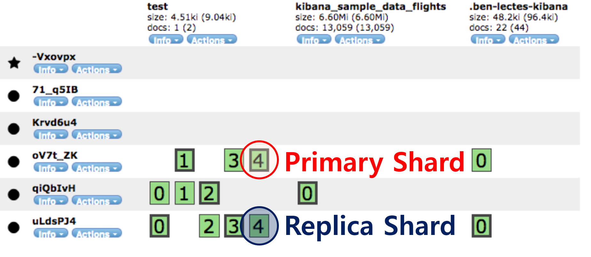
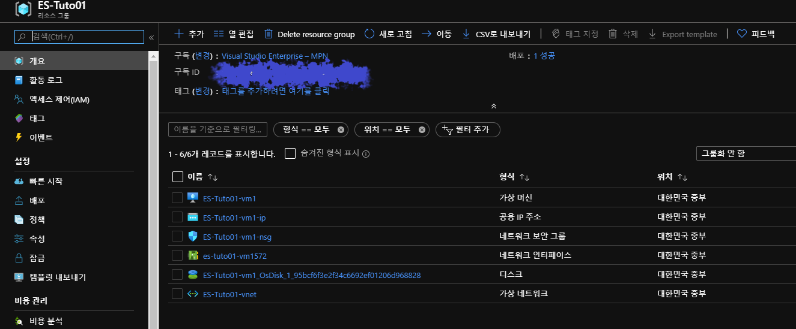
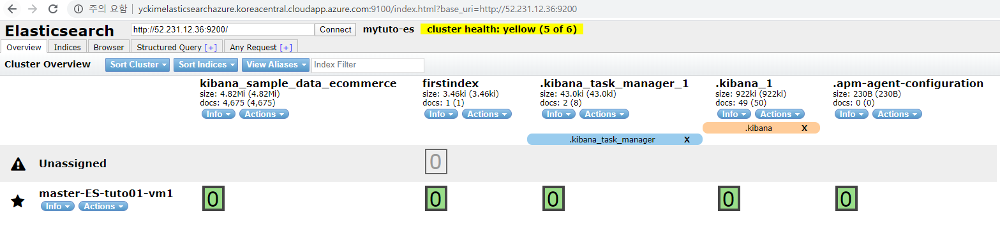

## 1. Elasticsearch에 대하여

### 1.1 Elasticsearch란?

- 고가용성의 확장 가능한 오픈소스 이면서 
  - Full-Text 검색엔진이고
  - 분석엔진임

### 1.2 Lucene

- Apache Software재단의 검색엔진 상위 프로젝트
- Java기반
- Free and Open-source Software
- Doug Cutting(Hadoop의 창시자)에 의해 개발
- Apache License 하에 배포

### **1.3** Full-Text 검색엔진으로서의 ES

- Shay Banon이 Lucene을 기반으로 만든 검색엔진
- Apache 2.0 License에 의거
- HTTP Web Interface와 Schema에 자유로운 JSON형태의 문서를 지원
- 준 실시간 분산형 검색엔진(NRT : Near Real Time)
- 검색엔진은 단독 서비스

### 1.4 분석 엔진으로서의 ES

- 준 실시간 분석이 가능한 분석엔진
- 분석엔진으로 사용하려 Beats나 Logstash, Kibana를 활용해 분석엔진으로 사용
  - **Beats**: 웹서버/앱서버의 에이전트로 설치. 앱&웹에 로그가 남는 것을 스트리밍(매우 작은 파일)하는데 사용하거나 ES와 함께 사용하는 등 자유도가 높음
  - **Logstash** : 필터링 정형화를 수행해 ES로 문서를 저장함
    - Input, Filter, Output
  - **Kibana** : Beats나 Logstash가 데이터를 잘 저장하면 Kibana를 붙여서 다양한 비쥬얼라이징을 할 수 있는 대시보드를 만들어 사용할 수 있음.

## 2. ES의 용어 및 개념

### 2.1 ES Cluster

- 위의 그림은 Head 플러그인을 설치하고 확인할 수 있는 내용임

### 2.2 문서(Document)

- Document는 JSON형태의 의미있는 데이터 형태를 갖고 ES의 **저장 기본단위**임
- RDB의 row와 비슷한 개념
- 문서는 SE에 저장될 때 고유한 문서 ID를 갖음
- 문서 ID는 Random값 혹은 사용자에 의해 정의된 값으로 설정할 수 있음
- 문서 ID는 문서 데이터를 찾아가는 Meta Key의 역할을 함
- JSON형태
  - JSON은 사람이 읽고 쓰기 쉬운 형태의 경량 데이터 구조
  - Key:Value의 쌍으로 사용
  - Value내에 key:value 형태의 object나 list도 포함함

### 2.3 인덱스(Index)

- **문서가 저장되는 가장 큰 단위(논리적인 단위)**
- RDB의 데이터베이스와 비슷한 개념
- 하나의 인덱스에 여러개의 json으로 되어있는 문서를 저장함
- 최초 데이터를 클러스터에 저장(인덱싱)할 때 인덱스가 자동으로 생성
  - RDB에서 데이터를 insert하기 위해 데이터베이스를 미리 생성해야하는 것과는 차이점이 있음

### 2.4 타입(Type)

- 인덱스를 파티션한 것
- RDB의 테이블과 비슷한 개념
- ES 6.x 버전부터 Multi Type은 Deprecate됨
- 현재는 하나의 인덱스에 **Single Type을 권고함(_doc)**
- ES 7.X 버전부터는 _doc 로 고정
  - 5.X 버전에서는 멀티 타입
  - 6.X 버전부터는 싱글 타입
  - 7.X 버전부터는 싱글 타입에 **_doc**으로 고정함

### 2.5 클러스터&노드(Cluster&Node)

- **마스터 노드를 3대로 구성한 그림** 
  - 실제로 보고받는 녀석은 1대임(-Vxovpx). 
  - 마스터 노드가 2개 이상일 경우 마스터 노드간의 유기적인 데이터 싱크가 필요하기 때문에 **실제 마스터 노드는 혼자서 역할**을 하고 주기적으로 다른 마스터 노드에게 변경사항을 알려줌
  - 다른 마스터 노드들은 실제 마스터 노드에 문제가 생기는 경우를 대비해 지속적으로 실제 마스터 노드 역할을 수행하기 위하여 준비. 만약 클러스터의 크기가 매우 크다면 마스터 노드가 많은 정보를 알아야 하므로 3대를 설정하는 것이 적당 

#### 클러스터(Cluster)

- ES는 클러스터로 구성됨
- 클러스터는 하나 이상의 노드로 구성
- 사용자는 클러스터를 대상으로 데이터를 저장(색인)하거나 검색 요청
- 여러 개의 노드를 합쳐서 하나의 노드처럼 보이게 하는 것이 클러스터
  - 클러스터로 되어있는 것은 노드1로 색인해도 되고 노드2로 색인해도 됨
- 클러스터 별 cluster_name과 cluster_uuid를 사용

#### 노드(Node)

- 클러스터를 구성하는 Elasticsearch의 **프로세스**
- 노드 간 헬스 체크, 문서를 색인하여 저장, 검색 요청에 데이터를 리턴
- 클러스터와 마찬가지로 노드 별 name과 UUID를 사용
- 노드의 역할 정의에 따라서 master, data, ingest, client 노드로 사용
  - **ES는 role을 설정하는 특징이 있음(매우 중요)**
  - ex) 코디네이터 role의 경우는 master, data, default, client 노드 모두에 적용됨 
  - **마스터(Master)** 노드
    - 클러스터 구성의 기준이 되는 노드
    - 클러스터 내 노드들의 **헬스 체크**를 담당
    - 클러스터 내에서 벌어지는 모든 업데이트 사항을 보고받음
  - **데이터(Data)** 노드
    - 사용자의 **문서가 저장**되는 노드
    - 사용자의 문서 요청에 데이터를 리턴해주는 노드
  - **디폴트(Default)** 노드
    - 마스터와 데이터 노드의 구분이 필요없을 때 사용
    - 데이터 노드 확장이 거의 필요없는 상태일 때 비용 절감을 위해 사용함
  - **클라이언트(Client)** 노드
    - 사용자의 쿼리를 받기 위한 노드
    - 사용자에게 받은 쿼리를 데이터 노드에게 전달
    - 데이터 노드가 리턴해 준 문서를 취합하여 사용자에게 리턴
    - 코디네이터 role을 제외한 나머지 role을 제거하면 client노드

### 2.7 샤드(Shard)

- 인덱스의 데이터를 나누는 단위
- 인덱스는 많은 데이터를 저장하기 때문에 데이터를 지속적으로 넣다보면
  - 1) 단일 노드의 디스크 볼륨 크기로 더 이상 문서 저장을 할 수 없는 순간이 옴
  - 2) 단일 노드의 유한한 CPU, Memory 자원으로 색인이나 검색 성능 저하
- 위의 문제점을 극복하기 위해 샤딩이 도입
- 단일 Lucene 인덱스가 포함할 수 있는 문서 수의 최대는 2,147,483,519건(약 21억건)
- 데이터 Role을 가진 노드들만 샤드를 가질 수 있음. 
  - default 노드의 경우 마스터, 데이터 노드의 2가지를 수행하므로 샤드를 가져갈 수 있음
- Replica 샤드가 있기 때문에 샤드/노드 오류가 발생하더라도 ES클러스터의 고가용성이 유지됨
- 모든 Replica 샤드에서 병렬 방식으로 검색을 실행할 수 있으므로 검색 처리량 확장이 가능함
- 색인할 때 Primary Shard에서 병렬 방식으로 검색을 실행할 수 있으므로 검색 처리량 확장 가능
- 색인할 때 Primary Shard의 복제를 하는 과정이 추가로 발생
  - I/O가 두 배로 발생하기 때문에 색인 성능 저하
  - 디스크 볼륨도 실제 문서 용량의 두배 필요

- **원본 샤드(Primary Share)**
  
  - Primary 샤드는 색인되어 저장되는 문서의 원본 Shard를 의미
  
  - 인덱스에 문서가 색인될 때 가장 처음에 생성되는 샤드
  
  - Primary 샤드에서는 Shard 번호가 할당되어 어느 노드에 어떤 샤드가 할당되어 있는지 식별이 가능
  
  - 한 번 저장한 샤드 갯수는 immutable하기 때문에 변경 못함
  
  - 6.X 버전에서는 5개의 Primary Shard를 기본으로 설정
  
  - 7.X 버전에서는 **1개의 Primary Shard를 기본으로 설정**(문제 발생..)
  
    
  
- **복제본 샤드(Replica Shard)**
  
  - Replica 샤드는 색인되어 들어온 문서의 복제본 Shard를 의미함
    - 데이터 유실을 막기 위해 사용
  - ES에 Primary 샤드가 색인된 후, Primary 샤드가 저장된 데이터 노드와 **무조건 다른 데이터 노드에 복제되는 샤드**
    - ex) 마스터 노드 한개만 띄우는 경우 Replica 샤드는 unsigned됨
  - Replica 샤드도 마찬가지로 번호가 할당되어 어떤 Primary 샤드의 복제본인지 식별이 가능함
  - 1개의 Replica 샤드를 기본으로 설정
  

### 2.8 세그먼트(Segment)

- 샤드는 다시 Segment들로 구성
- **문서가 저장되는 최소 단위(파일로 존재, 물리적인 단위)**
  
  - 문서를 색인하면 디스크에 바로 쓰는 것이 아니라 데이터를 쓰면 그 때 세그먼트 파일이 생기고 그때 검색이 가능한 상태가 됨
    - 문서는 먼저 System OS Page Cache영역에 저장
    - Refresh 과정을 통해 문서를 디스크에 저장
    - 저장된 데이터는 곧바로 검색 가능한 상태가 됨
  - immutable 특성(update 불가)
  - data lock을 걸 필요없이 일관성을 유지
  - 6.X 버전까지는 1초마다 refresh(준 실시간)
  - 7.X 버전부터는 30초 동안 검색 요청이 없으면 refresh disable
- 세그먼트는 문서를 모아놓은 물리적인 형태의 파일
- 잘게 쪼개진 데이터는 단일 요청에 의해 많은 Segment들이 등답해야 한다는 단점이 있음
- 그래서 백그라운드에서 Segment 병합(Merge)를 진행

  - 지속적으로 병합을 하게되면 하나 혹은 그 이상의 적은 수의 segment로 병합된 데이터가 저비용으로 리턴 할 수 있음

## 3. QnA

### 3.1 마스터 노드가 Full이 되는 경우가 있는가?

- 마스터 노드가 용량이 Full찰 수 있음. 사용자가 색인을 잘못하면 순식간에 마스터 노드가 Full이 됨. 
  - 모아서 사용하고 싶은 니즈가 있다면 리소스를 좋게 설정하고 사용하면 된다
- 마스터 노드 운영시 아쉬운 점은 사용자가 마스터 노드를 지정할 수 없으며 ES가 알아서 지정함

### 3.2 샤드 갯수를 나누는 기준이 있는가?

- 있다. 나중에 천천히

### 3.3 노드를 하나의 서버라고 생각하면 되는가?

- 노드를 쉽게 생각해서 서버 1대라고 생각해도 된다. 예전에는 한 서버에 구축했지만 구축 외의 운영이 힘들어서 문제가 발생했었음

## 4. Elasticsearch설치

- 목적 : Azure에 ES, Kibana, Head플러그인을 설치하고 ES가 돌아가는지 확인해보기
  - Elasticsearch 7.5.1 버전 설치
  - Kibana  7.5.1
  - 싱글 가상머신을 배포(CentOS-based 7.7)
    - 마스터 노드 하나만 배포
  - Inbound 포트 설정
    - 9100, 9200, 5601

### 4.1 Azure 단일 가상머신을 배포

### 4.2 Azure Root 권한을 위한 비밀번호 재설정

- ssh로 원격접속하고 아래의 내용으로 변경함(그냥)

~~~
$ sudo passwd -u root
$ sudo passwd root 
$ su
~~~

### 4.3 다운로드 방법

- 다운로드 방법 3가지
  - 진행은 RPM으로 설치

#### 4.3.1 YUM Repository 등록으로 설치(root권한으로 실행)

~~~
$ vi /etc/yum.repos.d/elasticsearch.repo

[elasticsearch-7.x]
name=Elasticsearch repository for 7.x packages
baseurl=https://artifacts.elastic.co/packages/7.x/yum
gpgcheck=1
gpgkey=https://artifacts.elastic.co/GPG-KEY-elasticsearch
enabled=1
autorefresh=1
type=rpm-md

$ sudo yum install elasticsearch -y
$ sudo yum install git -y
~~~

#### 4.3.2 RPM Download 설치 방법(root권한으로 실행)

- RPM으로 설치했음

~~~
### 아래와 같이 실행함
$ sudo yum -y install wget
$ sudo wget -q https://artifacts.elastic.co/downloads/elasticsearch/elasticsearch-7.5.1-x86_64.rpm -O /usr/local/src/elasticsearch-7.5.1-x86_64.rpm

$ sudo rpm -ivh /usr/local/src/elasticsearch-7.5.1-x86_64.rpm
~~~

##### RPM설치 시 중요파일 디렉토리 위치

- /etc/elasticsearch
  - elasticsearch.keynote
  - **elasticsearch.yml**
  - **jvm.options**
  - **log4j2.properties**
  - role_mapping.yml
  - roles.yml
  - users
  - users_roles

- /etc/sysconfig 아래에는 ES 환경변수
- /usr/share/elasticsearch 밑에 실행파일
  - **bin**
  - jdk
  - lib
  - modules
  - NOTICE.txt
  - **plugins**
  - README.textile

#### 4.3.3 user권한으로 설치 방법

~~~
## 1) zip
$ wget https://artifacts.elastic.co/downloads/elasticsearch/elasticsearch-7.3.0.zip
$ unzip elasticsearch-7.3.0.zip

## 2) tar
$ wget https://artifacts.elastic.co/downloads/elasticsearch/elasticsearch-7.3.0.tar.gz
$ tar -xzf elasticsearch-7.3.0.tar.gz
~~~

##### user권한으로 설치할 때 디렉토리

- rpm과 비교하면 config, data가 추가로 생성됨
- config 폴더 아래의 파일들은 rpm 설치 때의 /etc/elasticsearch 밑의 파일
  - **bin**
  - **config** : 임마가 /etc/elasticsearch 밑의 파일을 갖고 있음
  - **data**
  - lib
  - LICENSE.txt
  - logs
  - modules
  - NOTICE.txt
  - plugins
  - README.textile

#### 4.4 elasticsearch.yml 설정 변경 및 실행

~~~
$ ifconfig | grep inet | grep -vE '127.0.0.1|inet6' | awk '{print $2}'

10.10.0.4 # private IP를 기억

$ hostname -s

ES-Tuto01-vm1 # 얘는 node.name에 사용하려고 그냥

$ sudo vi /etc/elasticsearch/elasticsearch.yml

cluster.name: mytuto-es # 고유한 이름으로 설정
node.name: master-ES-tuto6 # 노드 이름. hostname -s로 확인한 내용을 넣어줬음

### For Head 플러그인 때문에 아래와 같이 변경
http.cors.enabled: true
http.cors.allow-origin: "*"

### For Response by External Request
network.host: 0.0.0.0

### Discovery Settings
discovery.seed_hosts: [ "10.0.2.4:9300",  ] # [ IP:9300 ], 아까 확인한 private IP를 넣어줌
cluster.initial_master_nodes: [ "10.0.2.4:9300",  ] # [ IP:9300 ], 마찬가지

# Xms1g, Xmx1g를 물리 메모리의 절반으로 수정
$ sudo vi /etc/elasticsearch/jvm.options

-Xms2g
-Xmx2g

## systemd를 사용하는 경우
$ sudo systemctl daemon-reload
$ sudo systemctl enable elasticsearch.service 
$ sudo systemctl restart elasticsearch

## 프로세스 확인
$ ps -ef | grep elasticsearch

## 어플리케이션 반응확인
curl localhost:9200
~~~

#### 4.5 포트 설정

- Azure 가상머신의 네트워크 보안그룹에서 Inbound 포트 설정을 변경
  - 9100, 9200 : Elasticsearch
  - 5601 : Kibana

#### 4.6 Head Plugin설치

~~~
$ sudo yum install epel-release -y
$ sudo yum install npm -y

## head 설치 및 실행
$ cd ~
$ sudo yum install git -y
$ sudo git clone git://github.com/mobz/elasticsearch-head.git
$ cd elasticsearch-head
$ sudo npm install
$ sudo npm run start &
~~~

##### 4.6.1 Head Plugin 접속

~~~
{DNS}:9100/index.html?base_uri={FQDN}:9200
~~~

- 예시)
  - http://yckimelasticsearchazure.koreacentral.cloudapp.azure.com:9100/index.html?base_uri=http://52.231.12.36:9200
    - DNS, port(9100)
      - http://yckimelasticsearchazure.koreacentral.cloudapp.azure.com:9100
    - FQDN, port(9200) : 
      - /index.html?base_uri=http://52.231.12.36:9200
  - 하나의 가상머신에 올렸기 때문에 DNS, FQDN의 차이점이 없다. 그냥 설정한 것
  
  

#### 4.7 Kibana 설치/설정/실행

- server.host를 외부에서도 접근이 가능하게 0.0.0.0으로 설정
- elasticsearch.url은 localhost에 ES를 함께 설치하였으므로 localhost:9200 으로 설정함
- kibana.index는 기본이름인 "kibnana"로 설정함

~~~
$ sudo wget -q https://artifacts.elastic.co/downloads/kibana/kibana-7.5.1-x86_64.rpm -O /usr/local/src/kibana-7.5.1-x86_64.rpm

$ sudo rpm -ivh /usr/local/src/kibana-7.5.1-x86_64.rpm

## 키바나 설정
$ sudo vi /etc/kibana/kibana.yml

server.host: "0.0.0.0"
#E elasticsearch.hosts: "http://{ES_URL}:9200" 키바나와 마스터노드가 같기 때문에 localhost로 아래와 같이 설정
elasticsearch.hosts: "http://localhost:9200"
kibana.index: ".kibana"

## 키바나 실행
$ sudo systemctl daemon-reload
$ sudo systemctl enable kibana.service
$ sudo systemctl restart kibana
~~~

##### 4.7.1 Smoke Test

~~~
$ curl localhost:9200

$ curl -H 'Content-Type: application/json' -XPOST localhost:9200/firstindex/_doc -d '{ "mykey": "myvalue" }'
~~~

- GET은 Content-Type을 명시하지 않아도 괜찮지만 POST, PUT, DELETE는 Content-Type을 명시해야 함

##### 4.7.2 Kibana 접속

~~~
{FQDN}:5601
~~~

- 예시)
  - FQDN, port(5601)
    - http://52.231.65.96:5601

##### 4.7.2 Trouble Shooting

- Smoke Test가 진행되지 않을 경우에는 elasticsearch.yml 파일에 기본으로 설정되어 있는 로그 디렉토리의 로그를 확인
  - path.log:/var/log/elasticsearch로 설정되어 cluster.name이 적용된 파일로 로깅됨
  - /var/log/elasticsearch/mytuto-es.log

~~~
$ sudo vi /var/log/elasticsearch/mytuto-es.log
~~~

