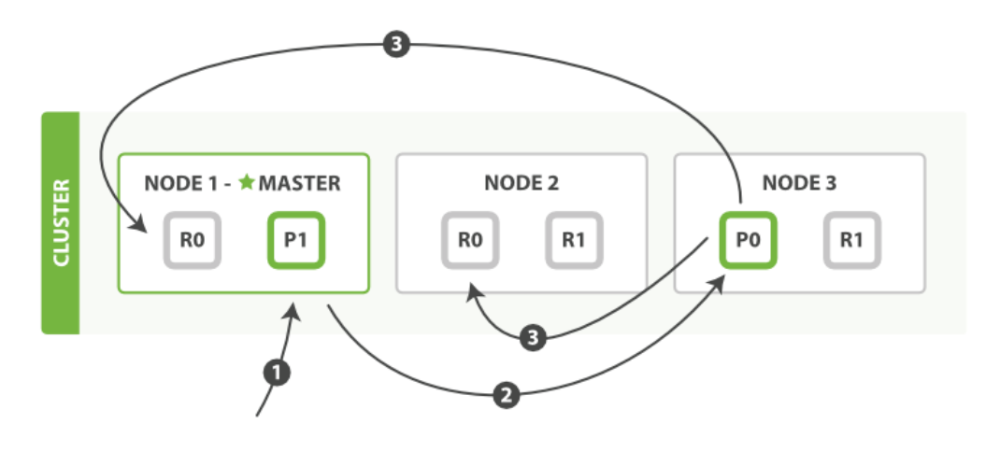
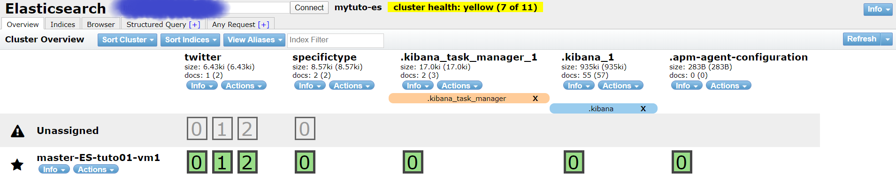
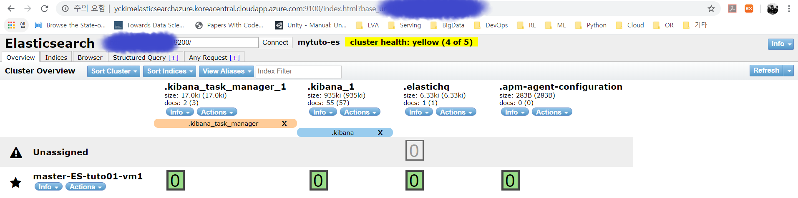
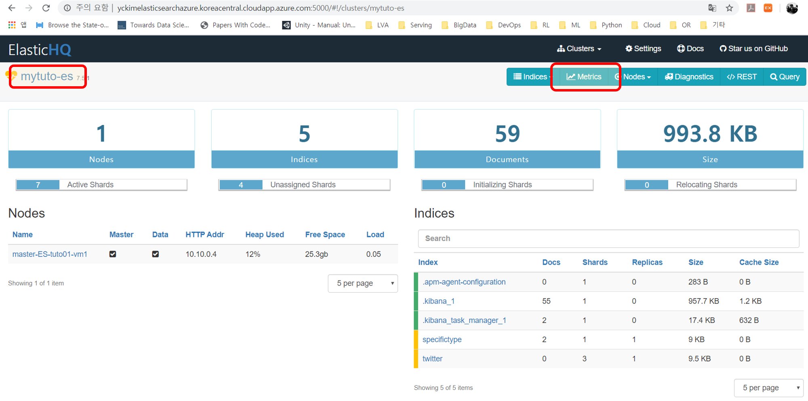

# Elasticsearch 기본 동작

- 인덱스 생성 및 삭제, 조회
- 문서 색인 및 조회
- 문서 갱신 및 삭제
- 클러스터 정보 확인하기

## 1. 인덱스 생성 및 삭제, 조회

- 인덱스는 문서들의 모음

- 인덱스를 생성하는 방법
  
  > 1. **인덱스의 settings를 정의** : static한 매핑
  >
  > 2. **인덱스의 mappings를** 정의 : RDB의 schema와 비슷
  > 3. **인덱스의 alias를 정의**
  > 4. **사용자 정의된 문서를 색인** : 다이나믹 매핑
  
- 인덱스는 미리 정의된 샤드 개수에 의해 나눠짐
  - **한 번 설정한 개수는 변경 불가**
  - 6.X 까지는 기본 Primary Shard 개수가 5개, 7.X부터는 기본 Primary Shard 개수가 1
  - 문서는 색인될 때 랜덤한 String을 문서 id로 할당받거나, 사용자가 정의한 문서 id로 생성되고 사용자는 생성된 문서 id를 통해 문서를 가져올 수 있음
  - 샤드 할당 알고리즘
    - shard = hash(routing) % number_of_primary_shards
    - ES 내부 해싱 알고리즘에 의해 문서의 id를 샤드 개수로 나눈 나머지 값을 할당

### Index settings

- **Static index settings** 
  - **number_of_shards** : primary 샤드 개수 절정
    - Primary shard의 개수는 온라인 중에 변경이 불가능하고 설정 변경을 위해선 서비스 중지 후에 가능함
    - 샤드 개수를 변경하기 위한 방법은 reindex 방법을 사용해야 한다
- **Dynamic index settings** 
  - **number_of_replicas** : replica 샤드 개수 설정
  - **refresh_interval** : 시스템 OS 페이지 캐시에 있는 데이터를 어느 주기로 세그먼트로 내릴 것인지 결정하는 설정
  - **index.routing.allocation.enable** : 인덱스의 샤드들의 라우팅 허용 설정
- **other settings**
  - Analysis, Mapping, Slowlog 등...
  - 검색엔진의 특성으로 인해 응답속도의 중요성이 요구되므로 색인 혹은 사용자가 날린 쿼리에 특정 임계치를 설정하여 초과하는 쿼리들은 로그를 남기도록 설정하기도 한다

#### elasticsearch, kibana, head 실행

- 실험을 위해서 가동하는 단계. 특별한 의미는 없음

~~~
$ sudo service elasticsearch start
$ sudo service kibana start
$ cd /usr/local/elasticsearch-head/
$ nohup npm run start &
~~~

### 인덱스 settings를 정의하여 인덱스 생성

- 항상 PUT Method를 사용함

~~~
PUT twitter
{
	"settings" : {
		"index" : {
			"number_of_shards" : 3,
			"number_of_replicas" : 1
		}
	}
}

{
  "acknowledged" : true,
  "shards_acknowledged" : true,
  "index" : "twitter"
}
~~~

### flat_settings 형태로도 인덱스 생성 가능

~~~
PUT twitter 
{
	"settings" : {
		"index.number_of_shards" : 3,
		"index.number_of_replicas" : 1
	}

}
~~~

- "."을 사용해서 1.1.1와 동일하게 생성할 수 있음

  

#### 참고) Index Read Only

- Index Read only - 삭제는 막을 수 없지만 read only 형태로 만드는 것

~~~

#### Index Read only - 삭제는 막을 수 없지만 read only 형태로 만드는 것은 가능
# "index.blocks.read_only_allow_delete": true 로 설정하고
# PUT twitter/_doc/1 ...로 문서를 색인하면 색인되지 않음
PUT twitter/_settings
{
    "index.blocks.read_only_allow_delete": true
}

# False로 설정하는 기능
PUT twitter/_settings
{
    "index.blocks.read_only_allow_delete": false
}

## null
PUT twitter/_settings
{
    "index.blocks.read_only_allow_delete": null
}

~~~

### 인덱스 삭제

- 삭제는 조심히 사용해야 함
  - nginx를 앞단에 두어서 DELETE Method를 특정 IP에서만 허용하게 설정하기도 한다고 함

~~~
DELETE twitter

{
  "acknowledged" : true
}
~~~

- CLI로 사용하는 경우

~~~
$ curl -XDELETE -H 'Content-Type: application/json' http://{ES_URL}:9200/{index}
~~~

### 인덱스 조회

- 조회시 GET 메서드 사용
- 인덱스가 존재하는지 확인
  - 존재할 경우: 200 - OK
  - 존재하지 않을 경우: 404 - Not Found 

### 인덱스가 존재하는지 확인

~~~
HEAD twitter

200 - OK
~~~

### 인덱스의 세팅을 확인

~~~
GET twitter/_settings

{
  "twitter" : {
    "settings" : {
      "index" : {
        "creation_date" : "1579774326729",
        "number_of_shards" : "3",
        "number_of_replicas" : "1",
        "uuid" : "bbnD6WXPQ3ut0uekYWYy7w",
        "version" : {
          "created" : "7050199"
        },
        "provided_name" : "twitter"
      }
    }
  }
}
~~~

### 인덱스의 매핑을 확인

~~~
## settings와 mappings는 다르다는 것을 기억!
GET twitter/_mappings

{
  "twitter" : {
    "mappings" : { }
  }
}

## GET twitter/_mappings와 같은 내용
GET twitter/_mapping

## 6번전에서는 아래와 같이 사용
GET twitter/_mapping
GET twitter/_mappings
GET twitter/_mapping/_doc
GET twitter/_mappings/_doc
~~~

### 인덱스의 상태를 확인

- 지속적으로 쌓이는 특정이 있음
- 중요한 정보들이 많이들어있어서 자주 사용함

~~~
## Index 통계 데이터 정보 확인
GET twitter/_stats
~~~

### 인덱스의 세그먼트 정보 확인

- 인덱스의 샤드 및 세그먼트 정보 확인

- 세그먼트를 초기에 제대로 숙지하지 않고 사용하는 경우가 많지만 성능에 굉장히 중요한 부분

~~~
## 세그먼트 정보 확인
GET twitter/_segments

{
  "_shards" : {
    "total" : 6,
    "successful" : 3,
    "failed" : 0
  },
  "indices" : {
    "twitter" : {
      "shards" : {
        "0" : [
          {
            "routing" : {
              "state" : "STARTED",
              "primary" : true,
              "node" : "Et_C_Vn9RmqzP43AuBQ8QQ"
            },
            "num_committed_segments" : 0,
            "num_search_segments" : 0,
            "segments" : { }
          }
        ],
        "1" : [
          {
            "routing" : {
              "state" : "STARTED",
              "primary" : true,
              "node" : "Et_C_Vn9RmqzP43AuBQ8QQ"
            },
            "num_committed_segments" : 0,
            "num_search_segments" : 0,
            "segments" : { }
          }
        ],
        "2" : [
          {
            "routing" : {
              "state" : "STARTED",
              "primary" : true,
              "node" : "Et_C_Vn9RmqzP43AuBQ8QQ"
            },
            "num_committed_segments" : 0,
            "num_search_segments" : 0,
            "segments" : { }
          }
        ]
      }
    }
  }
}
~~~

### 클러스터의 인덱스 정보 확인

- 인덱스 요약 정보
  - **cat** api는 ES의 순간 상태를 확인할 수 있음
  - docs의 수량, 지워진 개수, 사이즈(primary만) 등을 알 수 있음
  - **최적화된 검색엔진을 만들 때 사용**

~~~
## 클러스터 내 Index 상태 정보 확인
GET _cat/indices?v

health status index                    uuid                   pri rep docs.count docs.deleted store.size pri.store.size
yellow open   twitter                  GRA6_RkEQbqKBrUydD74UA   3   1          0            0       690b           690b
green  open   .kibana_task_manager_1   aMiW4QySQR2An_W0uHOW7g   1   0          2            1       17kb           17kb
green  open   .apm-agent-configuration 6ghMIVwBQM6InfGD2L27sw   1   0          0            0       283b           283b
green  open   .kibana_1                _dNPzxxGRlOo4i06-Z1-vQ   1   0         55            2    935.2kb        935.2kb

## 특정 인덱스의 상태 정보 확인
GET _cat/indices/twitter?v

health status index   uuid                   pri rep docs.count docs.deleted store.size pri.store.size
yellow open   twitter GRA6_RkEQbqKBrUydD74UA   3   1          0            0       690b           690b
~~~

## 2. 문서 색인 및 조회

- 인덱스는 미리 정의된 샤드 개수에 의해 나뉘어짐
- **한 번 설정한 샤드 개수는 변경 불가능**
  - 6.x 까지는 Primary Shard 개수가 5, 7.x부터는 기본 Primary Shard 개수가 1
- 문서는 색인될 때 랜덤한 string을 문서 id로 할당받거나, 사용자가 정의한 문서 id로 생성됨
  - 사용자는 생성된 문서 id를 통해 문서를 가져올 수 있음
    - **문서를 가져오는 것과 검색은 다르다**
- 샤드 할당 알고리즘
  - *shard = hash(routing) % number_of_primary_shards*
  - ES 내부 해싱 알고리즘에 의해 문서의 id를 샤드 갯수로 나눈 나머지 값을 할당
  - 샤드 번호는 엘라스틱서치 내부 해시 알고리즘에 할당

### 색인의 필수 조건

- 프라이머리 샤드가 항상 제일 먼저 색인
- 프라이머리 샤드가 색인이 전부 완료된 이후엔 레플리카 샤드로 복제

### 윗 그림의 프로세스

> 0. 사용자가 특정 IP/DNS로 문서 색인을 요청
>
>    ex) PUT index/_doc/1
>
>  1. ES 내부 할당 알고리즘에 의해서 샤드 0번에 할당
>
>     샤드할당 알고리즘 : *shard = hash(routing) % number_of_primary_shards*
>
>     ex) 128(hash의 output으로 가정) % 2 = 0
>
> 2. 요청이 들어온 IP/DNS의 노드가 3번 노드의 Primary shard 0번에  toss를 수행
>
> 3. Primary shard 0은 복제를 수행함
>
>    NODE1, NODE2에 각각 Replica shard를 생성
>
>    복제가 잘 안될 수도 있지만 색인 과정에서 Replica shard에 문서가 잘 복제되는지는 중요하지 않음
>
> 4. Primary shard 0은 최초에 사용자에 의해 요청이 들어온 Node 1로 "복제가 되었다/안되었다"를 보고
>
> 5. Node 1은 결과물을 사용자에게 리턴

### tip) 기억할 점

- 사용자가 특정한 도메인에만 요청을 지속적으로 하면 나머지 노드들은 유휴하게 될 수 있으므로 ES는 현재 node들의 앞단에 Load Balancer를 설정(특정 IP를 고정으로 할당)하여 부하를 분산시키는 것을 권고
- 만약 볼륨이 가득차서 레플리카 샤드가 색인되지 못하는 경우 ES는 5번까지 시도하고 더 이상 할당을 시도하지 않음
  - 이후에 관리자가 볼륨을 다시 비운다고 ES가 자동 할당을 시도하지 않고 retry 명령어를 날려야 다시 시도하게 됨

### 사용자 정의 문서 ID를 지정하여 색인

- PUT 메서드를 사용하면 ID를 지정하여 색인하겠다는 것임'
- 7.x 버전부터는 _doc 이외의 타입 이름은 권고되지 않음
- 아래와 같이 설정해도 settings없이 문서를 색인함
- **동일한 ID로 색인하면 update를 수행함**
  - 정보를 확인하면 version이 바뀌는 것을 확인할 수 있음

~~~
## 7.x 버전부터는 _doc 이외의 타입 이름은 권고되지 않음
PUT twitter/_doc/1
{
    "user" : "kimchy",
    "post_date" : "2009-11-15T14:12:12",
    "message" : "trying out Elasticsearch"
}

{
  "_index" : "twitter",
  "_type" : "_doc",
  "_id" : "1",
  "_version" : 1,
  "result" : "created",
  "_shards" : {
    "total" : 2,
    "successful" : 1,
    "failed" : 0
  },
  "_seq_no" : 0,
  "_primary_term" : 1
}

## GET _mappings로 확인
GET twitter/_mappings

{
  "twitter" : {
    "mappings" : {
      "properties" : {
        "message" : {
          "type" : "text",
          "fields" : {
            "keyword" : {
              "type" : "keyword",
              "ignore_above" : 256
            }
          }
        },
        "post_date" : {
          "type" : "date"
        },
        "user" : {
          "type" : "text",
          "fields" : {
            "keyword" : {
              "type" : "keyword",
              "ignore_above" : 256
            }
          }
        }
      }
    }
  }
}
~~~

### type을 _doc이 아닌 다른 이름으로 설정하는 경우

- type을 _doc으로 사용하는 것을 권고함
- type을 다른 이름으로 사용해도 작동함

~~~
## 7.x 버전에서 type 을 _doc 으로 주지 않은 채 PUT Method 로 문서를 색인한다면?
## 아래와 같은 경고가 나타남
PUT specifictype/mytype/1
{
    "user" : "kimchy",
    "post_date" : "2009-11-15T14:12:12",
    "message" : "trying out Elasticsearch"
}

#! Deprecation: [types removal] Specifying types in document index requests is deprecated, use the typeless endpoints instead (/{index}/_doc/{id}, /{index}/_doc, or /{index}/_create/{id}).
{
  "_index" : "specifictype",
  "_type" : "mytype",
  "_id" : "1",
  "_version" : 1,
  "result" : "created",
  "_shards" : {
    "total" : 2,
    "successful" : 1,
    "failed" : 0
  },
  "_seq_no" : 0,
  "_primary_term" : 1
}

## mytype 이 아닌 _doc 타입 이름으로도 문서 색인 가능 
PUT specifictype/_doc/2
{
    "user" : "kimchy",
    "post_date" : "2009-11-15T14:12:12",
    "message" : "trying out Elasticsearch"
}

{
  "_index" : "specifictype",
  "_type" : "_doc",
  "_id" : "2",
  "_version" : 1,
  "result" : "created",
  "_shards" : {
    "total" : 2,
    "successful" : 1,
    "failed" : 0
  },
  "_seq_no" : 1,
  "_primary_term" : 1
}

## _mappings로 확인
GET specifictype/_mapping

{
  "specifictype" : {
    "mappings" : {
      "properties" : {
        "message" : {
          "type" : "text",
          "fields" : {
            "keyword" : {
              "type" : "keyword",
              "ignore_above" : 256
            }
          }
        },
        "post_date" : {
          "type" : "date"
        },
        "user" : {
          "type" : "text",
          "fields" : {
            "keyword" : {
              "type" : "keyword",
              "ignore_above" : 256
            }
          }
        }
      }
    }
  }
}
~~~

### 업데이트 설정 X 문서 색인

- **op_type=create** 사용
  - 대게 사용자가 문서의 업데이트를 막기위해 사용함
    - 만약 문서가 존재한다면 Error가 발생
  - op_type=create로 문서 ID가 없을 때만 색인되고 아닌 경우는 에러가 발생하게 설정할 수 있음

~~~
## 문서 ID가 없으 때만 색인 : Index Create Operator, 문서 아이디가 존재하면 문서 색인이 불가능함
## 이이 ID 1인 문서를 색인했으므로 아래와 같이 에러가 발생
PUT twitter/_doc/1?op_type=create
{
    "user" : "kimchy",
    "post_date" : "2009-11-15T14:12:12",
    "message" : "trying out Elasticsearch"
}

{
  "error": {
    "root_cause": [
      {
        "type": "version_conflict_engine_exception",
        "reason": "[1]: version conflict, document already exists (current version [1])",
        "index_uuid": "GRA6_RkEQbqKBrUydD74UA",
        "shard": "2",
        "index": "twitter"
      }
    ],
    "type": "version_conflict_engine_exception",
    "reason": "[1]: version conflict, document already exists (current version [1])",
    "index_uuid": "GRA6_RkEQbqKBrUydD74UA",
    "shard": "2",
    "index": "twitter"
  },
  "status": 409

## _create API
# PUT twitter/_doc/1?op_type=create 과 동일한 동작
PUT twitter/_doc/1/_create
{
    "user" : "kimchy",
    "post_date" : "2009-11-15T14:12:12",
    "message" : "trying out Elasticsearch"
}
~~~

### 문서 갱신

- **동일한 문서 ID**를 통해 문서 갱신
- **마지막 업데이트된 정보만 확인이 가능함**
- 정보를 업데이트하면 그 이전 버전은 세그먼트가 백그라운드에서 머징될 때 정리가 됨
  - 버전별로 작업이 힘들다는 단점이 있음

~~~
PUT twitter/_doc/1
{
    "user" : "salad",
    "post_date" : "2009-11-15T14:12:12",
    "message" : "trying out Elasticsearch"
}

{
  "_index" : "twitter",
  "_type" : "_doc",
  "_id" : "1",
  "_version" : 2, ## 버전이 1에서 2로 변경된 것을 알 수 있음
  "result" : "updated",
  "_shards" : {
    "total" : 2,
    "successful" : 1,
    "failed" : 0
  },
  "_seq_no" : 1,
  "_primary_term" : 1
}

~~~

### 사용자 정의 문서를 ID 지정없이 색인

- **POST method**를 사용해 문서를 색인
- 랜덤하게 문서 아이디가 생성됨

~~~
## 사용자 정의된 문서를 ID지정 없이 색인 : POST Method를 이용하면 문서 ID가 랜덤하게 생성
POST twitter/_doc
{
    "user" : "kimchy",
    "post_date" : "2009-11-15T14:12:12",
    "message" : "trying out Elasticsearch"
}

{
  "_index" : "twitter",
  "_type" : "_doc",
  "_id" : "J4Xu0W8BcFApZyNRJRJ6",
  "_version" : 1,
  "result" : "created",
  "_shards" : {
    "total" : 2,
    "successful" : 1,
    "failed" : 0
  },
  "_seq_no" : 0,
  "_primary_term" : 1
}

~~~

### 문서 조회

- 조회 요청을 **Round Robin**으로 처리
- 최초 요청을 받은 노드가 응답을 주면 제일 좋으나 데이터를 가진 NODE1이 계속 요청을 클라이언트에게 리턴
- 문서를 가진 다른 노드들은 상대적으로 유휴해지는 단점이 있음
- 그래서 요청 자체도 앞단에서 Balacing을 권고함

### 문서 ID를 통해 문서 조회

~~~
## 문서 아이디를 통해 문서 가져오기
GET twitter/_doc/1
~~~

### 실제 문서 데이터인 _source 오브젝트만 조회

~~~
## 문서의 _source field만 가져오기
GET twitter/_source/1

{
  "user" : "salad",
  "post_date" : "2009-11-15T14:12:12",
  "message" : "trying out Elasticsearch"
}
~~~

### 문서 ID를 통한 삭제

- ES는 문서들의 버전을 관리함. 그래서 Delete가 수행되면 해당 문서에 버전을 체크해 놓고, 백그라운드에서 머징할 때 Delete된 문서를 디스크에서 삭제함

~~~
DELETE twitter/_doc/1

{
  "_index" : "twitter",
  "_type" : "_doc",
  "_id" : "1",
  "_version" : 3, # 버전이 2에서 3으로 변경된 것을 알 수 있음
  "result" : "deleted",
  "_shards" : {
    "total" : 2,
    "successful" : 1,
    "failed" : 0
  },
  "_seq_no" : 2,
  "_primary_term" : 1
}
~~~

## 3. 클러스터 정보 확인

- ES에서 인덱스 세팅과 클러스터 세팅이 헷갈리는 경우가 많음
  - 클러스터 설정 : 노드들의 세팅 정보
  - 인덱스 설정 : 클러스터가 구축되어 있을때 인덱스들의 개별 설정

### 클러스터 상태정보(노드개수, 샤드개수 등)

~~~
## 클러스터 Health 정보 확인하기
GET _cluster/health

{
  "cluster_name" : "mytuto-es",
  "status" : "yellow", # Unassigned 때문에 yellow로 되었음
  "timed_out" : false,
  "number_of_nodes" : 1,
  "number_of_data_nodes" : 1,
  "active_primary_shards" : 7,
  "active_shards" : 7,
  "relocating_shards" : 0,
  "initializing_shards" : 0,
  "unassigned_shards" : 4,
  "delayed_unassigned_shards" : 0,
  "number_of_pending_tasks" : 0,
  "number_of_in_flight_fetch" : 0,
  "task_max_waiting_in_queue_millis" : 0,
  "active_shards_percent_as_number" : 63.63636363636363
}
~~~

### 클러스터 사용자 설정 정보

~~~
## cluster settings 정보 확인
GET _cluster/settings

{
  "persistent" : { },
  "transient" : { }
}
~~~

### Elasticsearch 기본동작

- https://www.elastic.co/guide/en/elasticsearch/reference/current/getting-started-explore.html
- https://www.elastic.co/guide/en/elasticsearch/reference/current/docs-index_.html
- https://www.elastic.co/guide/en/elasticsearch/reference/current/docs-get.html
- https://www.elastic.co/guide/en/elasticsearch/reference/current/docs-delete.html

# Elasticsearch 플러그인

### 플러그인이란?

- ES 기능을 커스텀 설정에 의해 좀 더 강화하여 사용하는 방법
- 커스터마이징 할 기능을 가진 플러그인을 별도로 설치하여 사용함

- 전체 노드에 설치해야하는 플러그인들이 있음
- 플러그인을 로딩하려면 **클러스터 재시작이 필요함**
- root 계정으로 설치(sudo 활용)

### Core 플러그인

- ES에서 공식적으로 지원하는 플러그인
- ES버전이 올라갈 때마다 같이 버전 업데이트가 지원됨
- ES에서 공식적으로 권고됨

### Community contributed

- 개인 개발자나 회사에 의해 지원되는 플러그인

## 1. 플러그인 설치

~~~
$ cd /usr/share/elasticsearch/

## 인터넷이 잘 되는 환경이라면
$ sudo bin/elasticsearch-plugin install [plugin_name] 

## 노리한국어 분석기의 예시
$ sudo bin/elasticsearch-plugin install analysis-nori

## 인터넷이 잘 안되면
$ sudo bin/elasticsearch-plugin install file://path/to/plugin.zip

## 파일서버에 올려두고 설치
$ sudo bin/elasticsearch-plugin install [url]

## 설치된 플러그인 리스트 확인
$ sudo bin/elasticsearch-plugin list

## 설치한 플러그인 제거
$ sudo bin/elasticsearch-plugin remove [pluginname]
~~~

## 2. head 플러그인 활용 및 설치

- 한눈에 클러스터를 보기 위한 도구
- https://github.com/ElasticHQ/elasticsearch-HQ
- http://{Server FQDN}:5000

~~~
$ sudo yum install -y install git
$ git clone https://github.com/mobz/elasticsearch-head.git
$ cd elasticsearch-head/

$ sudo yum install bzip2 epel-release -y
$ sudo yum install npm -y
$ npm install
$ nump run start
~~~

### 3. HQ 플러그인 활용 및 설치

- 한눈에 **클러스터의 사용률**을 보기 위한 도구
- https://github.com/ElasticHQ/elasticsearch-HQ
- http://{Server FQDN}:5000
- **Stand alone 플러그인** : 클러스터 노드에 설치할 필요가 없는 플러그인
  - mytuto-es: 클러스터 이름
  - metric에서 모니터링 툴을 구축하지 않아도 가볍게 유의미한 것들을 조회가능하도록 해놓음
    - HQ가 위의 지표를 보여줄 수 있는 것은 ES가 지속적으로 클러스터의 통계 데이터나, ES 통계 데이터를 지속적으로 쌓고 있기 때문임. HQ는 metrics에서 이러한 통계들을 시각화하여 보여줌

~~~
sudo yum -y install git
git clone https://github.com/ElasticHQ/elasticsearch-HQ.git
cd elasticsearch-HQ/

sudo yum install python34 python34-pip -y
sudo pip3 install -r requirements.txt년ㅇ
~~~
