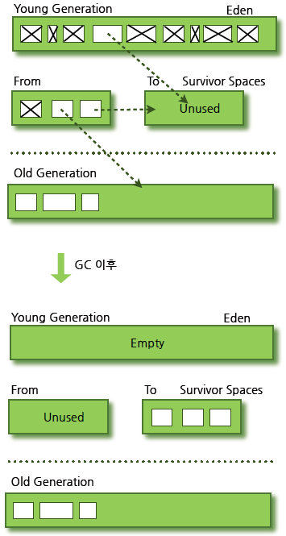
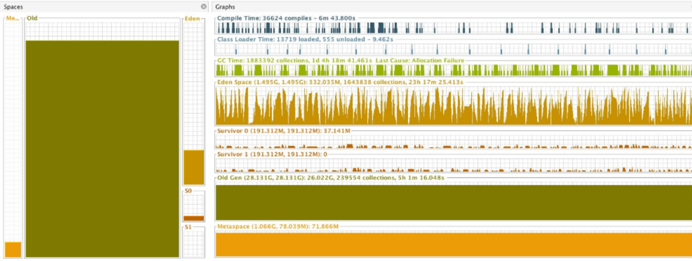
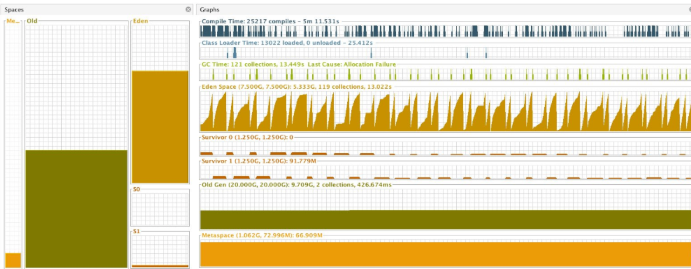

# Elasticsearch 환경 설정 및 클러스터 운영

- Elasticsearch 환경설정
- Elasticsearch 클러스터 운영
- Elasticsearch API 활용하기

# Elasticsearch 환경설정

> elasticsearch.yml - Elasticsearch의 핵심 설정
>
> jvm.options  -  JVM옵션, 힙사이즈의 중요성
>
> log4j2.properties - 로그는 어떻게 모을 것인가

## Elasticsearch 환경설정

- **Static settings**
  - elasticsearch.yml 파일에 정의
  - 각각의 노드 별로 설정해야 함
- **Dynamic Settings**
  - 클러스터에 API로 호출(실제 운영중에 api로 설정을 변경하고 ES는 그 즉시 변경)
  - 클러스터 단위로 설정

## 1. elasticsearch.yml 파일 설정

- **cluster.name**

  - 클러스터를 고유하게 식별할 수 있는 이름 설정

  ~~~
  cluster.name: mytuto-es
  ~~~

- **node.name**

  - 노드를 고유하게 식별할 수 있는 이름 설정
  - 호스트명 기준으로 설정하는 것이 운영에 용이(헤드를 볼 때도 이 노드가 어떤 샤드를 갖고 있는지 확인할 때 등...)

  ~~~
  node.name: master-ES-Master-vm2
  ~~~

  

- **path.data**(반드시 설정해야 함)

  - Index 데이터를 저장할 경로 지정

    > **Tip)** 시스템 아키텍처 관점에서 특히 빅데이터 처리 시스템의 경우 최근 흐름은 연산을 수행하는 Core와 HDFS를 저장하는 저장소를 분리하여 사용하는 경향이 있음(ex. Azure Blob Storage, AWS S3). ES도 이와 비슷하게 저장소를 따로 설정하기도 함

  - Single Path 혹은 Multi Path 사용 가능

  - Multi Path를 쓰는 경우 샤드 계획이 잘 수립되어야 함

  ~~~
  path.data: /data1 (싱글패스로 사용)
  path.data: /data1, /data2 (멀티 패스로 사용: 볼륨을 여러개 사용하는 경우)
  ~~~

  

- **path.logs**

  - Elasticsearch의 로그를 저장할 경로 지정
  - 어플리케이션 운영 로그, Elasticsearch Deprecated 로그, Indexing, Searching Slow 로그(운영로그: 클러스터에 지금 색인이 잘 안되고 있을 경우 로그로 남기도록 설정. 쿼리를 쓸 때 사용자가 임계치를 걸면 임계치보다 오래걸린 색인, 쿼리들을 남기는 로그를 설정 가능)
  - gc.log 6.X 버전부터 기본으로 사용

  ~~~
  path.logs: /var/log/elasticsearch
  ~~~

## Discovery

>두 대의 마스터 노드가 추가되려면 기존 마스터 정보를 알고 있어야 함
>
>노드가 클러스터를 찾아가는 과정
>
>Ping을 기반으로 동작(default interval 1s, retries 3)

- **discovery.seed_hosts**
  
  - 기본은 주석 처리되어 있지만 반드시 설정해야 함
  
  - 마스터 노드, 데이터 노드 모두 설정
  
  - 기본 설치 진행 시 localhost내에 9300-9305 포트를 스캔해서 클러스터링 진행
  
  - 설정을 안하고 하나의 시스템에서 노드를 6개 띄운다고 가정한다면 9301, 9302, 9303, 9304, 9305, 9306으로 알아서 port를 잡아서 띄움
  
  - 외부 시스템에 설치된 ES 노드와 클러스터링이 필요하면 필수로 설정해야 함
  
  - Data노드는 이 설정만으로 Discovery
  
    > **TIP)** 만약 클러스터를 배포한 상태에서 데이터노드를 추가하고자하는 경우, seed_hosts를 기존에 배포된 노드 중에서 **단 하나의 노드의 IP만** 바라보게 설정해도 Discovery에 포함됨
  
  - **6.X** 에서는 **discovery.zen.ping.unicast.hosts**로 정의
  
  ~~~
  discovery.seed_hosts: discovery.seed_hosts: [ "10.10.1.4:9300",  "10.10.1.5:9300",  "
  10.10.1.6:9300", ] # Azure의 PrivateIP를 설정한 것임
  ~~~
  
- **cluster.initial_master_nodes**

  - 마스터 노드들에 반드시 들어가야 하는 설정
    - 최초에 클러스터를 배포할 때 마스터 선출 가능 목록을 설정할 수 있게 해줌
    - Master 노드에서는 discovery.seed_hosts 설정으로 Discovery
  - 단일 노드의 경우 단일 노드의 IP를 필수적으로 설정해야 함
  - ES는 목록을 기준으로 minimum master nodes 수를 계산하고 적용함
  - 6.X 에서는 **discovery.zen.minimum_master_nodes** 로 정의

  ~~~
  cluster.initial_master_nodes: [ "10.10.1.4:9300",  "10.10.1.5:9300",  "
  10.10.1.6:9300",  ]
  ~~~

- **discovery.zen.minimum_master_nodes**

  - 클러스터의 실제 마스터 노드와 마스터 후보 노드(eligible master nodes)들의 **최소 마스터 개수 설정**
  - ((마스터 노드 개수) / 2 ) + 1 개 설정을 권고(6.X버전)
    - **7.X 에서는 ES 자체적으로 최소 마스터 개수를 설정함(ES쪽에서 무결성 보장을 책임지겠다는 얘기)**
  - 해당 노드 개수만큼 마스터가 내려가면 데이터 무결성을 위해서 ES는 클러스터를 강제로 중지함

## Split Brain

- 클러스터 구성에서 네트워크 단절로 인해 여러 개의 노드가 서로 마스터로 인식되는 현상

  > 4개의 마스터를 운영할 때에는 최소 마스터 개수를 4 / 2 + 1 = 3 으로 설정
  >
  > 최소 개수인 3 미만(만약 2대의 마스터가 내려가서)이 되면 클러스터를 중지시켜서 split brain을 방지함
  >
  > 즉, 색인과 검색을 중지시켜서 데이터가 꼬이는 일을 미연에 방지하겠다는 관점에서 최소 마스터 개수를 설정
  >
  > - 참고로 프로세스가 강제로 종료되는 것이 아니라 여전히 살아있음

## 마스터 Fault

> 1.  실제 마스터 노드가 내려감
> 2.  나머지 후보 마스터 노드들은 ping check을 시작하고 자기들끼리 투표를 통해 마스터를 선출
>    - 지속적으로 수행하는 ping check에서 응답이 없는 노드들을 확인
> 3. 실제 마스터가 2번이 된 순간 미리 설정한 내용들이 클러스터에 다시 반영

## 네트워크 설정

### network.host 고급 설정

- **network.bind_host**

  - network.host 설정에서 외부의 데이터 호출을 받는 부분만 분리
    - 실제 사용자의 api를 받아 검색, 색인을 받는 IP
  - 여러개의 network device에 설정된 ip. 다중으로 설정이 가능함

  ~~~
  # 와일드카드로 설정
  network.bind_host: 0.0.0.0
  ~~~

- **network.publish_host**

  - 클러스터 내의 다른 노드들과 통신하는 부분을 분리
  - 노드를 고유하게 식별할 수 있는 하나의 IP만 설정 가능함
    - 진짜 IP(이더넷에서 할당된 아이)를 설정해야 함

  ~~~
  network.publish_host: 10.10.1.5 # VM의 private IP 
  ~~~

- **http.port**

  - http 프로토콜을 통해 ES의 API를 전달할 때 사용할 포트
  - bind_host와 매칭됨

  ~~~
  http.port: 9200
  ~~~

- **transport.tcp.port**

  - 클러스터 내에 노드들이 서로 통신을 할 때 사용할 포트 설정
  - 노드는 서로의 용량이나 샤드의 상태를 알아야하기 때문에 tcp 통신을 해야함
  - publish_host와 연결되어 사용

  ~~~
  transport.tcp.port: 9300
  ~~~

  

## Node Roles 설정

> - 노드의 role에는 master-eligible, data, ingest, coordinate role이 있음
>
> - role을 조합하여 노드의 특성을 정의

- **Master node**

  - 마스터 노드로서의 역할을 할 수 있는 role이 부여된 노드

    ~~~
    node.master: true
    node.data: false
    node.ingest: false
    ~~~

- **Data node**

  - 데이터가 저장되는 역할을 할 수 있는 role이 부여된 노드

    ~~~
    node.master: false
    node.data: true
    node.ingest: false
    ~~~

- **Ingest Node**(현재는 잘 사용하지 않음. 대신 Logstash같은 것들을 사용)

  - 문서가 색인되기 전에 파이프라인을 통해 사전 처리를 할 수 있는 role이 부여된 노드

    ~~~
    node.master: false
    node.data: false
    node.ingest: true
    ~~~

- **Client Node**

  - 클라이언트의 요청을 받고 라우팅 및 분산만 처리할 수 있는 role이 부여된 노드(전달이 코디네이트 role)

  - 코디네이트 role을 끌 수 없음

    ~~~
    node.master: false
    node.data: false
    node.ingest: false
    ~~~

## 그 외 설정

- **http.cors.enabled: true**
  - 웹 브라우저에서 Elasticsearch에 접근할 수 있도록 해주는 설정
  - Head나 HQ 플러그인을 사용할 때 설정
- **http.cors.allow-origin: "*"**
  - 웹 브라우저로 접근할 수 있는 IP ACL

## 2. Elasticsearch 환경설정 - jvm.options

>Java는 Heap 에 객체를 할당하여 사용하는 구조
>
>Heap 영역은 크게 Young / Old Generation 으로 구성
>
>알아서 필요없는 객체를 청소해주는 GC(Garbage Collector)

> **tip)** 꼭 읽어볼 것
>
> Java Garbage Collection : https://d2.naver.com/helloworld/1329

## Young Generation

- 가장 처음에 객체를 받는 Eden 영역
- Eden이 차올라 age bit 에 의해 정리되는 객체를 제외한 나머지 객체를 넘겨주는 from Survivor 영역
- 다시 Eden이 차오를 때 from Survivor 영역의 객체와 함께 넘겨주는 to Survivor 영역

## Old Generation

- from Survivor 영역이 차올라 to Survivor 영역이 받아줄 수 없을 때 객체를 받아주는 영역
- age bit 에 의해 정리되지 않은 객체를 받아주는 영역
- Old Generation도 언젠가는 꽉 차 오르게 됨. 그땐 그 중에서도 자주 참조되는 것만 남기고 나머지는 GC로 보냄

> GC는 위 영역들 사이에서 객체가 이동될 때 발생함
>
> GC가 진행될 때 모든 객체 할당 행위를 멈추고 객체의 복사만 진행되는 Stop The World 발생

- Xms4g
  - 최소 힙사이즈 설정
- Xmx4g
  - 최대 힙사이즈 설정

> ES는 initial size와 maximum size를 동일하게 설정하기를 권고함
>
> - **runtime에서 힙 사이즈 조정 비용이 크다**
> - **heap size 조정 중 JVM이 잠시 멈출 수 있는 문제점이 있음(Stop the world)**
>
> 크면 클수록 많은 데이터를 Heap 에서 사용 가능
>
> - GC 발생 시 성능 저하 고려
>
> 가능하면 물리 메모리의 50%를 넘지 않도록 권고함
>
> - 최초 색인이 일어날 때 시스템 페이지 캐시를 통해 segment로 적재
> - 검색이나 어그리게이션이 일어날 때 페이지 캐시에 있는 segment를 확인
> - 디스크 I/O를 피하기 위한 충분한 페이지 캐시를 확보하도록 권고
>
> ES는 32G를 넘지 않도록 권고
>
> - Heap에 데이터를 OOP(Ordinary Object Point) 구조체로 저장
> - 아키텍쳐 별로 32bit과 64bit 크기의 주소 참조
> - 32bit는 최대 32G 까지 참조 가능(offset 영역을 활용). 64 bit는 18EB까지 참조 가능
>   - 64bit는 메모리 참조의 영역이 넓어서 성능이 저하할 수 있으니 피하는 것이 좋음

- **-XX:+UseConcMarkSweepGC**
  - 기본으로 CMS GC 를 사용
- **-XX:CMSInitiatingOccupancyFraction=75**
  - Old 영역이 75% 차오르면 GC 주기를 시작
- **-XX:+UseCMSInitiatingOccupancyOnly**
  - GC 통계에 따르지 않고 설정한 CMSInitiatingOccupancyFraction 을
    기준으로 GC 주기를 시작
- **-XX:+HeapDumpOnOutOfMemoryError**
  - OOM 에러 발생 시 힙덤프를 발생시켜줌
- **-XX:HeapDumpPath=/var/lib/elasticsearch**
  - 힙 덤프를 저장할 경로
- **-XX:ErrorFile=/var/log/elasticsearch/hs_err_pid%p.log**
  - JVM Fatal error logs 를 받을 경로

## GC Tuning

- Young을 좀 더 확보해서 young gc가 너무 빈번하지 않도록, 참조가 서바이브 되도록	
  - old gc가 발생하는 경우 그 시간이 비교적 적음
- Young 영역을 구성하는 Eden, Survivor 0, 1 이 작아 잦은 Young gc 발생
- age bit 도달 전 old gc에 의해 객체가 old 영역으로 이동

### CMS 기본 GC의 JVM Heap Space

> 그림을 보면 old 영역이 매우 큰 반면 Young은 Old에 비해 상대적으로 매우 작으며 심지어 Eden, Surive 0, 1로 나뉘어 있음
>
> tip) VirtualVM

- **XX:NewRatio=2**
  - New:Old = 1:2 로 튜닝
- **XX:SurvivorRatio=6**
  - Survivor0:Survivor1:Eden = 1:1:6 로 튜닝

### CMS 튜닝된 GC의 JVM Heap Space

## log4j2.properties

> ES는 log4j2 를 사용해 어플레케이션 로그를 기록

- ${sys:es.logs.base_path}
  - Log 설정 디렉토리
  - path.logs
- ${sys:es.logs.cluster_name}
  - 클러스터 이름 (mytuto-es)
  - cluster.name
- ${sys:es.logs.node_name}
  - 노드 이름
  - node.name

## 그 외 시스템설정

- ES는 많은 파일에 다량의 접근 시도함
- 열 수 있는 File descriptor가 부족하다면 데이터 손실 가능성 발생

### /etc/security/limits.conf

~~~
$ sudo vi /etc/security/limits.conf

elasticsearch soft nofile 65536
elasticsearch hard nofile 65536
~~~

- Elasticsearch 는 operation type에 따라 많은 thread pool을 사용함
- ES 유저가 적어도 4096 개의 프로세스를 다룰 수 있어야 함

~~~
elasticsearch soft nofile 4096
elasticsearch hard nofile 4096
~~~

### /etc/sysconfig/elasticsearch

- ES 환경 변수가 정의되어 있는 파일

~~~
sudo vi /etc/sysconfig/elasticsearch
~~~

### /etc/sysctl.conf

- ES는 문서를 저장할 때 mmap을 사용

~~~
$ sudo vi /etc/sysctl.conf

vm.max_map_count=262144

$ sudo sysctl -p # 온라인으로 적용
Swap Disabling
~~~

### Swap disabling

- 디스크로 swap out이 되면 성능 저하가 발생

~~~
$ sudo swapoff -a # 사용하는 것이 좋은지 모름...
$ sudo vi /etc/sysctl.conf

vm.swappiness = 1 # 스왑을 가능하면 안쓰는게 좋음

$ sudo sysctl -p
~~~

# Elasticsearch Clustering

- 마스터 노드 3대
- 데이터 노드 3대

## 시나리오

> **기억할점**
>
> 1) 마스터 노드 3대를 배포하여 클러스터 설정
>
> - 마스터 노드의 role은 샤드 할당을 받을 수 있게 node.data를 true로 설정할 것임(나중에 변경)
>
> 2) 데이터 노드 3대를 추가로 배포하여 기존 클러스터에 묶음

## 1) Master Node Cluster 예시

- 마스터 노드들에 색인의 요청이 들어오는 경우 특정 서버에만 요청이 들어올 수 있기 때문에 로드밸런스를 앞단에 설정해주는 것이 원칙(Azure에는 LoadBalance가 있기 때문에 고정IP를 설정해서 사용함)
- 아래의 예시는 3대의 서버에 마스터, 데이터 롤을 전부 부여한 예시이기 때문에 변경해야 함
  - node.master : true
  - node.data : true

~~~
## 각각 3대의 서버에서 모두 작업을 수행
# tmux를 사용하면 편함
$ vi /etc/elasticsearch/elasticsearch.yml

### For ClusterName & Node Name
cluster.name: mytuto-es
node.name: master-ES-Master-vm2

### For HEAD
http.cors.enabled: true
http.cors.allow-origin: "*"

### For Response by External Request
network.bind_host: 0.0.0.0
network.publish_host: 10.10.1.5

### Discovery Settings
# discovery.seed_hosts는 하나의 클러스터로 묶는 서버들의 IP와 포트를 설정
# 각각의 서버에 존재하는 yml파일에 모두 설정해야함
discovery.seed_hosts: [ "10.10.1.4:9300",  "10.10.1.5:9300",  "
10.10.1.6:9300", ]
# master node에 해당하는 아이들을 cluster.initial_master_nodes에 전부 설정
cluster.initial_master_nodes: [ "10.10.1.4:9300",  "10.10.1.5:9300",  "
10.10.1.6:9300",  ]

### ES Node Role Settings
node.master: true
node.data: true

## 물리 메모리를 반으로 설정
$ vi /etc/elasticsearch/jvm.options

-Xms2g
-Xmx2g
~~~

### 2) Cluster Data Node 예시

- 3개의 서버를 더 설정(각 서버에는 하나의 데이터 노드가 있음)하여 인덱싱을 수행하는 역할을 분배
- 각 데이터 노드에서 elasticsearch.yml 파일을 변경해야 함

~~~
$ vi /etc/elasticsearch/elasticsearch.yml

### For ClusterName & Node Name
cluster.name: mytuto-es
node.name: data-ES-Data-vm6

### For Head
http.cors.enabled: true
http.cors.allow-origin: "*"

### For Response by External Request
network.bind_host: 0.0.0.0
network.publish_host: 10.10.1.9

### Discovery Settings
# 일반적으로 데이터 노드의 경우 디스커버리의 대상을 Master노드를 바라보게 설정함
# 데이터 노드는 cluster.initial_master_nodes설정을 할 필요가 없음
discovery.seed_hosts: [ "10.10.1.4:9300",  "10.10.1.5:9300",  "
10.10.1.6:9300", ]

### ES Port Settings
http.port: 9200
transport.tcp.port: 9300

### ES Node Role Settings
node.master: false
node.data: true
~~~

### 3) 마스터 노드들의 role을 다시 변경

- rolling start의 방식이 아닌 수동으로 작업하는 예시
  - 마스터에 해당하는 노드들마다 각각 실행해야함
- 각각의 마스터 노드의 elasticsearch.yml 파일을 변경
  - ES 7.X 부터는 노드의 역할이 변경되면 프로세스가 올라오지 않음
    - /usr/share/elasticsearch/bin/elasticsearch-node repurpose 명렁어를 사용해서 샤드 내의 데이터를 clean up한 뒤에 재시작

~~~
$ vi /etc/elasticsearch/elasticsearch.yml

### ES Node Role Settings
node.master: true
node.data: false

$ sudo -s

$ systemctl stop elasticsearch # elasticsearch를 stop시킬 경우 unsigned 샤드가 나타남

$ /usr/share/elasticsearch/bin/elasticsearch-node repurpose 
------------------------------------------------------------------------

    WARNING: Elasticsearch MUST be stopped before running this tool.

Found 1 shards in 1 indices to clean up
Use -v to see list of paths and indices affected
Node is being re-purposed as master and no-data. Clean-up of shard data will be performed.
Do you want to proceed?
Confirm [y/N] y
Node successfully repurposed to master and no-data.

$ systemctl restart elasticsearch.service
~~~

### Smoke Test

~~~

~~~

### Kibana에서 REST API로 클러스터 정보 확인

~~~
GET _cluster/health

{
  "cluster_name" : "mytuto-es",
  "status" : "green",
  "timed_out" : false,
  "number_of_nodes" : 6, # 마스터노드와 데이터노드의 합
  "number_of_data_nodes" : 3, # 데이터노드의 개수
  "active_primary_shards" : 3,
  "active_shards" : 6,
  "relocating_shards" : 0,
  "initializing_shards" : 0,
  "unassigned_shards" : 0,
  "delayed_unassigned_shards" : 0,
  "number_of_pending_tasks" : 0,
  "number_of_in_flight_fetch" : 0,
  "task_max_waiting_in_queue_millis" : 0,
  "active_shards_percent_as_number" : 100.0
}

~~~

