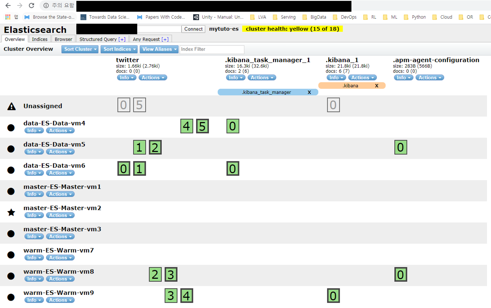

## 1. Rolling Restart 자세히

- 시나리오 : Warm 데이터 노드의 메모리의 설정을 변경하고 다시 클러스터에 discovery

~~~
GET _cluster/health

{
  "cluster_name" : "mytuto-es",
  "status" : "green",
  "timed_out" : false,
  "number_of_nodes" : 9,
  "number_of_data_nodes" : 6,
  "active_primary_shards" : 3,
  "active_shards" : 6,
  "relocating_shards" : 0,
  "initializing_shards" : 0,
  "unassigned_shards" : 0,
  "delayed_unassigned_shards" : 0,
  "number_of_pending_tasks" : 0,
  "number_of_in_flight_fetch" : 0,
  "task_max_waiting_in_queue_millis" : 0,
  "active_shards_percent_as_number" : 100.0
}
~~~

### 1.1 Twitter Index 생성

- twitter 인덱스의 샤드를 6개로 설정하고 replicas의 개수를 1개로 설정함

~~~
PUT twitter
{
  "settings": {
    "index.number_of_shards": 6,
    "index.number_of_replicas": 1
  }
}

{
  "acknowledged" : true,
  "shards_acknowledged" : true,
  "index" : "twitter"
}
~~~

### 1.2 Routing을 Off로 변경

- 전체 클러스터에 new_primaries를 설정
  - 클러스터가 전체가 Off되는 경우 샤드는 남아있지만 라우팅 설정은 전부 초기화됨

~~~
# Routing Off
PUT _cluster/settings
{
  "transient" : {
    "cluster.routing.allocation.enable" : "new_primaries"
  }
}

{
  "acknowledged" : true,
  "persistent" : { },
  "transient" : {
    "cluster" : {
      "routing" : {
        "allocation" : {
          "enable" : "new_primaries"
        }
      }
    }
  }
}

# 변경된 클러스터 settings 확인
GET _cluster/settings?flat_settings
{
  "persistent" : { },
  "transient" : {
    "cluster.routing.allocation.enable" : "new_primaries"
  }
}
~~~

### 1.3 Primary / Replica 샤드 간 데이터 동기화 설정

~~~
## 동기화 실행
POST _flush/synced

{
  "_shards" : {
    "total" : 18,
    "successful" : 18,
    "failed" : 0
  },
  "twitter" : {
    "total" : 12,
    "successful" : 12,
    "failed" : 0
  },
  ".kibana_task_manager_1" : {
    "total" : 2,
    "successful" : 2,
    "failed" : 0
  },
  ".apm-agent-configuration" : {
    "total" : 2,
    "successful" : 2,
    "failed" : 0
  },
  ".kibana_1" : {
    "total" : 2,
    "successful" : 2,
    "failed" : 0
  }
}
~~~

### 1.4 특정 노드에 접속하여 ES를 stop

- ex. warm 데이터 노드의 메모리 설정을 업그레이드하기 위해 접속
  - warm-ES-Warm-vm7의 설정을 변경

~~~
## stop 하는 순간 unassigned 인덱스들이 생겨남
## 이때 클러스터의 상태가 Green에서 Yellow로 변경됨
$ sudo systemctl stop elasticsearch

$ sudo -s

$ vi /etc/elasticsearch/jvm.options

-Xms4g
-Xmx4g
~~~

### 1.5 노드를 다시 실행 및 다시 추가된 노드 확인

- ES를 다시 시작한다고 unassigned 샤드가 재할당되지 않음
  - 클러스터에 노드는 올라와 있지만 unassigned 노드는 여전히 재할당되지 않은 것을 알 수 있음

~~~
$ sudo systemctl start elasticsearch

## warm-ES-Warm-vm7이 제대로 작동하고 있는 것을 확인할 수 있음
GET _cat/nodes
10.10.1.9   9 36 1 0.03 0.09 0.10 dil - data-ES-Data-vm6
10.10.1.7   9 36 1 0.05 0.08 0.06 dil - data-ES-Data-vm4
10.10.1.5  12 46 2 0.10 0.15 0.17 ilm * master-ES-Master-vm2
10.10.1.12  4 75 0 0.00 0.02 0.05 dil - warm-ES-Warm-vm9
10.10.1.8   7 36 0 0.02 0.06 0.06 dil - data-ES-Data-vm5
10.10.1.6   7 36 1 0.00 0.05 0.07 ilm - master-ES-Master-vm3
10.10.1.11  3 75 1 0.01 0.03 0.05 dil - warm-ES-Warm-vm8
10.10.1.4  12 36 1 0.04 0.10 0.08 ilm - master-ES-Master-vm1
10.10.1.10  4 75 1 0.29 0.19 0.11 dil - warm-ES-Warm-vm7
~~~

### 1.6 라우팅 할당 On

- 라우팅을 초기화 시키면 이 때 비로소 unassigned 샤드들이 다시 재할당되고 클러스터의 상태가 Green으로 변경됨

~~~
## 라우팅을 다시 초기화 시킴
PUT _cluster/settings
{
	"transient" : {
		"cluster.routing.allocation.enable" : null # null은 초기화 내용임. 즉, all
	}
}

{
  "acknowledged" : true,
  "persistent" : { },
  "transient" : { }
}

## 클러스터 API로 settings 확인
GET _cluster/settings?flat_settings

{
  "persistent" : { },
  "transient" : { }
}

## 
GET _cat/health?v
epoch      timestamp cluster   status node.total node.data shards pri relo init unassign pending_tasks max_task_wait_time active_shards_percent
1581007251 16:40:51  mytuto-es green           9         6     18   9    0    0        0             0                  -                100.0%
~~~

