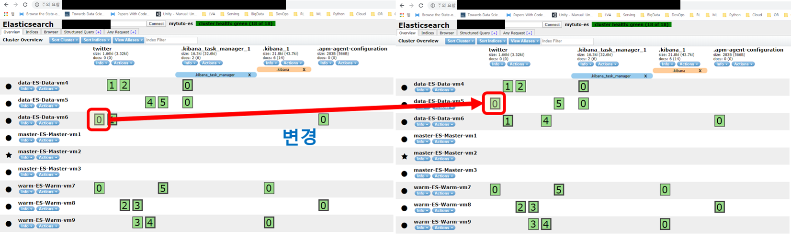
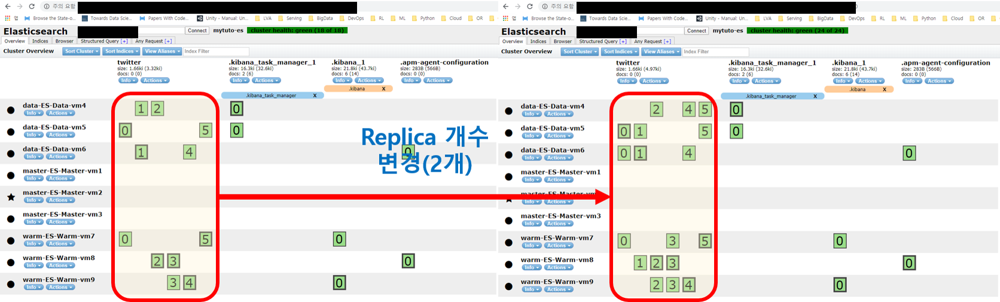
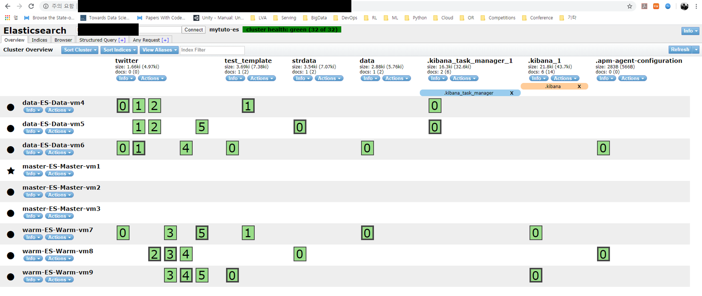
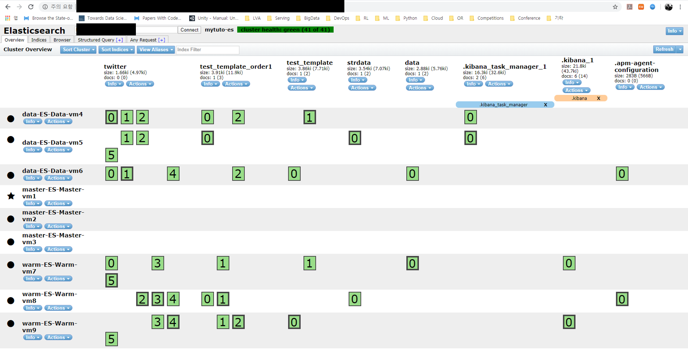
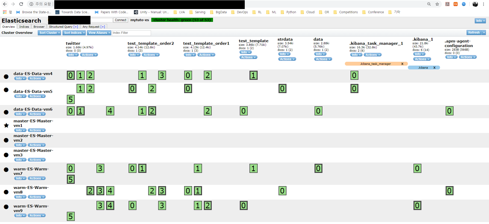
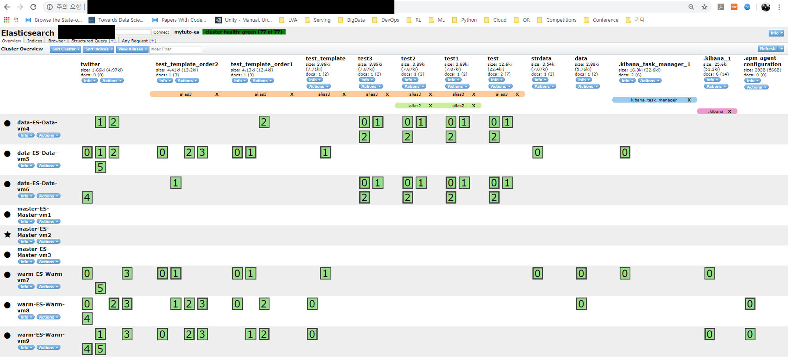

## 3. 중요 명령어

> 1. Shard Allocation
> 2. Dynamic Index Setting
> 3. Template
> 4. Cluster API
> 5. Reindex
> 6. bulk
> 7. Aliases
> 8. etc

### 3.1 샤드 Allocation

#### 3.1.1 POST _cluster/reroute

- 강제로 사드를 다른 노드로 변경

~~~
## Shard Reroute 
POST _cluster/reroute 
{
  "commands" : [ 
    {
      "move" : {
        "index" : "twitter",
        "shard" : 0,
        "from_node" : "data-ES-Data-vm6",
        "to_node" : "data-ES-Data-vm5"
     }
    } 
  ]
}

{
  "acknowledged" : true,
  "state" : {
    "cluster_uuid" : "b3-Ksr_aRqafQOG5rc0nqw",
    "version" : 281,
    "state_uuid" : "JQw4fr6ST5-rz5hqrzlgrw",
    "master_node" : "G_ELEJK6SjGyJeD0ctEc_A",
    "blocks" : { },
    "nodes" : {
      "zclQbwDhSja44zBU_l---w" : {
        "name" : "master-ES-Master-vm1",
        ...
        ...
~~~

#### 3.1.2 Shard Allocation by Watermark 

- 일반적인 방법인 Disk Threshold를 사용하는 방법
  - default값

~~~
## watermark 설정
PUT _cluster/settings?flat_settings
{
  "transient": {
    "cluster.routing.allocation.disk.threshold_enabled": "true",
    "cluster.routing.allocation.disk.watermark.low": "85%",
    "cluster.routing.allocation.disk.watermark.high": "90%",
    "cluster.routing.allocation.disk.watermark.flood_stage": "95%"
  }
}

{
  "acknowledged" : true,
  "persistent" : { },
  "transient" : {
    "cluster.routing.allocation.disk.threshold_enabled" : "true",
    "cluster.routing.allocation.disk.watermark.flood_stage" : "95%",
    "cluster.routing.allocation.disk.watermark.high" : "90%",
    "cluster.routing.allocation.disk.watermark.low" : "85%"
  }
}

## 클러스터 세팅 확인
GET _cluster/settings?flat_settings

{
  "persistent" : { },
  "transient" : {
    "cluster.routing.allocation.disk.threshold_enabled" : "true",
    "cluster.routing.allocation.disk.watermark.flood_stage" : "95%",
    "cluster.routing.allocation.disk.watermark.high" : "90%",
    "cluster.routing.allocation.disk.watermark.low" : "85%"
  }
}
~~~

### 3.2 Dynamic Index Setting

#### 3.2.1 Number of replicas

- 리플리카 개수 변경

~~~
## Dynamic Index Setting 
# Number Of Replicas
PUT twitter/_settings
{
  "index.number_of_replicas" : 2
}

{
  "acknowledged" : true
}

{
  "twitter" : {
    "settings" : {
      "index.creation_date" : "1581004716638",
      "index.number_of_replicas" : "2",
      "index.number_of_shards" : "6",
      "index.provided_name" : "twitter",
      "index.uuid" : "BZStiz4gSjyCt9MiaGh0yQ",
      "index.version.created" : "7050199"
    }
  }
}
~~~

#### 3.2.2 Refresh Interval

~~~
# Refresh Interval
PUT twitter/_settings
{
  "index.refresh_interval" : "2s"
}

{
  "acknowledged" : true
}

GET twitter/_settings?flat_settings

{
  "twitter" : {
    "settings" : {
      "index.creation_date" : "1581004716638",
      "index.number_of_replicas" : "2",
      "index.number_of_shards" : "6",
      "index.provided_name" : "twitter",
      "index.refresh_interval" : "2s", ## 1초에서 2초로 변경된 것을 알 수 있음
      "index.uuid" : "BZStiz4gSjyCt9MiaGh0yQ",
      "index.version.created" : "7050199"
    }
  }
}
~~~

#### 3.2.3 Routing Allocation

~~~
## allocation
PUT twitter/_settings
{
  "index.routing.allocation.enable" : null
}

{
  "acknowledged" : true
}

## 클러스터 상태 확인
GET _cluster/settings?flat_settings

{
  "persistent" : { },
  "transient" : {
    "cluster.routing.allocation.disk.threshold_enabled" : "true",
    "cluster.routing.allocation.disk.watermark.flood_stage" : "95%",
    "cluster.routing.allocation.disk.watermark.high" : "90%",
    "cluster.routing.allocation.disk.watermark.low" : "85%"
  }
}
~~~

#### 3.2.4 Routing Rebalance

~~~
## Routing Rebalance
PUT twitter/_settings
{
  "index.routing.rebalance.enable" : null
}

{
  "acknowledged" : true
}

## 클러스터 상태 확인
## 
GET _cluster/settings?flat_settings

{
  "persistent" : { },
  "transient" : {
    "cluster.routing.allocation.disk.threshold_enabled" : "true",
    "cluster.routing.allocation.disk.watermark.flood_stage" : "95%",
    "cluster.routing.allocation.disk.watermark.high" : "90%",
    "cluster.routing.allocation.disk.watermark.low" : "85%"
  }
}

~~~

#### 3.2.5 Index Dynamic Mapping

- string의 경우 dynamic mapping되면 text, keyword 2개를 자동으로 생성
  - keyword 필드를 꼭 기억하고 있어야 함

~~~
# Index Dynamic Mapping 
PUT data/_doc/1 
{ "count": 5 }

{
  "_index" : "data",
  "_type" : "_doc",
  "_id" : "1",
  "_version" : 1,
  "result" : "created",
  "_shards" : {
    "total" : 2,
    "successful" : 1,
    "failed" : 0
  },
  "_seq_no" : 0,
  "_primary_term" : 1
}

## 매핑 확인
GET data/_mapping

{
  "data" : {
    "mappings" : {
      "properties" : {
        "count" : {
          "type" : "long"
        }
      }
    }
  }
}

##
PUT strdata/_doc/1
{ "stringdata": "strdata" }

{
  "_index" : "strdata",
  "_type" : "_doc",
  "_id" : "1",
  "_version" : 1,
  "result" : "created",
  "_shards" : {
    "total" : 2,
    "successful" : 1,
    "failed" : 0
  },
  "_seq_no" : 0,
  "_primary_term" : 1
}

## 매핑 확인
# ES의 dynamic mapping의 경우 text와 keyword 두 가지로 매핑되는 것을 꼭 기억해야함
GET strdata/_mapping

{
  "strdata" : {
    "mappings" : {
      "properties" : {
        "stringdata" : {
          "type" : "text", ### text
          "fields" : {
            "keyword" : {			
              "type" : "keyword",   ### keyword 매우 중요
              "ignore_above" : 256
            }
          }
        }
      }
    }
  }
}

~~~

 

### 3.3 Template

- 복수의 템플릿을 설정 가능함
  - 와일드카드 형태로 사용 가능
  - test_template 인덱스가 mytemplate에 의해 프라이머리 샤드의 개수가 2개인 것을 알 수 있음

~~~
## 템플릿 적용
PUT _template/mytemplate
{
  "index_patterns": ["te*", "bar*"],
  "order" : 0,
  "settings": {
    "number_of_shards": 2
  }
}

{
  "acknowledged" : true
}

## 내가 지정한 mytemplate 세팅 확인 
GET _template/mytemplate?flat_settings

{
  "mytemplate" : {
    "order" : 0,
    "index_patterns" : [
      "te*",
      "bar*"
    ],
    "settings" : {
      "index.number_of_shards" : "2"
    },
    "mappings" : { },
    "aliases" : { }
  }
}

POST test_template/_doc
{
  "test": "template"
}

{
  "_index" : "test_template",
  "_type" : "_doc",
  "_id" : "q0rFG3ABbmk_TcJG4ywN",
  "_version" : 1,
  "result" : "created",
  "_shards" : {
    "total" : 2,
    "successful" : 2,
    "failed" : 0
  },
  "_seq_no" : 0,
  "_primary_term" : 1
}
~~~

#### 다른 Template인 mytemplate_order1 정의 

~~~
## 또다른 템플릿 정의
PUT _template/mytemplate_order1
{
  "index_patterns": ["test*"],
  "order" : 1,
  "settings": {
    "number_of_shards": 3,
    "number_of_replicas": 2
  }
}

{
  "acknowledged" : true
}

## 템플릿 mytemplate_order1 세팅 확인
GET _template/mytemplate_order1?flat_settings

{
  "mytemplate_order1" : {
    "order" : 1,
    "index_patterns" : [
      "test*"
    ],
    "settings" : {
      "index.number_of_replicas" : "2",
      "index.number_of_shards" : "3"
    },
    "mappings" : { },
    "aliases" : { }
  }
}

## 인덱스 생성
POST test_template_order1/_doc
{
  "test": "template"
}

{
  "_index" : "test_template_order1",
  "_type" : "_doc",
  "_id" : "rErMG3ABbmk_TcJG1yxT",
  "_version" : 1,
  "result" : "created",
  "_shards" : {
    "total" : 3,
    "successful" : 1,
    "failed" : 0
  },
  "_seq_no" : 0,
  "_primary_term" : 1
}
~~~

#### Template인 mytemplate_order2 정의 

~~~
PUT _template/mytemplate_order2
{
  "index_patterns": ["test_template*"],
  "order" : 2,
  "settings": {
    "number_of_shards": 4
  }
}

{
  "acknowledged" : true
}

## 세팅 확인
GET _template/mytemplate_order2?flat_settings

{
  "mytemplate_order2" : {
    "order" : 2,
    "index_patterns" : [
      "test_template*"
    ],
    "settings" : {
      "index.number_of_shards" : "4"
    },
    "mappings" : { },
    "aliases" : { }
  }
}

## 인덱스 생성
POST test_template_order2/_doc
{
  "test": "template"
}

{
  "_index" : "test_template_order2",
  "_type" : "_doc",
  "_id" : "rUrQG3ABbmk_TcJG1Czj",
  "_version" : 1,
  "result" : "created",
  "_shards" : {
    "total" : 3,
    "successful" : 1,
    "failed" : 0
  },
  "_seq_no" : 0,
  "_primary_term" : 1
}
~~~

#### 템플릿 종류 확인 및 제거

- 템플릿을 제거해도 이미 생성된 인덱스에 적용된 내용은 변경되지 않음

~~~
GET _cat/templates?v&s=name

name                            index_patterns               order      version
.logstash-management            [.logstash]                  0          
.management-beats               [.management-beats]          0          70000
.ml-anomalies-                  [.ml-anomalies-*]            0          7050199
.ml-config                      [.ml-config]                 0          7050199
.ml-meta                        [.ml-meta]                   0          7050199
.ml-notifications-000001        [.ml-notifications-000001]   0          7050199
.ml-state                       [.ml-state*]                 0          7050199
.monitoring-alerts-7            [.monitoring-alerts-7]       0          7000199
.monitoring-beats               [.monitoring-beats-7-*]      0          7000199
.monitoring-es                  [.monitoring-es-7-*]         0          7000199
.monitoring-kibana              [.monitoring-kibana-7-*]     0          7000199
.monitoring-logstash            [.monitoring-logstash-7-*]   0          7000199
.slm-history                    [.slm-history-1*]            2147483647 
.transform-internal-003         [.transform-internal-003]    0          7050199
.transform-notifications-000002 [.transform-notifications-*] 0          7050199
.triggered_watches              [.triggered_watches*]        2147483647 
.watch-history-10               [.watcher-history-10*]       2147483647 
.watches                        [.watches*]                  2147483647 
mytemplate                      [te*, bar*]                  0          
mytemplate_order1               [test*]                      1          
mytemplate_order2               [test_template*]             2       

## 템플릿 제거
DELETE _template/mytemplate
DELETE _template/mytemplate_order1
DELETE _template/mytemplate_order2

## 템플릿 확인
GET _cat/templates?v&s=name

name                            index_patterns               order      version
.logstash-management            [.logstash]                  0          
.management-beats               [.management-beats]          0          70000
.ml-anomalies-                  [.ml-anomalies-*]            0          7050199
.ml-config                      [.ml-config]                 0          7050199
.ml-meta                        [.ml-meta]                   0          7050199
.ml-notifications-000001        [.ml-notifications-000001]   0          7050199
.ml-state                       [.ml-state*]                 0          7050199
.monitoring-alerts-7            [.monitoring-alerts-7]       0          7000199
.monitoring-beats               [.monitoring-beats-7-*]      0          7000199
.monitoring-es                  [.monitoring-es-7-*]         0          7000199
.monitoring-kibana              [.monitoring-kibana-7-*]     0          7000199
.monitoring-logstash            [.monitoring-logstash-7-*]   0          7000199
.slm-history                    [.slm-history-1*]            2147483647 
.transform-internal-003         [.transform-internal-003]    0          7050199
.transform-notifications-000002 [.transform-notifications-*] 0          7050199
.triggered_watches              [.triggered_watches*]        2147483647 
.watch-history-10               [.watcher-history-10*]       2147483647 
.watches                        [.watches*]                  2147483647 
~~~

#### HOT / WARM Data

- hot / warm 데이터는 템플릿을 이용하여 설정

~~~
## 와일드카드를 사용해 설정
PUT _template/mytemplate
{
  "index_patterns": ["*"],
  "order" : 0,
  "settings": {
    "number_of_shards": 3,
    "index.routing.allocation.require.box_type" : "hotdata"
  }
}

{
  "mytemplate" : {
    "order" : 0,
    "index_patterns" : [
      "*"
    ],
    "settings" : {
      "index.number_of_shards" : "3",
      "index.routing.allocation.require.box_type" : "hotdata"
    },
    "mappings" : { },
    "aliases" : { }
  }
}

## 인덱스 설정에 warmdata를 설정
PUT data/_settings
{
  "index.routing.allocation.require.box_type" : "warmdata"
}
~~~

### 3.4 Cluster API

- transient, persistent 설정

~~~
# 1. transient, persistent 설정해보기 
PUT /_cluster/settings?flat_settings
{
  "persistent" : {
    "discovery.zen.minimum_master_nodes" : 1
  },
  "transient" : {
    "cluster.routing.allocation.enable" : "none"
  }
}

GET _cluster/settings?flat_settings

## 2. _cluster API 로 클러스터 라우팅 할당 모드를 변경 
PUT _cluster/settings?flat_settings
{
  "transient" : {
    "cluster.routing.allocation.enable" : "none"
  }
}

GET _cluster/settings?flat_settings

## 3. _cluster API 로 운영중인 특정 노드의 샤드 제외 

PUT _cluster/settings?flat_settings
{
  "transient" : {
    "cluster.routing.allocation.exclude._ip" : "1.1.1.1, 2.2.2.2, 3.3.3.*"
  }
}

#! Deprecation: [discovery.zen.minimum_master_nodes] setting was deprecated in Elasticsearch and will be removed in a future release! See the breaking changes documentation for the next major version.
{
  "acknowledged" : true,
  "persistent" : { },
  "transient" : {
    "cluster.routing.allocation.exclude._ip" : "1.1.1.1, 2.2.2.2, 3.3.3.*"
  }
}

GET _cluster/settings?flat_settings

{
  "persistent" : {
    "discovery.zen.minimum_master_nodes" : "1"
  },
  "transient" : {
    "cluster.routing.allocation.enable" : "none",
    "cluster.routing.allocation.exclude._ip" : "1.1.1.1, 2.2.2.2, 3.3.3.*"
  }
}

# 4. POST _cluster/reroute 를 이용한 샤드 할당에 실패한 샤드 강제 분배 
POST _cluster/reroute?retry_failed

# 5. POST _cluster/allocation/explain 을 통해 샤드가 왜 할당되지 못했는지를 확인 
POST _cluster/allocation/explain

# 6. _all 이나 wildcard 를 대상으로 삭제작업 방지 
PUT _cluster/settings?flat_settings
{
  "transient": {
    "action.destructive_requires_name": true
  } 
}

GET _cluster/settings?flat_settings
~~~

### 3.5 Reindex

~~~
# POST _reindex 를 이용한 재색인 

POST _reindex
{
  "source": {
    "index": "twitter"
  },
  "dest": {
    "index": "new_twitter"
  }
}

# 외부 클러스터에서 reindex 가능 

# sudo vi /etc/elasticsearch/elasticsearch.yml
# 아래 내용 추가하려 해당 whitelist 로 부터 인덱스를 재색인 할 수 있도록 설정
# reindex.remote.whitelist: "{SRC_Cluster_URL}:9200"

# curl -XPOST -H 'Content-Type: application/json' http://{my_cluster_url}/_reindex
#{
#    "source": {
#        "remote": {
#            "host": "http://{SRC_Cluster_URL}:9200",
#        },
#        "index": "twitter"
#    },
#    "dest": {
#        "index": "re_twitter"
#    }
#}
~~~

### 3.6 bulk

~~~
POST _bulk
{ "index" : { "_index" : "test", "_type" : "_doc", "_id" : "1" } }
{ "field1" : "value1" }
{ "delete" : { "_index" : "test", "_type" : "_doc", "_id" : "2" } }
{ "create" : { "_index" : "test", "_type" : "_doc", "_id" : "3" } }
{ "field1" : "value3" }
{ "update" : {"_id" : "1", "_type" : "_doc", "_index" : "test"} }
{ "doc" : {"field2" : "value2"} }

## score의 값을 확인할 수 있음
GET test/_search
{
  "took" : 20,
  "timed_out" : false,
  "_shards" : {
    "total" : 3,
    "successful" : 3,
    "skipped" : 0,
    "failed" : 0
  },
  "hits" : {
    "total" : {
      "value" : 2,
      "relation" : "eq"
    },
    "max_score" : 1.0,
    "hits" : [
      {
        "_index" : "test",
        "_type" : "_doc",
        "_id" : "3",
        "_score" : 1.0,
        "_source" : {
          "field1" : "value3"
        }
      },
      {
        "_index" : "test",
        "_type" : "_doc",
        "_id" : "1",
        "_score" : 1.0,
        "_source" : {
          "field1" : "value1",
          "field2" : "value2"
        }
      }
    ]
  }
}

# json 문서로 bulking 하기 
# curl -s -H "Content-Type: application/x-ndjson" -XPOST localhost:9200/_bulk --data-binary “@accounts.json"

# curl -s -H "Content-Type: application/x-ndjson" -XPOST localhost:9200/_bulk --data-binary "@shakespeare_6.0.json"
~~~

### 3.7 Aliases

~~~
# aliases API 

# test index 생성
POST test1/_doc 
{ "name": "test1" }

POST test2/_doc 
{ "name": "test1" }

POST test3/_doc 
{ "name": "test1" }

POST /_aliases
{
  "actions": [
    { "add": { "index": "test1", "alias": "alias1" } }
  ]
}

POST test1/_aliases/alias_direct

# 삭제
POST /_aliases
{
  "actions": [
    { "remove": { "index": "test1", "alias": "alias1" } }
  ]
}

DELETE test1/_aliases/alias_direct

# 여러 인덱스에 앨리어싱 

POST /_aliases
{
  "actions": [
    { "add": { "indices": ["test1", "test2"], "alias": "alias2" } }
  ]
}

# 와일드카드 이용

POST /_aliases
{
  "actions": [
    { "add": { "index": "test*", "alias": "alias3" } }
  ]
}
~~~

### 3.8 기타

~~~
# 세그먼트 병합하기 

POST /_forcemerge?max_num_segments=1

# index open/close 
POST twitter/_close
POST twitter/_open
~~~

