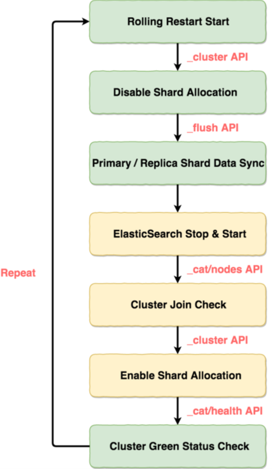
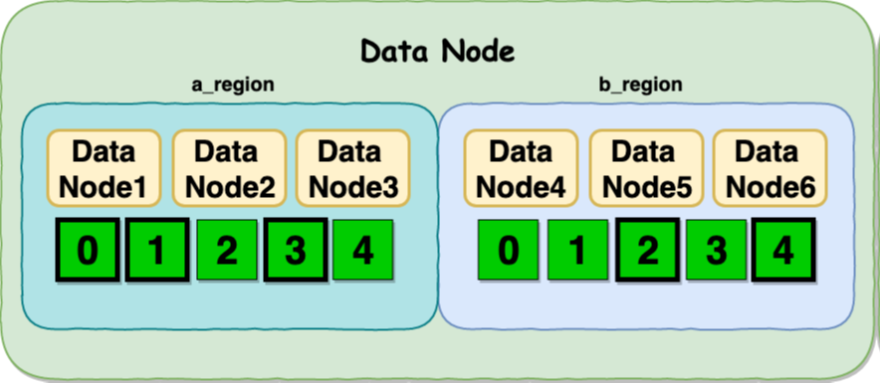
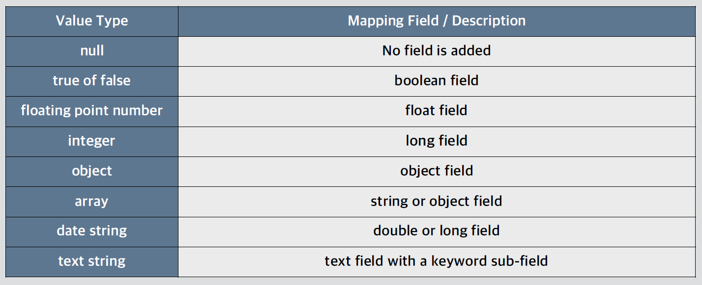
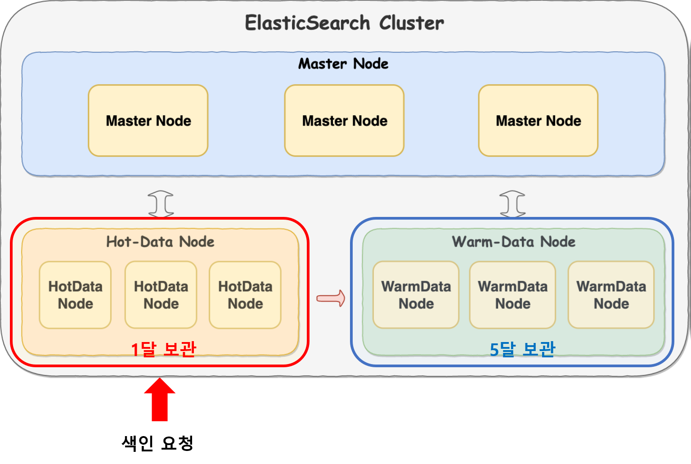
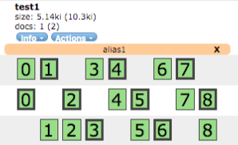
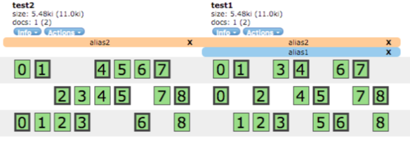
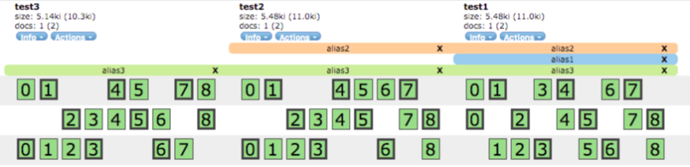

# Elasticsearch 클러스터 운영

> **Rolling Restart** - 무중단 운영을 위한 작업방법
>
> **Shard Allocation** - 안정적인 성능 제공을 위한 샤드 분배 방법
>
> **Index Setting** - 인덱스는 어떻게 설정해야 하는가
>
> **Template** - 미리 정의된 템플릿으로 인덱스 만들기
>
> **hot-warm data node** - 비용 절감하기

## Rolling Restart

- 시스템 작업 혹은 ES 버전 업그레이드를 해야하는 니즈가 있는 경우

  - ES의 업그레이드 주기는 굉장히 빠름

- 레플리카가 있는 클러스터의 경우(없을 수가 없다...), 어플리케이션 재시작 혹은 시스템 리붓을 할 때마다 클러스터 내부에서는 주인을 잃은 샤드들이 기본 라우팅 설정으로 복구(자동으로 재할당)

- 많은 노드들을 작업해야 할 때면 이런 샤드들이 재할당 되기를 기다렸다가 클러스터가 green 상태가 될 때 까지는 **시간 뿐 아니라 네트워크와 Disk I/O 등의 많은 리소스를 필요**

  => 이런 작업을 할 때에 샤드의 재할당이 일어나지 않게 하는 것이 Rolling Start

### Rolling Restart 순서

1. **_cluster API로 클러스터 라우팅 할당을 new_primaries로 변경**

   - new_primaries를 설정할 경우 샤드의 재할당(1분 설정)이 막힘

   ~~~
   PUT _cluster/settings
   {
   	"transient": {
   		"cluster.routing.allocation.enable" : "new_primaries"
   	}
   }
   ~~~

   

2. **Primary / Replica 샤드 간 데이터 동기화**

   - API를 사용한 이후 까지는 클러스터는 Green상태

   ~~~
   POST _flush/synced
   ~~~

   

3. **작업하고자 하는 노드의 프로세스 중지**

   - 클러스터에서 제외된 노드 내의 샤드들이 unssigned 상태로 변경
   - stop이 후 클러스터의 상태는 yellow로 변경

   ~~~
   $ sudo systemctl stop elasticsearch
   ~~~

   

4. **작업 진행 후 ES 프로세스를 재시작**

   - ES 버전 업그레이드, 플러그인 업그레이드 등....
   - 프로세스가 제대로 올라오면 클러스터의 해당 노드가 없는 상태로 추가

   ~~~
   $ sudo systemctl start elasticsearch
   
   $ GET _cat/nodes
   ~~~

   

5. **클러스터에 추가된 것을 확인했으면 라우팅 할당 On**

   ~~~
   PUT _cluster/settings
   {
   	"transient" : {
   		"cluster.routing.allocation.enable" : null # null은 초기화 내용임. 즉, all
   	}
   }
   
   $ GET _cat/health?v
   ~~~

   

6. **이후에 unassigned 샤드들이 올라온 노드로 복구됨**

### Rolling Restart 더보기

- https://www.elastic.co/guide/en/elasticsearch/reference/current/rolling-upgrades.html

## Shard Allocation

- ES를 운영하다보면 여러대로 구성된 클러스터에 노드별 용량이 상이해지는 경우가 발생
- 생성되는 인덱스의 샤드가 노드수와 동일하다면 큰 차이가 발생하지 않겠지만 운영하다보면 노드 증설 등으로 인해 기존에 계획대로 샤드 배치가 되지 않는 경우가 자주 발생함(당연함)
- 노드에 샤드가 똑같이 분배되지 않을 때에 용량 이격은 벌어짐
  - 생성되는 샤드 개수가 노드 개수와 다를 때 : 샤드 개수를 계획할 때 노드 개수를 고려해야 함

### 1. POST _cluster/reroute 를 이용한 샤드 강제 분배

- 클러스터의 reroute를 이용(지금은 사용X)

- reroute 더보기 : https://www.elastic.co/guide/en/elasticsearch/reference/current/cluster-reroute.html

  ~~~
  POST _cluster/reroute
  {
  	"commands" : [{
  		"move" : {
  			"index" : "twitter",
  			"shard" : 0, # 샤드번호
  			"from_node" : "xxxx",
  			"to_node" : "yyyy" # 목적지 노드
  		}
  	}]
  }
  ~~~

  

### 2. Disk-based Shard Allocation

- PUT _cluster/settings의 disk threshold를 이용하는 방법

- Defacto Standard임(reroute는 사용X)

- Disk-based Shard Allocation 더보기 : https://www.elastic.co/guide/en/elasticsearch/reference/current/disk-allocator.html

  ~~~
  PUT _clusters/settings
  {
  	"transient" : {
  		"cluster.routing.allocation.disk.threshold_enabled": "true",
          "cluster.routing.allocation.disk.watermark.low": "85%",
          "cluster.routing.allocation.disk.watermark.high": "90%",
          "cluster.routing.allocation.disk.watermark.flood_stage": "95%"
  	} 
  }
  ~~~

  - **watermark.low**

    - 더 이상 차오르지 못하도록 임계치. 신규로 생성되는 인덱스는 제외

  - **watermark.high**

    - 설정 즉시 설정한 임계치 이상인 노드를 임계치로 맞추기 위해 샤드 재분배 실행

  - **watermark.flood_stage**

    - 디스크 용량이 더 이상 차오르지 못하도록 할 임계치
    - 임계치가 넘으면 인덱스를 삭제 가능한 read only 모드로 변경
    - 데이터 정리 후 해당 인덱스에 대해 read only 해제 필요

    ~~~
    PUT twitter/_settings
    {
    	"index.blocks.read_only_allow_delete" : null
    }
    ~~~

    

### 데이터 노드 그룹으로 샤드 할당

- **cluster.routing.allocation.awareness.attributes**
  - 마스터 노드에 세팅하는 순간부터 적용됨

#### node.attr.rack_id

- **node.attr.rack_id**: a_region
- **node.attr.rack_id**: b_region
  - 데이터 노드의 region 군을 세팅
  - node.attr.rack_id는 elasticsearch.yml 파일에 설정해야 함 
  - **cluster.routing.allocation.awareness.attributes가 적용되면 node.attr.rack_id 가 바로 실행됨**
  - "a_region"이라는 value는 그냥 값일 뿐 ES내부에서 알아서 묶어줌
    - 리전별로 미리 
- **마스터 노드 awareness 하는 순간 샤드를 데이터 노드에 세팅된 rack_id를 기준으로 rebalancing 시작**
- **하나의 리전에서 서비스하다가 HA가 필요할 때에 데이터노드를 먼저 세팅 후 마스터 노드에서 세팅해야 함**

## Index setting

> 1) Static index settings
>
> - number_of_shards
>
> **2) Dynamic index settings**
>
> - **number_of_replicas**
> - **refresh_interval**
> - **index.routing.allocation.enable**
>
> 3) other settings..
>
> - Anaysis, Mappings, Slowlog(쿼리가 얼마나 걸리는지)

### Dynamic index settings

- 운영중에 인덱스 세팅을 변경
- RestAPI로 변경사항을 요청

### number_of_replicas

- 운영중에 인덱스 세팅을 변경

- REST API로 변경사항을 요청

  ~~~
  PUT twitter/_settings
  {
  	"index.number_of_replicas" : 2
  }
  ~~~

### refresh_interval

- 색인이 될 때 데이터가 메모리 페이지 캐시로 쓰인 이후 검색이 가능하도록 디스크로 쓰이는 시간 텀

- reset은 null로 설정함

  ~~~
  PUT twitter/_settings
  {
  	"index.refresh_interval" : "2s"
  }
  
  GET twitter/_settings
  ~~~

  

### Routing Allocation : 대상이 최초 인덱스와 unsigned

- **새롭게 할당된 데이터 노드에 대해 샤드를 재할당하는 방식 결정**

  - all(default) : 모든 샤드들에게 할당을 허용

  - none : 샤드가 할당되지 않도록 설정

  - primaries: 프라이머리 샤드만 할당되도록 설정

  - new_primaries : 새롭게 생성되는 인덱스의 프라이머리 샤드만 할당되도록 설정

  - null : default로 설정(all을 선택하는 것과 동일)

  ~~~
  PUT twitter/_settings
  {
  	"index.routing.allocation.enable" : null
  }
  ~~~

### Routing Rebalance : 대상이 assigned

- **데이터 노드에 샤드를 어떤 방식으로 재배치할 것인지를 결정**

- **assigned 샤드를 대상으로 재배치 방식 결정**

  - all(degault) : 모든 샤드들에게 재배치 허용

  - none : 샤드가 재배치되지 않도록 설정

  - primaries : 프라이머리 샤드만 재배치되도록 설정

  - replicas : 레플리카 샤드만 재배치되도록 설정

  - null : default로 설정(all을 선택하는 것과 동일)

  ~~~
  PUT twitter/_settings
  {
  	"index.routing.rebalance.enable" : null
  }
  ~~~

  

### Mapping

- 문서가 색인될 때 문서와 문서에 포함된 필드들을 어떻게 저장할지 결정하는 과정

- 6.X 버전부터 Multi Mapping Deprecated

- **Dynamic Mapping**
  - ES가 인입되는 문서를 보고 알아서 타입을 찾아 매핑
- **Static Mapping**
  - 사용자가 정의한 스키마를 기준으로 매핑

~~~
PUT intdata/_doc/1
{
	"count" : 5
}

GET intdata/_mapping

PUT strdata/_doc/1
{
	"stringdata" : "strdata"
}

GET strdata/_mapping
~~~

> Dynamic Mapping으로 인덱스에 mappings가 정의되고, count key는 long타입으로 자동 매핑되어 매핑을 생성

### Dynamic Mapping Field

### Index Settings 더보기

- https://www.elastic.co/guide/en/elasticsearch/reference/current/index-modules.html#index-modulessettings

## Template

- 인덱스가 생성될 때 사용자 정의된 세팅이나 매핑을 자동으로 적용

  - 인덱스 패턴, 인덱스 세팅, 인덱스 매핑 관련 사항 정의
  - 인덱스가 생성될 때 패턴이 매칭되는 인덱스는 해당 정의를 따름
  - **order가 높은 번호가 낮은 번호를 override하여 merging**
  - template 더보기 : https://www.elastic.co/guide/en/elasticsearch/reference/current/indices-templates.html

  ~~~
  PUT _template/mytemplate
  {
  	"index_patterns" : ["te*", "bar*"],
  	"order" : 0,
  	"settings" : {
  		"index.number_of_shards" : 1
  	}
  }
  
  GET _template/mytemplate
  ~~~

- 템플릿 삭제는 DELETE Method

  ~~~
  DELETE _template/mytemplate
  ~~~

  

## Hot-data / Warm-data

- ES 에서는 기본적으로 Hot-data / Warm-data를 지원하지 않음
  - **설계시에 Hot/Warm-data 처럼 보이게끔 만들어서 사용**
- ES 에서는 빠른 응답을 위해 **SSD 디스크 사용을 권고**하는데 인덱스가 크고 보관기간이 길다면 당연히 비용 부담이 증가하고 이 때문에 문제가 발생
  - 그래서 자주 안보는 데이터들은 상대적으로 비용이 저렴하고 고용량인 SATA 디스크를 이용
  - 최근 데이터 주기를 정하여 시간이 지난 인덱스의 샤드를 WarmData 노드쪽으로 재할당
- Hot/Warm-data 처럼 보이게끔 만들기 위해선 **elasticsearch.yml 파일, Template, Curator 를 이용하여 운용해야 함**

### Hot/Warm 구조에서 주의할 점

- 색인은 HotData 노드로 진행
- 빠르게 보아야 할 기간이 지나면 WarmData 노드로 curator 를 통해 샤드 이동
- 6개월 전체 조회를 하는 경우 WarmData 노드에서 처리할 데이터가 HotData노드보다 5배 많음
  - WarmData 노드 쪽 힙을 더 많이 할당해야 함
- 한 달 이후는 전부 Warm Data 노드로 샤드를 재할당해야 함
  - **Kibana ILM** : 하나의 클러스터만 관리할 수 있음
  - **Curator** : 복수의 클러스터를 관리할 수 있음
- Hot/Warm 더보기 : https://www.elastic.co/blog/hot-warm-architecture-in-elasticsearch-5-x

### 1. Hot-data/Warm-data setting

- 각각의 노드가 어떤 타입으로 운영되는지를 설정하여 시작

- **데이터 노드에만 정의**

  - hotdata는 그냥 변수이므로 값만 통일해서 사용하면 ES가 알아서 설정해줌

  ~~~
  $ sudo vi /etc/elasticsearch/elasticsearch.yml
  
  ## hotdata node setting
  node.attr.box_type: hotdata
  
  ## warmdata node setting
  node.attr.box_type: warmdata
  ~~~

  

### 2. Template 적용

- 템플을 통해 특정 패턴에 적용되는 새롭게 생성된 인덱스의 샤드를 hotdata 쪽으로만 할당

  ~~~
  PUT _template/mytemplate
  {
  	"index_patterns": ["*"], # 와일드카드 패턴
  	"order" : 0,
  	"settings": {
  		"index.number_of_shards": 1,
  		"index.routing.allocation.require.box.type" : "hotdata"
  	}
  }
  
  ## Hot/Warm 간 샤드 이동
  PUT _test/_settings
  {
  	"index.routing.allocation.require.box_type" : "warmdata"
  }
  ~~~

  - hotdata node에 보관하는 일자 이후의 인덱스들의 샤드들을 warmdata node로 재할당
  - 위 과정은 사람이 일일이 하기 힘들기 때문에 일반적으로 curator를 두어서 배치로 운영함

## Elasticsearch API 활용

> **Cluster API** : 클러스터 운영 API
>
> **Reindex API** : 데이터 마이그레이션
>
> **Bulk API** : 문서 한번에 색인
>
> 그 외 운영에 유용한 API

- ES는 여러가지 API를 두어서 온라인 상의 사용이나 운영의 편이를 도모함
  - 운영을 위해 클러스터 상태나 지표들을 볼 수 있는 모니터링 API
  - 클러스터의 설정을 변경할 수 있는 클러스터 설정변경 API
  - 데이터를 이관하거나 별칭을 달 수 있는 API 등

### 1. Cluster API

- 운영중인 클러스터의 세팅 정보 확인이나 온라인 상태로 설정을 변경할 수 있는 API
- 자주 변경할 여지가 있는 사항들은 _cluster API로 진행
- 설정 모드는 2가지
  - **Transient**
    - Full cluster restart 시 리셋되는 설정
  - **Persistent**
    - 사용자가 변경하지 않으면 영구적으로 보존되는 설정
    - static setting보다 운선순위가 높음
- 우선순위
  - **Transient > Persistent > elasticsearch.yml**

### 현재 클러스터 세팅 확인 및 초기화

~~~
## 클러스터 세팅 확인
GET _cluster/settings

## 클러스터 세팅 초기화
PUT _cluster/settings
{
	"persistent": {
		"cluster.routing.allocation.disk.threshold_enable" : null
	},
	"transient" : {
		"cluster.routing.allocation.enable" : null
	}
}
~~~

### 운영중인 특정 노드의 샤드 제외

~~~
PUT _cluster/settings
{
	"transient": {
		"cluster.routing.allocation.exclude._ip" : "1.1.1.1, 2.2.2.2, 3.3.3.3"
	}
}
~~~

- 좀 더 안정적인 롤링 리스타트를 할 때 샤드를 미리 다 제거하고 진행
- unassigned 샤드가 있는 상황에서 추가로 노드를 작업해야할 때 진행
- 아이피는 class 별도로 세팅 가능(ex 1.1.1.0/24)
  - _name : node name 기준으로도 exclude가능
  - _host: host name 기준으로로 exclude 가능

### reroute를 이용한 샤드 할당에 실패한 샤드 강제 분배

~~~
POST _cluster/reroute?retry_failed
~~~

- 인덱스 세팅 중 어떤 상황에 의해 할당되지 못한 샤드를 다시 할당하는 시도 횟수에 제한이 있음
- index.allocation.max_retries 값에 의해 default 로 5번만 추가 시도
- 5번 전부 실패하면 샤드 할당을 더이상 하지 않음
  - 디스크 볼륨이 부족한 경우에 5번 시도 후 샤드 할당을 포기
  - 디스크 볼륨을 정리하고 retry 를 시도

~~~
POST _cluster/allocation/explain
~~~

- POST _cluster/allocation/explain 을 통해 샤드가 왜 할당되지 못했는지를 확인
  - 용량 문제가 아닌데 retry가 시도된 후 복구가 되지 않을 때에는 해당 명령으로 원인을 확인

### 모든 인덱스에 대해 _all 이나 wildcard 를 대상으로 삭제작업 방지하기

~~~
PUT _cluster/settings
{
	"transient" : {
		"action.desctructive_requires_name" : true
	}
}
~~~

- 인덱스가 정의될 위치에 _all를 넣거나 wildcard (*) 를 넣으면 전체 인덱스에 대해 작업 가능
- DELETE 의 경우는 의도되지 않은 실수를 방지하기 위해 해당 작업 disable 가능

- persistent 에도 설정 가능

### Cluster API 더보기

- https://www.elastic.co/guide/en/elasticsearch/reference/current/cluster-update-settings.html
- https://www.elastic.co/guide/en/elasticsearch/reference/current/shards-allocation.html
- https://www.elastic.co/guide/en/elasticsearch/reference/current/allocation-filtering.html
- https://www.elastic.co/guide/en/elasticsearch/reference/current/cluster-reroute.html
- https://www.elastic.co/guide/en/elasticsearch/reference/current/cluster-allocation-explain.html
- https://www.elastic.co/guide/en/elasticsearch/reference/current/indices-delete-index.html

### 2. Reindex API

- POST _reindex 를 이용한 재색인

  - 인덱스를 복제할 때 사용
  - 원본 인덱스의 세팅이나 매핑은 복제되지 않음
  - 클러스터 내부 뿐 아니라 외부 클러스터의 인덱스도 복제 가능

  ~~~
  POST _reindex
  {
  	"source" : {
  		"index" : "twitter"
  	}
  	"dest" : {
  		"index" : "new_twitter"
  	}
  }
  ~~~

  

### 외부 클러스터에서 reindex

- 외부 클러스터에서 reindex 가능

- 인덱스를 **복제 받은 클러스터 elasticsearch.yml 에 원본 인덱스 클러스터를 whitelist 로 등록**

- reindex 더보기 : https://www.elastic.co/guide/en/elasticsearch/reference/current/docs-reindex.html

  ~~~
  $ vi /etc/elasticsearch/elasticsearch.yml
  
  reindex.remote.whitelist : "1.1.1.1:9200"
  
  $ curl -XPOST -H 'Content-Type: application/json' http://{my_cluster_url}/_reindex
  {
  	"source" : {
  		"remote" : {
  			"host" : "http://1.1.1.1:9200"
  		}
  		"index" : "twitter"
  	},
  	"dest" : {
  		"index" : "re_twitter"
  	}
  }
  ~~~

  

### 3. Bulk API

- 인덱스 문서의 색인, 삭제, 업데이트를 벌크로 진행할 수 있는 API

- Java, Python, Perl 등 언어별로 bulk api 라이브러리 제공

- Bulk API 더보기 : https://www.elastic.co/guide/en/elasticsearch/reference/current/docs-bulk.html

  ~~~
  POST _bulk
  { "index" : { "_index" : "test", "_type" : "_doc", "_id" : "1" } }
  { "field1" : "value1" }
  { "delete" : { "_index" : "test", "_type" : "_doc", "_id" : "2" } }
  { "create" : { "_index" : "test", "_type" : "_doc", "_id" : "3" } }
  { "field1" : "value3" }
  { "update" : {"_id" : "1", "_type" : "_doc", "_index" : "test"} }
  { "doc" : {"field2" : "value2"} }
  ~~~

  

### json file 형태의 문서 bulk api로 처리

~~~
$ curl -H 'Content-Type: application/x-ndjson' -XPOST 'localhost:9200/_bulk?pretty' --data-binary @accounts.json
~~~

### 4. 그 외 운영에 유용한 API

### \_aliases API

- 인덱스에 별칭을 부여하는 API

- _reindex API와 함께 자주 사용

- 존재하는 인덱스와 같은 이름으로는 설정 불가

  
  
  ~~~
  POST /_aliases
  {
  	"actions" : [
  		{"add" : {"index": "test1", "alias" : "alias1"}}
  	]
  }
  ~~~
  
  ~~~
  POST test1/_aliases/alias_direct
  
  POST /_aliases
  {
  	"actions" : [
  		{"remove" : {"index" : "test1", "alias" : "alias1"}}
  	]
  }
  ~~~
  
  

### 복수의 인덱스에 설정 가능

- 여러 인덱스에 걸쳐서 설정 가능

  
  
  ~~~
  POST /_aliases
  {
  	"actions" : [
  		{"add" : {"index" : ["test1", "test2"], "alias" : "alias2"}}
  	]
  }
  ~~~
  
  
  
  
  ~~~
  POST /_aliases
  {
  	"actions" : [
  		{"add" : {"index" : "test*", "alias" : "alias3"}}
  	]
  }
  ~~~
  
  

### \_forcemerge API

- segment 를 강제로 병합하는 API

- 색인 중인 인덱스에는 사용을 비추천

- 색인 끝난 인덱스는 하나의 segment 로 merge를 추천

- I/O 비용이 크기 때문에 색인이나 검색이 없는 시간대에 진행

  ~~~
  POST /_forcemerge?max_num_segments=1
  ~~~

  > 분석엔진으로 ES를 활용할 때 요긴하게 사용할 수 있음

### _open/close API

- 인덱스의 상태를 open/close 할 수 있는 API

- closed 된 인덱스는 read/write 불가

- 클러스터 전체 샤드에서 제외

- 라우팅 disabled

  ~~~
  POST twitter/_close
  POST twitter/_open
  ~~~

  

### 나머지 API들

- https://www.elastic.co/guide/en/elasticsearch/reference/current/indices-aliases.html
- https://www.elastic.co/guide/en/elasticsearch/reference/current/indices-forcemerge.html
- https://www.elastic.co/guide/en/elasticsearch/reference/current/indices-open-close.html
