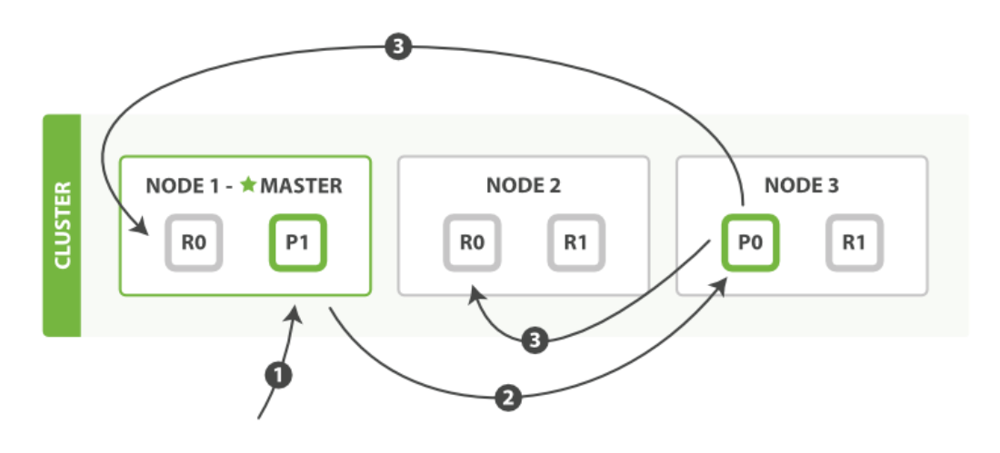
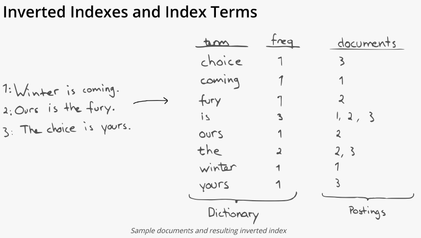
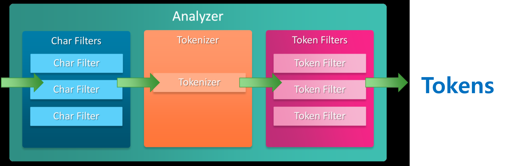
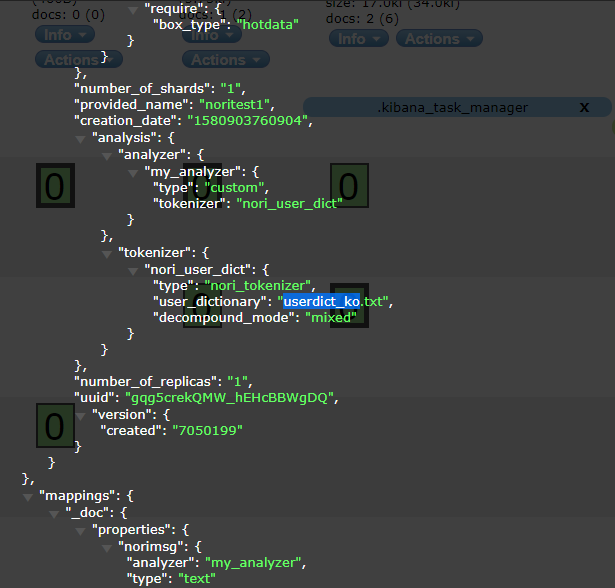
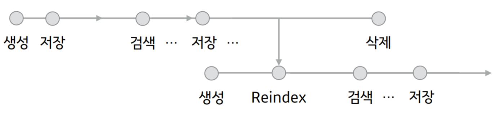
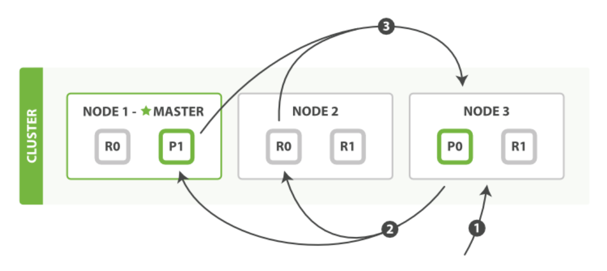
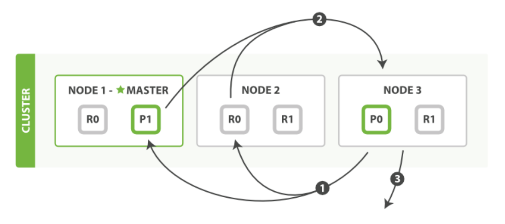

# Elasticsearch 검색엔진 활용

> 검색엔진으로 ES 활용

# 검색엔진으로 Elasticsearch 활용하기

> 인덱스 생성과정
>
> 분석기 변경 방법
>
> 쿼리 생성

## ES 인덱스 생성과정

- 색인의 필수 조건
  - 프라이머리 샤드가 항상 가장 먼저 writing되어야 함
  - 프라이머리 샤드가 writing이 전부 완료된 이후에 리플리카 샤드로 복제를 수행

### Inverted Index

- 색인되어 들어온 문서는 Inverted Index 형태로 세그먼트에 저장
- 정의된 Analyzer에 의해서 토크나이징 된 단어를 기준으로 색인
  - 만약 별도로 Analyzer를 정의하기 않으면 standard analyzer가 적용됨

### Analysis

- 이메일의 본문 같은 full-text 에 대해 검색이 될 수 있도록 분석하는 과정

### Analyzer 의 구성요소

- **Character filters**
  - 원본 text 를 사전에 가공하는 과정
  - 설정하지 않거나 **다중으로 필터 설정**이 가능함
    - ex) html 태그 제거, 패턴매칭(123-456-789 -> 123_456_789), Hindu-Arabic 숫자 (٠١٢٣٤٥٦٧٨٩) 를 아라비아 숫자로 매핑 (0123456789)
- **Tokenizer**
  - 어떠한 방식으로 원본 text 를 토크나이징 할 것인가 결정
  - 토크나이징 된 term은 token이라고 함
  - **하나의 Tokenizer**만 설정이 가능함
    - ex) 공백을 기준으로 토크나이징 : You are a boy!!! -> You / are / a / boy!!!
- **Token filters**
  - Tokenizer에 의해 결정된 token 들을 가공
  - 서정하지 않거나 다중으로 필터 설정이 가능함
    - ex) stopwords 로 지정된 단어를 제거 :  You / are / a / boy -> you / boy

### Analyzer

- 기본은 **standard analyzer**임

  - 변경이 가능하고 사용자 정의 analyzer 설정도 가능

- **_analyzer API** 를 통해 분석되는 토큰 확인이 가능(테스트 목적)

- 실제 인덱스 analysis 를 정의하여 해당 인덱스를 대상으로 _analyze API 실행

  ~~~
  POST _analyze
  {
  	"text": "Winter is Coming!!"
  }
  
  POST _analyze
  {
  	"tokenizer": "standard",
  	"filter": ["lowercase", "asciifolding"],
  	"text": "Is this déja vu?"
  }
  ~~~

  

### Standard Analyzer

- character filter 미사용

- Standard Tokenizer 사용, 공백기준, 문자열 기준의 의미있는 토큰을 생성

- Standard Token Filter, Lower Case Token Filter, Stop Token Filter 사용

  ~~~
  POST _analyze
  {
      "analyzer": "standard",
      "text": "Winter is coming!!!"
  }
  POST _analyze
  {
      "tokenizer": "standard",
      "filter": [ "lowercase", "asciifolding" ],
      "text": "Is this déja vu?"
  }
  ~~~

### Whitespace Analyzer

- character filter 미사용

- Whitespace Tokenizer 사용, space 기준으로 토큰 생성

- token filter 미사용

  ~~~
  POST _analyze
  {
  	"analyzer": "whitespace",
  	"text": "Winter is comming!!!"
  }
  
  
  POST _analyze
  {
  	"char_filter": ["html_strip"],
  	"tokenizer": "whitespace",
  	"filter": ["uppercase"],
  	"text": "<B>This is mixed anlyzer</B>"
  }
  ~~~

  

### Analyzer 의 설정 방법

1. **이미 정의되어 있는 analyzer를 그대로 가져다가 사용하는 방식**
   - analyzer 자체에서 제공되는 parameter 설정만 사용해 토큰을 생성
2. **이미 정의되어 있는 tokenzier 에 character filter, token filter 를 조합해 사용하는 방식**
   - tokenizer 를 선택하고 tokenizer parameter 추가
   - character filter 와 token filter 를 사용자 정의로 설정해 토큰을 생성
3. **plugin 형태로 제공되는 외부 analyzer 를 사용하는 방식**
   - ES에서 제공되지 않는 외부 analyzer를 플러그인으로 설치해 토큰을 생성

#### 1. 이미 정의되어 있는 Analyzer

- 정의되어 있는 Analyzer에 character filter, token filter 를 조합하여 사용하는 방식

~~~
PUT index_analyzer_settings1
{
    "settings": {
        "analysis": {
        	"analyzer": {
        		"my_analyzer" : {
                    "type": "standard",
                    "max_token_length": 5,
                    "stopwords": "_english_"
        		}
        	}
    	}
	},
	"mappings": {
        "properties": {
            "comment": {
                "type": "text",
                "analyzer": "my_analyzer"
            }
        }
    }
}
~~~

~~~
POST index_analyzer_settings2/_analyze
{
    "analyzer": "my_analyzer",
    "text": "<B>This is Standard Analyzer</B>"
}

POST index_analyzer_settings2/_doc
{
	"comment": "<B>This is Standard Analyzer</B>"
}

GET index_analyzer_settings2/_search
{
    "query": {
        "match": {
        	"comment": "standard"
        }
    }
}
~~~

#### 2. 이미 정의되어 있는 Tokenizer에 character filter, token filter 를 조합하는 방식

~~~
PUT index_analyzer_settings2
{
    "settings": {
        "analysis": {
            "analyzer": {
                "my_analyzer" : {
                    "type": "custom", ## 이곳에 custom으로 설정
                    "char_filter": [ "html_strip" ],
                    "tokenizer": "standard",
                    "filter": [ "uppercase" ]
				}
			}
		}
	},
    "mappings": {
        "properties": {
        	"comment": {
        	"type": "text",
        	"analyzer": "my_analyzer"
        	}
		}
    }
}
~~~

~~~
POST index_analyzer_settings2/_analyze
{
    "analyzer": "my_analyzer",
    "text": "<B>This is Standard Analyzer</B>"
}

POST index_analyzer_settings2/_doc
{
	"comment": "<B>This is Standard Analyzer</B>"
}

GET index_analyzer_settings2/_search
{
    "query": {
        "match": {
	        "comment": "standard"
        }
    }
}
~~~

~~~
PUT mixed_analyzer
{
    "settings": {
        "analysis": {
            "char_filter": {
                "my_char_filter": {
                    "type": "mapping",
                    "mappings": [ ":) => _happy_", ":( => _sad_" ]
                }
			},
			"tokenizer": {
                "my_tokenizer": {
                    "type": "standard",
                    "max_token_length": 20
                }
			},
			"filter": {
                "my_stop": {
                    "type": "stop",
                    "stopwords": ["and", "is", "the", "this"]
                }
            },
			"analyzer": {
                "my_analyzer": {
                    "type": "custom",
                    "char_filter": [ "html_strip", "my_char_filter" ],
                    "tokenizer": "my_tokenizer",
                    "filter": [ "lowercase", "my_stop" ]
                }
            }
        }
    }
}
~~~

#### 3. plugin 형태로 제공되는 외부 analyzer를 사용하는 방식

~~~
PUT nori_analyzer
    {
    "settings": {
        "analysis": {
            "tokenizer": {
                "nori_user_dict": { ## nori 분석기를 사용하는 예시
                    "type": "nori_tokenizer",
                    "decompound_mode": "mixed",
                    "user_dictionary": "userdict_ko.txt" ## 딕셔너리 사용
            	}
        	},
			"analyzer": {
                "my_analyzer": {
                    "type": "custom",
                    "tokenizer": "nori_user_dict"
                }
			}
		}
	},
	"mappings": {
        "properties": {
            "comment": {
                "type": "text",
                "analyzer": "my_analyzer"
			}
        }
    }
}
~~~

### Nori Analyzer

- decompound_mode 별로 복합어에 대한 다른 토큰을 가져가는 설정
  - **none** : 단어를 분리하지 않고 그대로 제공
    - ex) 가곡역 => 가곡역
  - **discard(default)** : 복합어는 버리고 복합어를 나눈 토큰으로 설정
    - ex) 각곡역 => 가곡, 역
  - **mixed** : 복합어와 복합어를 나눈 토큰으로 설정
    - ex) 가곡역 => 가곡역, 가곡, 역

- mecab-ko-dic dictionary 를 기본 사전으로 사용함
- 사전 파일을 \<token> [<token 1> ... \<token n>] 로 정의
- index close / open 후 적용

### 기억할점

- Analyzer 가 바뀌면 토큰도 변경됨
  - 검색할 단어가 바뀌므로 중간에 Analyzer를 변경하면 의도와 다른 결과를 가져옴
  - 특정 text type field 에 대해 Analyzer 를 변경하려면 반드시 _reindex 가 필요함

### tip)

- token 이나 token 의 frequency 를 확인하고 싶을 때는 Terms Vector 를 활용함

  ~~~
  POST /shakespeare/_doc/gPezC3ABFjKEo3V5Mu-2/_termvectors
  {
  	"fields": [
  	"text_entry"
  	],
      "offsets": true,
      "payloads": true,
      "positions": true,
      "term_statistics": true,
      "field_statistics": true
  }
  ~~~

  

### 더보기

**Analyzer More**

- https://www.elastic.co/guide/en/elasticsearch/reference/current/analysis-analyzers.html

**Character filters More**

- https://www.elastic.co/guide/en/elasticsearch/reference/current/analysis-charfilters.html

**Tokenizer More**

- https://www.elastic.co/guide/en/elasticsearch/reference/current/analysis-tokenizers.html

**Token filters More** 

- https://www.elastic.co/guide/en/elasticsearch/reference/current/analysis-tokenfilters.html

**Nori Analyzer**

- https://www.elastic.co/guide/en/elasticsearch/plugins/current/analysis-nori-analyzer.html

## ES 쿼리 생성

- 검색하기
- **_search API** 를 통해 원하는 도큐먼트를 검색
- URI 혹은 HTTP request body 를 통해 쿼리 작성
- 문서의 **위치를 찾는 Query** 와 문서를 **가져오는 Fetch** 과정으로 구성

### Query Phase

- 쿼리를 받아 **문서가 어느 노드 어느 샤드에 있는지를 찾는 과정**
- **from, size 를 계산하여 빈 queue 를 생성**
- 전체 노드, 샤드에 문서가 있는지를 확인, 노드들도 로컬에 queue 를 생성
- queue 에 검색된 문서의 id 를 넣고 결과를 score 기준으로 sorting 후 리턴

### Fetch Phase

- 리턴받은 doc id 를 기준으로 multi get 요청
- 노드별로 리턴받은 문서를 클라이언트에게 리턴

### URI Search

- URI 에 request parameters 를 통해 검색 질의

- 한정된 검색 옵션만 사용 가능(Quick Test)

- Score 없음

  ~~~
  GET shakespeare/_search?from=0&size=100&q=text_entry:mother&sort=line_id:asc
  ~~~

  

### Request Body Search

- Request Body Search More
  - https://www.elastic.co/guide/en/elasticsearch/reference/current/search-request-body.html

#### 1. query

~~~
## 1. query 구문을 사용해 질의
POST sharespeare/_search
{
	"query": {
		"term": {
			"play_name.keyword": "Henry IV"
		}
	}
}
~~~

- Query DSL 을 이용해 HTTP Body 정의 후 질의
- query 구문을 사용하여 질의

#### 2. from, size parameters

~~~
## 2. from, size 파라미터 및 query를 사용한 질의
POST shakespeare/_search
{
    "from": 0,
    "size": 2,
    "query": {
        "match": {
        "text_entry": "my mother"
        }
    }
}

## from size 의 값을 변경
PUT shakespeare/_settings
{
	"index.max_result_window": 10001
}
~~~

- from, size parameter로 **pagination**
- 기본은 from:0, size:10
- from + size 가 기본으로는 10000 까지만 허용
- 더 필요하면 index.max_result_window 조정 필요

#### 3. sort를 사용한 정렬

~~~
## 3. key field(line_id)를 기준으로 내림차순으로 정렬
POST shakespeare/_search
{
    "sort": { 
	    "line_id": "desc"
    }
}
~~~

- key field 기준으로 sort 가능
- 오름차순(asc), 내림차순(desc) 정렬

#### 4. explain

~~~
## explain을 true로 설정해 score가 계산되는 과정을 확인
POST shakespeare/_search
{
	"explain": true,
	"from": 0, "size": 2,
	"query": {
		"match": {
			"text_entry": "my mother"
		}
	}
}
~~~

- score가 계산되는 과정을 확인하는 explain
  - score는 TF, IDF, Field Length 를 이용하여 계산됨
  - TF(Term Frequency) : Term이 해당 Document에 등장하는 빈도
  - IDF(Inverse Document Frequency) : Term이 전체 Index에서 등장하는 빈도
  - Field Length : Term 이 포함된 Field 의 길이
  - Score↑ : [ TF↑ · IDF↓ · Field Length↓ ]

#### 5. _source filtering

- 원하는 데이터만 필터링

~~~
POST shakespeare/_search
{
    "_source": false,
    "sort": {
    	"line_id": "desc"
	}
}

POST shakespeare/_search
{
    "_source": [
        "speaker",
        "text_entry"
    ],
    "sort": {
	    "line_id": "desc"
    }
}

POST shakespeare/_search
{
    "_source": [
	    "*num*"
    ],
	"sort": {
		"line_id": "desc"
	}
}
~~~

#### 6. highlight

- highlight 로 검색 결과 하이라이팅

~~~
POST shakespeare/_search
{
    "_source": [
        "play_name",
        "speaker",
        "text_entry"
    ],
    "query": {
        "query_string": {
        	"query": "henry"
        }
    },
    "highlight": {
        "fields": {
        	"speaker": {}
        }
    }
}
~~~

## Query DSL(Domain Specific Language)

- JSON 기반의 Elasticsearch 쿼리를 정의하는 언어

> ### 1. Leaf query clause
>
> - **자체적으로 쿼리를 할 수 있는 완성된 검색 쿼리 절**
> - **match, term, range 등...**
>
> 2. Compound query clause
>
> - Leaf query 혹은 Compound query 를 혼합해주는 검색 쿼리 절
> - bool, boosting 등

### Full Text Query(Query Context query)

- **쿼리문을 analyze 하여 검색. 스코어가 가장 높은 문서순으로 노출**
- **검색 쿼리 절이 얼마나 문서에 잘 매치되는지 유사성을 확인**
- 검색 쿼리와의 매칭율에 따라 **_score** 를 부여
  - ex) elastic search 검색 -> elastic 포함된 문서, search 포함된 문서 검색
- **match, match_phrase, match_phrase_prefix, query_string 등**
- 각 쿼리는 key:value 형태로 바로 검색하거나 쿼리 종류별로 제공하는 parameter 는 사용할 수 있음

- **쿼리 종류**
  - https://www.elastic.co/guide/en/elasticsearch/reference/current/full-text-queries.html
- **쿼리 별 파라미터**
  - https://opendistro.github.io/for-elasticsearch-docs/docs/elasticsearch/full-text/#options

#### 1. match Query

~~~
POST shakespeare/_search
{
	"query": {
		"match": {
			"text_entry": "my mother"
		}
	}
}
~~~

- 쿼리문의 analyze 된 토큰으로 유사한 문서 검색
- key:value 형태 검색

~~~
POST shakespeare/_search
{
	"query": {
		"match": {
			"text_entry": "my mother",
			"boost": 2
		}
	}
}
~~~

- boost parameter 로 검색 score 가중치 적용 가능

#### 2. match_phrase Query

~~~
POST shakespeare/_search
{
	"query": {
		"match_phrase": {
			"text_entry": "my mother a"
		}
	}
}
~~~

- analyze 된 쿼리의 토큰을 순서대로 합쳐서 쿼리 구문을 만들어 검색

#### 3. match_phrase_prefix Query

~~~
POST shakespeare/_search
{
	"query": {
		"match_phrase_prefix": {
			"text_entry": "my mother d"
		}
	}
}
~~~

- match_phrase 와 동일한 방식으로 문서 검색
- 마지막 문자를 와일드 카드 형태로 검색

#### 4. multi_match query

~~~
POST multi_match_index/_search
{
	"query":{
		"multi_match": {
			"query": "Engine",
			"fields": [
				"name", 
				"comment"
			]
		}
	}
}
~~~

- fields parameter 에 정의된 field 들에서 검색
- match 쿼리를 여러개의 필드들에 대해서 검색

#### 5. query_string Query

~~~
POST shakespeare/_search
{
	"query": {
		"query_string": {
			"query": "henry VI*",
			"fields": [
				"text_entry",
				"play_name"
			]
		}
	}
}
~~~

- match, multi_match, match_phrase_prefix 의 기능을 할 수 있는 쿼리
- match_phrase_prefix 기능은 와일드카드(*) 추가로 가능

### Term Level Query(Filter Context 로 주로 쓰이는 쿼리)

- **정확히 일치하는 용어만 검색, analyze 되지 않음(하나의 토큰만 생성), 범위 검색**
- 정확히 일치하는 문서만 검색되기 때문에 **_score 는 무의미하나 스코어링이 되지 않는 것은 아님**
- **쿼리로 사용하는 전체 문자열을 기준으로 정확히 일치하는 token이 있는 경우에만 검색이 가능**
- **keyword field 기반으로 검색**
  - date 필드의 값이 2015년과 2018년 사이에 속해있는지 등...
- 각 쿼리는 key:value 형태로 바로 검색하거나 쿼리 종류별로 제공하는 parameter 는 사용할 수 있음
- **term, terms, range 등**
- **쿼리 종류**
  - https://www.elastic.co/guide/en/elasticsearch/reference/current/term-level-queries.html
- **쿼리 별 파라미터**
  - Term Level Query 는 parameter 가 다양하지 않아 각 쿼리문에서 확인

#### 1. term Query

~~~
POST shakespeare/_search
{
	"query": {
		"term": {
			"play_name.keyword": "Henry IV"
		}
	}
}
~~~

- 역색인 된 토큰 중에 term 이 정확히 일치할때만 결과를 리턴
- keyword 필드에 대해서만 쿼리 가능
- 위의 예제는 dynamic indexing 된 sub field 인 {field}.keyword 를 사용하는 것을 전제로함
- mapping 시 keyword 로 미리 설정이 되었다면 "gender": "M" 형태로 검색
- key:value 형태 검색

~~~
POST shakespeare/_search
{
	"query": {
		"term": {
			"play_name.keyword": {
				"value": "Henry IV",
				"boost": 2.0
			}
		}
	}
}
~~~

- boost parameter 로 검색 score 가중치 적용이 가능함

#### 2. terms Query

~~~
POST shakespeare/_search
{
	"from": 0, "size": 10000,
	"query": {
		"terms": {
			"speaker.keyword": [
				"YORK",
				"KING HENRY IV"
			]
		}
	}
}
~~~

- 여러개의 용어에 대해 검색 가능
- or 검색과 유사한 기능

#### 3. range Query

~~~
POST shakespeare/_search
{
	"query": {
		"range": {
			"line_id": {
				"gte": 250,
				"gle": 259
			}
		}
	}
}
~~~

- numeric, date, geo field 에 대해서만 가능
- gte(greater than || equal), gt, gle(less than || equal), lt 파라미터 사용

#### 4. wildcard Query

~~~
POST shakespeare/_search
{
	"query": {
		"wildcard": {
			"speaker.keyword": "KING HENR*"
		}
	}
}
~~~

## Query DSL(Domain Specific Language)

- JSON 기반의 Elasticsearch 쿼리를 정의하는 언어

> 1. Leaf query clause
>
> - 자체적으로 쿼리를 할 수 있는 완성된 검색 쿼리 절
> - match, term, range 등...
>
> ### 2. Compound query clause
>
> - **Leaf query 혹은 Compound query 를 혼합해주는 검색 쿼리 절**
>
> - **bool, boosting 등**

#### 1. bool 쿼리

~~~
POST shakepeare/_search
{
	"query": {
		"bool": {
			"must": [
				{
					"match": {
						"text_entry": {
							"query": "my heart"
						}
					}
				}
			],
			"filter": [
				{
					"term": {
						"speaker.keyword": "KING HENRY IV"
					}
				},
				{
					"range": {
						"line_id": {
							"gte": "30"
						}
					}
				}
			]
		}
	}
}
~~~

- **하나 이상의 boolean clause 가 사용됨**
- **must, filter, should, must_not 항목으로 구성**
  - **must** : 문서에 일치하는 항목, 스코어 계산
  - **filter** : 문서에 일치하는 항목, 스코어 0, 보통 filter context 실행
  - **should** : 문서에 일치하는 항목, must나 filter 항목이 없으면 적어도 하나의 쿼리절과 일치되는 결과 리턴
  - **must_not** : 문서에 일치하지 않는 항목, 스코어 0, 보통 filter context 실행
- **자주 사용되는 filter, must_not 절은 캐싱의 대상이 됨**

#### 2. must

- 문서에 일치하는 항목, 스코어 계산

~~~
POST shakespeare/_search
{
	"query": {
		"bool": {
			"must": [
				{
					"match": {
						"text_entry": {
							"query": "my mother"
						}
					}
				}
			]
		}
	}
}
~~~

#### 3. filter

- 문서에 일치하는 항목, 스코어 0, term level query 권고

~~~
POST shakespeare/_search
{
	"query": {
		"bool": {
			"filter": [
				{
					"term": {
						"speaker.keyword": "KING HENRY IV"
					}
				}
			]
		}
	}
}
~~~

#### 4. should

~~~
POST shakespeare/_search
{
	"from":0, "size": 10000,
	"query": {
		"bool": {
			"should": [
				{
					"match": {
						"text_entry": {
							"query": "my mother",
							"boost": 2
						}
					}
				},
				{
					"term": {
						"speaker.keyword": {
							"value": "KING HENRY IV"
						}
					}
				}
			]
		}
	}
}
~~~

- 문서에 일치하는 항목
- must나 filter 항목이 없으면 **적어도 하나의 쿼리절과 일치되는 결과 리턴**
- minimum_should_match 가 없으면 **default 로 1**이 적용됨

~~~
POST shakespeare/_search
{
	"from": 0, "size": 1000,
	"query": {
		"bool": {
			"filter": [
				{
					"term": {
						"spearker.keyword": {
							"value": "KING HENRY IV"
						}
					}
				}
			],
			"should": [
				{
					"match": {
						"text_entry": {
							"query": "her mother",
							"boost": 2
						}
					}
				}
			],
			"minimum_should_match": 1
		}
	}
}
~~~

#### 5. must_not

- 문서에 일치하지 않는 항목, 스코어 0, term level query 권고

~~~
POST shakespeare/_search
{
	"query": {
		"bool": {
			"must_not": [
				{
					"match": {
						"text_entry": {
							"query": "my mother"
						}
					}
				}
			]
		}
	}
}
~~~

~~~
POST shakespeare/_search
{
	"query": {
		"bool": {
			"must": [
				{
					"match": {
						"text_entry": "my mother"
					}
				}
			],
			"filter": [
				{
					"range": {
						"line_id": {
							"gte": "30"
						}
					}
				}
			],
			"should": [
				{
					"term": {
						"speaker.keyword": "KING HENRY IV"
					}
				},
				{
					"term": {
						"speaker.keyword": "YORK"
					}
				}
			],
			"minimum_should_match": 1,
			"must_not": [
				{
					"match": {
						"play_name": "Part"
					}
				}
			]
		}
	}
}
~~~

### Query DSL More

- https://www.elastic.co/guide/en/elasticsearch/reference/current/query-dsl.html