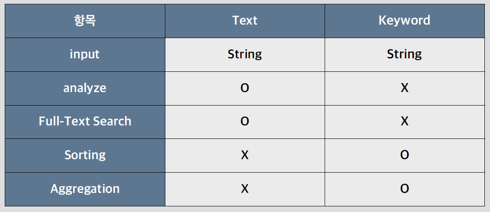
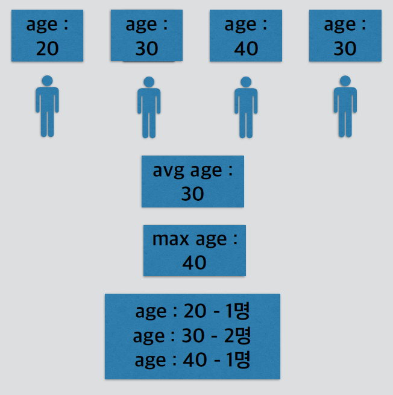
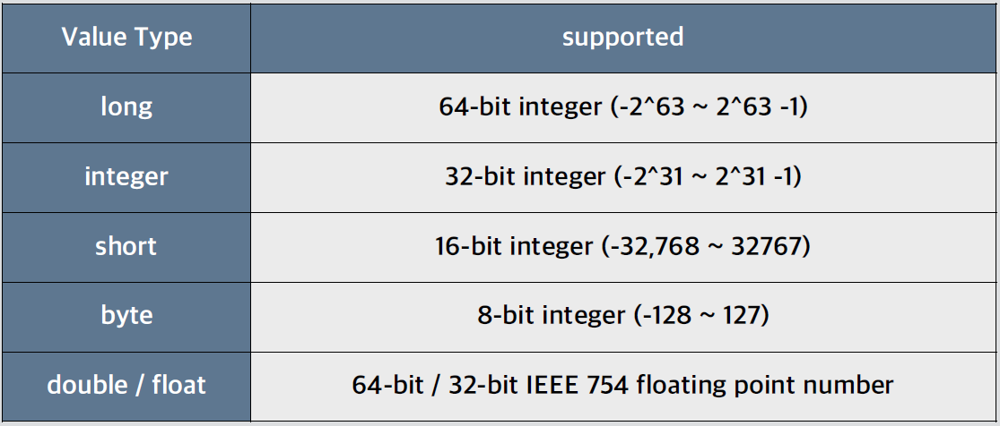
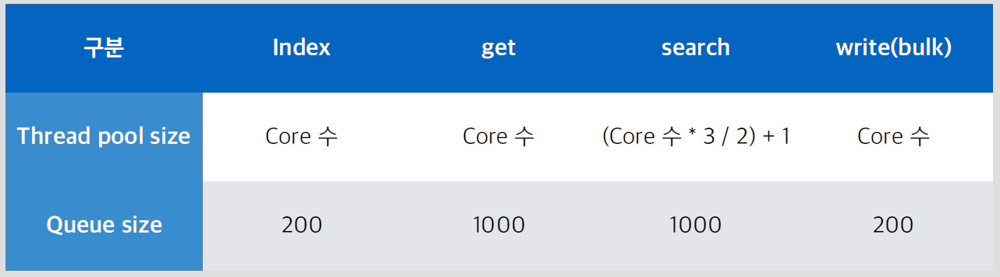

# Elasticsearch 성능 최적화와 모니터링

- Elasticsearch 색인 성능 최적화
- Elasticsearch 검색 성능 최적화
- Elasticsearch 모니터링

## QnA

### 1. 인덱스에 정규표현식을 사용할 수 있는가?

- 와일드카드를 제외한 정규표현식은 사용 불가능

~~~
POST test1
{
"test": "TTT"
}
POST test2
{
"test": "TTT"
}
DELETE test[0-9] --> error
DELETE test* --> 와일드 카드는 가능
~~~

### 2. search analyzer는 무엇인가?

- 보통의 경우 인덱스에 애널라이저를 설정하고 특정 text field 에 해당하는 애널라이저를 설정하면 색인할 때 해당 애널라이저의 방식을 따라 토큰이 생성됨. 이후 검색 시에도 동일한 애널라이저를 통해 토큰을 생성하여 토큰이 있을 때 검색이 된다

  - 그런데 N-grams, Edge N-grams 같은 토큰나이저들은 색인 시에 실제 사용자가 검색하지 않을 토큰이 다양으로 생성되는 방식으로 토큰을 생성함

    ~~~
    ex) Foxes (min, max gram 3) -> Fox, oxe, xes
    ~~~

  - 사용자는 실제 의미있는 Fox 로 검색하는 것이 일반적. 그래서 색인 시에는 가능한 많은 토큰들을 생성하고, 검색을 할 때에는 의미 있는 토큰만을 대상으로 검색하고 싶을 때 search_analyzer를 사용

    - https://www.elastic.co/guide/en/elasticsearch/reference/current/searchanalyzer.html

### 3. 쿼리가 한 번이라고 수행되었을 때 받은 스코어를 유지할 수 있는 방법은 없는가?

- **constant_score** 를 사용해 처음부터 스코어를 지정해주는 방법이 있음. 이 쿼리는 사용자가 특정 쿼리에 스코어를 지정해 지속적으로 사용할 것이 예상된다는 판단을 전제로하여 filter 절 내에 정의하도록 구성

~~~
# score1, 2, 3...
POST bank/_search
{
  "query": {
    "match": {
      "address": "Fleet"
    }
  }
}

# filter 절은 캐싱 됨
GET bank/_search
{
  "query": {
    "constant_score" : {
      "filter": {
        "match" : { "address" : "Fleet"}
      },
      "boost" : 3.4
    }
  }
}
~~~

### 4. bulk size 조정 방법

- 벌크 사이즈의 조정은 클라이언트에서 함. ES에서 조정할 수 있는 것은 bulk job 이 코어를 몇 개까지 사용할 수 있게 설정하는지, 코어를 전부 사용해 더 이상 할당할 코어가 없을 때 요청된 job들을 얼마나 저장할지만 결정할 수 있음

### 5. term 쿼리는 스코어가 일정한데 어떤 사항을 기준으로 순서가 결정되는지?

- 순서는 랜덤하게 결정. 스코어가 모두 동일하기 때문에 전체 문서가 필요하면 pagination 을 활용해야 함

~~~
POST shakespeare/_search
{
  "query": {
    "term": {
      "speaker.keyword": "CADE"
    }
}
~~~

### 6. search template이란?

- 사용자가 요청할 쿼리의 형식을 미리 템플릿화 해서 정의하고 정의된 템플릿에 편하게 쿼리를 요청할 수 있는 기능(검색할 때 변수를 사용해서 검색할 수 있음)

~~~
GET _search/template
{
  "source" : {
    "query": { 
      "match" : { 
        "{{my_field}}" : "{{my_value}}"
        }
    },
    "size" : "{{my_size}}"
  },
  "params" : {
    "my_field" : "message",
    "my_value" : "some message",
    "my_size" : 5
  }
}

POST _scripts/my_search_template
{
  "script":{
    "lang":"mustache",
    "source":{
      "query":{
        "match":{
          "text_entry":"{{my_query}}" 
        } 
      } 
    }
  }
}

# _scripts api 를 이용해 어떻게 정의 되어 있는지 확인.
GET _scripts/my_search_template

POST shakespeare/_search/template
{
  "id": "my_search_template",
  "params": {
    "my_query": "my mother"
  }
}
~~~

# 1. Elasticsearch 색인 성능 최적화

> **static mapping 적용** : 미리 정해놓은 스키마로 리소스 절약
>
> **_all 필드** : 특별한 니즈가 없다면 쓰지 말아야 하는 기능들
>
> **refresh_interval 변경** : 색인된 데이터를 검색결과에 반영하기

- 색인은 디스크에 write 하는 I/O job
- 어떤 방식으로 색인하는지가 I/O 의 빈도 혹은 부하를 결정
- 인덱스의 스키마인 mapping 을 사전에 정의하는 것만으로도 성능이 향상됨

## 1.1 static mapping 적용

### Mapping

- 문서를 구성하는 Field 의 데이터를 어떤 Field Datatype으로 저장할지 결정하는 과정(스키마를 미리 짜놓는 것)
- 문자열 데이터에 대해 **Text Field Datatype**으로 사용할지, **Keyword Field DataType**으로 사용할지
- Numeric Field Datatype 은 Short Field DataType 으로 사용하지, Long Field Datatype 으로 사용할지
- Field Datatype 은 어떻게 정의하여 사용할지
- 인덱스의 매핑을 미리 결정하지 않으면 알아서 문서의 Field Datatype 을 판단하여 dynamic 하게 매핑을 진행(비효율적)

### Field Datatype

- text, keyword, date, long, double, boolean, geo, ...

## 1.1.1 static mapping : text

### Text Field Datatype

- email 본문 같은 full-text 로 색인되는 Field Datatype
- Analyzer 를 통해 토큰을 생성하여 검색 가능하도록 색인됨(Inverted Index)
- sorting 및 aggregation 에 사용되지 않음

~~~
PUT text_index1
{
  "mappings": {
    "properties": {
      "title": {
        "type": "text" 
      } 
    }
  }
}
~~~

## 1.1.2 static mapping : keyword

### Keyword Field Datatype

- email 본문 같은 full-text 로 색인되는 Field Datatype
- **Analyze 되지 않음**
- **필드의 전체 데이터가 하나의 토큰으로 생성됨**
- **sorting, aggregation 지원**
- 색인될 때, 토큰의 전체 value로 구성되어 Exact value 로만 검색됨

~~~
PUT keyword_index
{
  "mappings": {
    "properties": {
      "title": {
        "type": "keyword" 
      } 
    }
  }
}
~~~

### Text vs Keyword

- dynamic mapping 으로 string이 들어오면 text 와 keyword 둘 다 사용 가능
  - 성능저하를 가져오는 것을 염두하고 사용
- fields 로 sub field 세팅
- sub field 는 test.keyword 로 질의
- 색인될 때, text 는 analyzer 를 거치게 됨
  - keyword 로 사용할 의도였다면 이러한 분석은 낭비

- keyword 로 사용할 string 이라면 keyword type 으로 매핑
- 너무 긴 문자열의 keyword datafield 의 색인을 막기 위해 기본으로 ignore_above 를 256 으로 설정

### Aggregation

- 검색을 기반으로 수집된 데이터에 대해 집계/통계를 내는 프레임워크
- 메일 본문같은 긴 내용은 집계/통계를 내기 어려운 데이터
- 수치나 특정 문자로 한정된 데이터들의 집계를 내는 역할
- Keyword Field Datatype 으로 정의된 데이터에 대해 집계
- Kibana 에서 집계/통계 낼 때 주로 사용
- Metric / Bucket Aggregation

## 1.1.3 static mapping : date

### Data Field Datatype

- 형식이 지정된 날짜가 포함된 문자열(ex. "2015-01-01" 또는 "2015/01/01 12:10:30")
- milliseconds 를 나타내는 epoch_millis (ex. 1420070400001)
- 혀용할 타입만 지정도 가능

### Date Field Datatype 으로 매핑 생성

- Dynamic mapping 시 처음에 입력되는 형태로 인식
- 최초 epoch_millis 로 색인되면 long type 으로 Dynamic mapping 이 되어 date 형태는 색인되지 않음

~~~
PUT date_index
{
  "mappings": {
    "properties": {
      "date": {
        "type": "date" 
      } 
    }
  }
}

POST date_index/_doc
{ 
  "date": "2015-01-01" 
}

POST date_index/_doc
{ 
  "date": "2015-01-01T12:10:30Z"
}

POST date_index/_doc
{ 
  "date": 1420070400001
}

GET date_index/_search
{
"sort": { "date": "asc"}
}
~~~

### 사용자가 정의한 format 으로만 색인되도록 매핑 설정

~~~
PUT date_index_format
{
  "mappings": {
    "properties": {
      "date": {
        "type": "date",
        "format": "yyyy-MM-dd HH:mm:ss||yyyy-MM-dd||epoch_millis" 
      } 
    }
  }
}
~~~

### Numeric Field Datatype

- 숫자 형식의 Field Datatype
- 적절하게 맞추면 좋으나 동일 타입으로 통일을 권고
- **dynamic 매핑은 long**

## 1.1.4 static mapping: Object

### hierarchical nature of JSON Field Datatype

- object 나 list 같이 계층 구조의 Field Datatype 은 properties 서브 필드 내에 정의
- properties 서브 필드가 사용되는 경우
  1. 매핑을 정의해서 인덱스를 생성할 때
  2. 매핑 타입을 추가할 때(기존 필드 이름과 겹치지 않는 선에서만 지원)
  3. 매핑을 정의하지 않고 문서를 색인할 때 Elasticsearch 가 dynamic 하게 매핑을 정의할 때
  4. 구조화된 object, list 같은 계층화 된 Field Datatype 을 정의할 때

~~~
PUT object_index
{
  "mappings": {
    "properties": {
      "region": {
        "type": "keyword"    
      },
      "manager": {
        "properties": {
          "age": {
            "type": "integer"
          },
          "name": {
            "properties": {
              "first": {
                "type": "keyword"
              },
              "last": {
                "type": "keyword"
              }
            }
          }
        }
      }
    }
  }
}
~~~

### Object Field Datatype indexing

~~~
PUT object_index/_doc/1
{
  "region": "US",
  "manager": {
    "age": 30,
    "name": {
      "first": "John",
      "last": "Smith",
      "full": "Smith John" 
    }    
  }
}
~~~

### Object Field Datatype searching

~~~
GET object_index/_search
{
  "query": {
    "match": {
      "manager.name.first": {
        "query": "John" 
      } 
    }
  }
}
~~~

## 1.1.5 static mapping : nested

~~~
PUT nested_index
{
  "mappings": {
    "properties": {
      "user": {
        "type": "nested" 
      } 
    }
  }
}
~~~

- Nested Field Datatype 은 색인이 되는 순간 다시 dynamic mapping으로 색인
- 항목의 개수가 가변적일 때만 사용
- static mapping 으로 성능 확보가 어려운 Field Datatype 으로 지양하는 것이 좋음
- 항목의 개수가 변하지 않으면 Object Field Datatype 으로 정의(해당 mapping 을 미리 만들어 놓아야 dynamic mapping을 피할 수 있음)

~~~
PUT nested_index/_doc/1
{
  "user" : [
{
  "first" : "John",
  "last" : "Smith"
},
{
  "first" : "Alice",
  "last" : "White"
}
]
}
~~~

- Nested Field Datatype 은 nested query 로 검색

~~~
GET nested_index/_search
{
  "query": {
    "nested": {
      "path": "user",
      "query": {
        "bool": {
          "must": [
            {
              "match": {
                "user.first": "John"
              }
            },
            {
              "match": {
                "user.last": "Smith" 
              } 
            }
            ] 
        } 
      } 
    }
  }
}
~~~

### static mapping more

- https://www.elastic.co/guide/en/elasticsearch/reference/current/mappingtypes.html

## 1.2 _all field : 특별한 니즈가 없다면 쓰지 말아야 하는 기능들

- 문서의 모든 field value 를 합치는 meta field
- 검색을 할 때 사용되며, 세그먼트에 저장되지는 않지만 힙 영역에 올라가는 데이터
- text field 로 analyze 되는 필드

- 6.0 부터 deprecated

  - 6.0 이전

    ~~~
    {
    "first_name": "John",
    "last_name": "Smith",
    "date_of_birth": "1970-10-24"
    }
    ~~~

  - 6.0 이후

    ~~~
    {
    "first_name": "John",
    "last_name": "Smith",
    "date_of_birth": “1970-10-24",
    "_all": "John Smith 1970-10-24"
    }
    ~~~

- all field 를 5버전 이하에서 사용한다면 disable 권고

- 템플릿에 default type 을 통해 전체 인덱스 disable

  - 7.X 버전에서 removed 됨
  - _default_field 도 함께 removed 됨

~~~
PUT allfield
{
  "mappings": {
    "_default_": {
      "_all": {
        "enabled": false 
      } 
    }    
  }
}
~~~

- 니즈가 있다면 copy_to 기능 권고

~~~
## 1. index 색인
PUT copy_index
{
  "mappings": {
    "properties": {
      "first_name": {
        "type": "text",
        "copy_to": "full_name"
      },
      "last_name": {
        "type": "text",
        "copy_to": "full_name"
      },
      "full_name": {
        "type": "text" 
      } 
    } 
  }
}

## 2. document 색인
POST copy_index/_doc
{
  "first_name": "John",
  "last_name": "Smith"
}

## 3. search
GET copy_index/_search
{
  "query": {
    "match": {
      "full_name": "John Smith" 
    }
  }
}
~~~

### More _all field

- https://www.elastic.co/guide/en/elasticsearch/reference/current/mapping-allfield.html
- https://www.elastic.co/guide/en/elasticsearch/reference/current/copy-to.html

## 1.3 refresh_interval 변경

> 색인 된 데이터를 검색결과에 반영하기

### refresh_interval

- 메모리 os 페이지캐시 영역으로부터 세그먼트에 문서를 저장하는 주기
- refresh 가 되면 저장된 문서는 검색 가능한 상태로 변경됨
- 온라인상에서 인덱스 별로 설정

~~~
PUT refresh/_settings
{
  "index" : {
    "refresh_interval" : "1s"
  }
}
~~~

- **-1 로 설정하면 disable**, null 로 설정하면 1s 로 초기화
- interval 을 길게 가져갈수록 I/O 빈도가 낮아져 성능 향상
- 메모리 버퍼의 용량을 고려하여 interval 을 설정(버퍼 용량 만큼 찼을 때 내려 줌)

~~~
PUT refresh/_settings
{
  "index" : {
    "refresh_interval" : -1
  }
}
~~~

- refresh_interval 을 끄고 색인할 때 직접 제어도 가능
- refresh=true 로 설정한 문서만 세그먼트로 내림

~~~
PUT refresh/_settings
{
  "index" : {
    "refresh_interval" : -1
  }
}

PUT refresh/_doc/1?refresh=true
{ 
  "msg": "first doc"
}
~~~

### More refresh_interval

- https://www.elastic.co/guide/en/elasticsearch/reference/current/index-modules.html#dynamic-indexsettings
- https://www.elastic.co/guide/en/elasticsearch/reference/current/indices-refresh.html
- https://www.elastic.co/guide/en/elasticsearch/reference/current/docs-refresh.html

## 1.4 그외

### 문서 id 없이 POST 로 색인 권고

- PUT 을 통해 문서 id 를 설정한 채로 색인을 할 때 ES 는 해당 id 의 문서가 있는지를 먼저 체크
- 문서가 많아질수록, 인데그사 커질수록 해당 부하가 커짐

### Bulk Indexing 활용 권고

- 가능하면 단일 색인 요청보다는 한 번에 많은 문서를 Bulk Indexing 하는 것이 더 효율적
- 단일 노드, 단일 샤드 환경에서 적절한 bulk size 측정 후 진행 권고
- **request reject 나 gc 상황을 봐가며 적정 수치 확인** 후 Bulk 사이즈를 정의해야 함

### 상황에 따른 Replica Shard 를 0으로 설정

- 한 번에 많은 데이터를 적재해야 하는 상황에서는 replica 를 0 으로 두고 색인
- 필요하면 **색인이 전부 완료된 이후에 레플리카 샤드를 추가**하는 형태로 작업하는 것을 권고
- 동일한 리소스를 쓴 것이지만 1) 적은 리소스를 2배의 시간 동안 쓸 것인지 2) 많은 리소스를 한번에 쓸 것인지

### Heap 에 할당하고 남은 메모리가 버퍼 캐시로 활용될 수 있도록 충분히 확보

### Index Buffer Size 를 상황에 맞게 설정 권고

- https://www.elastic.co/guide/en/elasticsearch/reference/current/indexing-buffer.html

### More Indexing Performance...

- https://www.elastic.co/guide/en/elasticsearch/reference/current/tune-for-indexing-speed.html

# 2. Elasticsearch 검색 성능 최적화

> **쿼리 튜닝 하기** : 검색에 유리한 튜닝 방법
>
> **캐싱 활용하기** : 검색 유형 별 캐시 활용 방법

## 2.1 쿼리 튜닝하기

### multi field 로 검색을 해야할 때에는 가능한 적은 필드로 검색

- copy_to 를 이용하면 두 개의 필드를 하나로 줄여 검색 가능

~~~
PUT copy_index
{
  "mappings": {
    "properties": {
      "first_name": {
        "type": "text",
        "copy_to": "full_name"
      },
      "last_name": {
        "type": "text",
        "copy_to": "full_name"
      },
      "full_name": {
        "type": "text" 
      } 
    }
  }
}
~~~

### Numeric Field Datatype 에 대해 Keyword Field Datatype 으로 색인 고려

~~~
POST nonum/_doc
{ 
  "account_no": "12345"
}

POST nonum/_doc
{ 
  "account_no": "22345"
}

GET nonum/_search
{ 
  "query": { 
    "term": { 
      "account_no": "12345" 
    } 
  }
}

GET nonum/_search
{ 
  "query": { 
    "range": { 
      "account_no": {
        "gte": 12300 
      } 
    } 
  }
}
~~~

- 집계 등의 수치 계산은 안 됨

~~~
POST nonum/_search?size=0
{
  "query" : {
    "constant_score" : {
      "filter" : {
        "match_all" : {}
      }
    }
  },
  "aggs" : {
    "hat_prices" : { 
      "sum" : {
        "field" : "account_no"
      }
    }
  }
}
~~~

### wildcard 는 꼭 써야하는지 검토

- token 으로 분리되는 용어는 wildcard 대신 match 를 써도 충분할 수 있음

~~~
GET bank/_search
{ 
  "query": { 
    "query_string" : { 
      "query": "Flee*"
    }
  }
}

GET bank/_search
{ 
  "query": { 
    "match": { 
      "address": "Fleet" 
    }
  } 
}
~~~

### exact match 검색을 할 때에는 match 대신 term 쿼리 사용

- 불필요한 analyze 를 제외하여 성능 향상

~~~
PUT termquery
{ 
  "mappings": { 
    "properties": { 
      "gender": { 
        "type": "keyword"
      }
    }
  }
}

POST termquery/_doc
{ 
  "gender": "F"
}

GET termquery/_search
{ 
  "query": { 
    "match": { 
      "gender": { 
        "query": "F"
      } 
    }
  }
}

GET termquery/_search
{ 
  "query": { 
    "term": { 
      "gender": { 
        "value": "F"
      } 
    } 
  }
}
~~~

### query context 와 filter context 를 적절히 활용

- filter context 쿼리는 스코어가 의미가 없는 쿼리
- filter 절에 넣어 스코어를 계산하는 단계를 없애면 성능 향상
- filter 절 안에 쿼리된 문서들은 캐싱됨
  - https://www.elastic.co/guide/en/elasticsearch/reference/current/query-cache.html

~~~
GET bank/_search
{
  "query": {
    "bool": { 
      "must": [ 
        { 
          "term": {
            "gender.keyword": "F"
          }
        } 
      ]
    }
  }
}

GET bank/_search
{
  "query": {
    "bool": { 
      "filter": [
        { 
          "term": { 
            "gender.keyword": "F"
          }
        } 
      ] 
    }
  }
}
~~~

- bool 쿼리는 각 쿼리들이 interleave 하게 실행
- 쿼리 순서는 크게 상관이 없음

~~~
GET bank/_search
{
  "query": { 
    "bool": {
      "must": [ 
        { 
          "match": { 
            "state": { 
              "query": "MI"
            } 
          }
        }
      ],
      "filter": [ 
        { 
          "range": {
            "age": { 
              "lte": "30" 
            } 
          }   
        }
      ] 
    }
  }
}

GET bank/_search
{
  "query": { 
    "bool": {
      "filter": [ 
        { 
          "range": { 
            "age": { 
              "lte": "30"
            } 
          }    
        }
      ],
      "must": [ 
        { 
          "match": {
            "state": { 
              "query": "MI"
            } 
          }   
        }
      ]
    }
  }
}
~~~

## 2.2 캐싱 활용하기

### Node Query Cache : bool 쿼리의 filter 절, constant_query 의 filter 절에 의해 문서의 내용이 캐싱되는 영역

- 검색 대상 인덱스가 클러스터 내 전체 인덱스 사이즈의 3% 이상일 때 동작
- 세그먼트 하나에 최소 10,000 개 이상의 문서가 저장되어야 동작
- 기본으로 Enable 되어 있으며, LRU 알고리즘에 의해 Eviction
- Heap 의 10% 가 기본으로 할당됨

~~~
$ curl -s -X GET “localhost:9200/_cat/nodes?v&h=name,qcm,qce?v&pretty”

# elasticsearch.yml
indices.queries.cache.size: 10%
~~~

### Shard Request Cache : size 가 0인 hits.total, aggregation 등의 수치가 캐싱되는 영역

- 인덱스의 샤드를 대상으로 캐싱됨
- 기본으로 Enable 되어 있으며, 샤드에 변경이 있으면 Eviction
- Index 를 대상으로 Dynamic설정이 가능하며, aggregation 등의 요청 별로도 설정 가능
- Heap 의 10% 가 기본으로 할당됨

~~~
$ curl -s -X GET “localhost:9200/_cat/nodes?v&h=name,rcm,rce?v&pretty”

PUT /my_index/_settings
{ "index.requests.cache.enable": true }

GET /my_index/_search?request_cache=true
{
  "size": 0,
  "aggs": {
    "popular_colors": {
      "terms": {
        "field": "colors"
      }
    }
  }
}

# elasticsearch.yml
indices.requests.cache.size: 10%
~~~

### Field Data Cache: sort 나 aggregation 을 할 때 대상 필드의 value 를 대상으로 캐싱되는 영역

- 기본으로 Enable 되어 있으며, LRU 알고리즘에 의해 Eviction
- Heap 의 10% 가 기본으로 할당됨
- Text Field Datatype 의 경우는 하나의 필드에도 많은 데이터가 들어가기 때문에 기본으로 Disable 되어 있음
- Text Field Datatype 에 적용하려면 매핑에 정의되어야 함(권고되지 않음)

~~~
$ curl -s -X GET “localhost:9200/_cat/nodes?v&h=name,fm,fe?v&pretty”

PUT my_index/_mapping
{
  "properties": {
    "my_field": {
      "type": "text",
      "fielddata": true
    }  
  }
}

# elasticsearch.yml
indices.fielddata.cache.size: 10%
~~~

## 2.3 그외

### 가능하면 아래 구성은 사용하지 않는 것을 권고

- Parent / Child 구조로 join job 이 들어가는 구조
- nested Field Datatype 를 사용한 매핑을 사용하는 구조
- elasticsearch 에서 제공하는 스크립트를 사용하여 색인하고 검색하는 구조

### range 쿼리에서 date를 기준으로 범위를 정할 때 시간을 반올림하여 검색하는 것을 권고

- now-1h -> now-1h/m

### Replica Shard 를 적절하게 두어 검색 성능을 높이도록 권고

### _forcemerge API

- segment 를 강제로 병합하는 API

- 색인 중인 인덱스에는 사용 비추

- 색인이 끝난 인덱스는 하나의 segment 로 merge 를 추천

- I/O 비용이 크기 때문에 색인이나 검색이 없는 시간대에 진행

  ~~~
  POST shakespeare/_forcemerge?max_num_segments=1
  ~~~

### Routing 

- routing key 를 통해 특정 샤드로 색인하는 방법
- routing key 를 색인 샤드 할당 알고리즘을 통해 할당
  - shard = hash(routing) % number_of_primary_shards
- routing key 에 의해 특정 샤드로 들어간 데이터는 검색 시에 검색이 아닌 문서 가져오기 과정을 거쳐 성능이 향상됨
  - ex. 메일 서비스 검색엔진을 ES 로 사용하고, 사용자별로 메일을 검색, 사용자 id 를 routing key 로 주고 메일 본문을 색인, 검색시에 사용자 id 를 routing key 로 찾으면 특정 샤드만 검색

~~~
POST rindex/_doc?routing=user1
{ 
  "title": "This is a document" 
}

POST rindex/_doc?routing=user1
{ 
  "title": "This is a document for fc" 
}

GET rindex/_search?routing=user1

{ 
  "query": { 
    "match": { 
      "title": "fc"
    }
  } 
}
~~~

### Rollover api

- 라우팅으로 커진 샤드를 캐어하는 방법
- 특정 조건이 맞으면 새로운 인덱스를 생성하고 alias 를 옮겨주는 기능

~~~
PUT logs-000001
{
  "aliases": {
    "logs_write": {}
  }
}

POST logs_write/_rollover
{
  "conditions": {
    "max_age": "7d",
    "max_docs": 2,
    "max_size": "5gb"
  }
}
~~~

- 특정 이름을 지정하여 생성도 가능
- ?dry_run 을 실행하면 모의실행 가능

~~~
POST logs_write/_rollover/my_new_index_name1
{
  "conditions": {
    "max_age": "7d",
    "max_docs": 2,
    "max_size": "5gb"
  }
}
~~~

### Thread Pool Size

- 헤비한 색인과 검색을 같이 해야하는 경우 **색인에 Thread Pool 이 과하게 할당하여 검색 성능이 떨어짐**
- Bulk job 에 할당되는 thread pool size 를 조절하여 검색성능 보장

~~~
# /etc/elasticsearch/elasticsearch.yml
thread.bulk.size: 16
~~~

### More Searching Performance

- https://www.elastic.co/guide/en/elasticsearch/reference/current/tune-for-searchspeed.html

# 3. Elasticsearch 모니터링

> rejected : 데이터의 누락이 발생하는 순간
>
> Cat API : 클러스터의 여러가지 상태 살펴보기
>
> Stats, Nodes API : 클러스터의 리소스 사용 지표 확인하기

## 3.1 rejected(데이터의 누락이 발생한 순간)

### rejected

- 노드 내에서 스레드의 메모리 사용을 관리하기 위해 여러개의 (Core 갯수 만큼) 스레드풀 사용
- index, get, search, write(bulk) 등 여러개의 스레드 풀 존재
- 각각의 스레프풀은 **대기열 큐**를 두어 대기중인 요청을 보관

### GET _nodes/thread_pool

- 대기열 큐가 꽉차면 그 이후부터는 요청이 reject 됨(요청이 실제로 유실 될 수도 있음)
- _node/stats 를 통해 모니터링

~~~
GET _nodes/stats
~~~

- _cat/thread_pool?v 를 thread_pool 정보만 **실시간으로 조회**

~~~
GET _cat/thread_pool/search?v
~~~

- /etc/elasticsearch/elasticsearch.yml 파일에 큐 사이즈 조절 가능

~~~
thread_pool.bulk.queue_size: 20000
thread_pool.search.queue_size: 20000
~~~

### rejected more...

- https://www.elastic.co/guide/en/elasticsearch/reference/current/modulesthreadpool.html

## 3.2 Cat API (클러스터의 여러가지 상태 살펴보기)

### Cat API

- GET method 를 통해 클러스터, 노드, 인덱스 등의 상태를 확인해볼 수 있는 API

### GET _cat/nodes

- 클러스터에 속한 node 들의 상태를 확인할 수 있는 명령

  ~~~
  172.31.9.100 15 90 0 0.08 0.04 0.05 mdi * NXLq-qi
  172.31.7.100 15 56 0 0.00 0.01 0.05 mdi - EWVXzG_
  ~~~

- 뒤에 ?v 옵션을 추가로 주면 항목의 필드 이름 확인 가능

  ~~~
  GET _cat/nodes?v
  ~~~

  > **heap.percent** : 사용중인 heap memory percentage
  >
  > **ram.percent** : 사용중인 memory percentage
  >
  > **cpu** : 사용중인 cpu 리소스 percentage
  >
  > **load_1m, 5m, 15m** : 사용중인 load average 값
  >
  > **node.role** : 노드의 role (m - master node, d - data, i - ingest)

- 뒤에 &h= 를 통해 필요한 항목만 발췌 가능

  ~~~
  GET _cat/nodes?v&h=ip,node.role
  
  172.31.9.100 mdi
  172.31.7.100 mdi
  ~~~

- 뒤에 &s=ip:asc 를 통해 정렬 가능 (역순은 desc)

  ~~~
  GET _cat/nodes?v&h=ip,node.role&s=ip:asc
  
  172.31.7.100 mdi
  172.31.9.100 mdi
  ~~~

- 뒤에 &format=json 을 통해 json 포맷으로 변경 가능

  ~~~
  GET _cat/nodes?v&h=ip,node.role&s=ip:asc&format=json
  
  
  [
    {
      "ip" : "172.31.7.100",
      "node.role" : "dil"
    },
    {
      "ip": "172.31.9.100",
      "node.role" : "dil"
    }
  ]
  ~~~

  

### GET _cat/allocation?v

- 샤드 및 디스크 용량 관련 사항 조회

  ~~~
  GET _cat/allocation?v
  
  shards disk.indices disk.used disk.avail disk.total disk.percent host ip node
  33 97.4kb 1.2gb 6.7gb 7.9gb 15 172.31.7.100 172.31.7.100 EWVXzG_
  34 6.5mb 4.1gb 11.8gb 15.9gb 25 172.31.9.100 172.31.9.100 NXLq-qi
  ~~~

  > **shards** : 샤드 개수
  >
  > **disk.indices** : 인덱스가 사용하고 있는 디스크 용량
  >
  > **disk.used** : 실제 시스템에서 사용된 디스크 용량
  >
  > **disk.avail** : 실제 시스템에서 사용 가능한 디스크 용량
  >
  > **disk.total** : 실제 시스템에서 전체 디스크 용량
  >
  > **disk.percent** : 실제 시스템의 디스크 용량 사용률

### GET _cat/shards?v

- 샤드 정보 조회

  ~~~
  GET _cat/shards?v
  
  index shard prirep state docs store ip node
  ttt 2 r STARTED 0 261b 172.31.9.100 NXLq-qi
  ttt 2 p STARTED 0 261b 172.31.7.100 EWVXzG_
  ttt 3 p STARTED 1 3.4kb 172.31.9.100 NXLq-qi
  …
  tdex1 2 r STARTED 1 2.6kb 172.31.9.100 NXLq-qi
  tdex1 2 p STARTED 1 2.6kb 172.31.7.100 EWVXzG_
  …
  ~~~

  > **shard** : 샤드 넘버
  >
  > **prirep** : 프라이머리, 리플리카 리플리카 여부
  >
  > **state** : 샤드 상태
  >
  > **docs** : 문서 개수
  >
  > **store** : 저장된 사이즈

- GET _cat/shards/ttt?v
  - 인덱스 별로도 샤드 정보 조회 가능

### GET _cat/indices?v

- 인덱스 정보 조회

  ~~~
  GET _cat/indices?v
  
  health status index uuid pri rep docs.count docs.deleted store.size pri.stor
  green open ydex gELeTBLXSYKM9rqdrOz_5Q 5 1 1 0 11.7kb 5.8kb
  green open nomap ykVP6PM6T-uUFGj_t4gEoA 5 1 1 0 8.9kb 4.4kb
  ~~~

  > **health** : 인덱스 헬스 상태 (green, yellow, red)
  >
  > **status** : 인덱스 open 상태 (open, close)
  >
  > **pri** : 프라이머리 샤드 개수
  >
  > **rep** : 리플리카 샤드 개수
  >
  > **docs.count** : 문서 개수
  >
  > **docs.deleted** : 삭제된 문서 개수
  >
  > **store.size** : 리플리카를 포함한 실제 저장된 사이즈
  >
  > **pri.store.size** : 프라이머리 실제 저장된 사이즈

- GET _cat/indices/ydex?v
  - 인덱스 별로 조회 가능

### GET _cat/health?v

- 클러스터 헬스체크 상태

  ~~~
  GET _cat/health?v
  
  epoch timestamp cluster status node.total node.data shards pri relo init una
  max_task_wait_time active_shards_percent
  1539602599 20:23:19 ben-lect-es-tmp green 6 3 98 49 0 0 0 0 -
  100.0%
  ~~~

  > **status** : 클러스터 전체 상태 (green, yellow, red)
  >
  > **node.total** : 클러스터에 속해져있는 전체 노드 개수
  >
  > **node.data** : 데이터노드 role 을 가지는 노드 개수
  >
  > **shards** : 클러스터에 저장된 전체 샤드 개수
  >
  > **pri** : 클러스터에 저장된 프라이머리 샤드 개수
  >
  > **relo** : 현재 할당 중인 샤드 개수
  >
  > **init** : 샤드 상태 변경 전 초기화를 거치고 있는 샤드 개수
  >
  > **uassigned** : 할당되지 않은 샤드 개수
  >
  > **pending_tasks** : 상태가 변경되는 과정에서 지연이 일어나고 있는 task 개수
  >
  > **active_shards_percent** : 안정적인 상태에서 운영중인 샤드의 percentage

### GET _cat/templates?v

- 세팅된 템플릿 조회

  ~~~
  GET _cat/templates?v
  
  name index_patterns order version
  .monitoring-kibana [.monitoring-kibana-6-*] 0 6040099
  logstash-index-template [.logstash] 0
  template_2 [te*] 1
  ~~~

  > **name** : 템플릿 이름
  >
  > **index_patterns** : 템플릿이 적용될 인덱스 패턴
  >
  > **order** : 템플릿 오더 넘버
  >
  > **version** : 템플릿 버전 정보

### Cat API More...

- https://www.elastic.co/guide/en/elasticsearch/reference/current/cat.html

## 3.3 Stats API

### Stats API

> GET method 를 통해 전체 클러스터, 인덱스 별 프라이머리 샤드와 전체 샤드의 각종 지표를 확인하는 API 로 클러스터 모니터링 지표로 활용

- docs.count : 저장된 문서 개수
- docs.deleted : 삭제된 문서 개수
- store : 저장된 용량(bytes)
- indexing.index_total : 색인된 횟수
- indexing.index_time_in_millis : 색인할 때 소요된 milliseconds
- get.total : get 한 횟수
- get.time_in_millis : get 할 때 소요된 milliseconds
- search.(query / fetch)_total : search 에서 (query / fetch) 를 요청한 횟수
- (query / fetch)_time_in_millis : (query / fetch) 에 소요된 milliseconds
- A = 1초 전 search.query_total : 현재 search.query_total = 1초 간 search query total 건수
  - 초당 search query 의 rate
- B = 1초 전 search.query_time_in_millis : 현재 search.query_time_in_millis = 1초 간 query time_in_millis
  - 초당 search query의 

- 그 외 merges, refresh 등의 수치도 제공
- 위 데이터를 primaries기준, total 기준으로 제공하고, 인덱스별로도 해당 데이터를 제공

## 3.4 Nodes API

### Nodes API

- 각 노드의 uuid 를 key 로 하여 elasticsearch.yml, jvm.options, plugin 정보 등을 제공

- 노드 이름, ip 정보, ES 버전, 노드 roles 정보

  ~~~
  GET _nodes
  
  "nodes": {
  "NXLq-qizQNe8GX2cLqI2EQ": {
  "name": "NXLq-qi",
  "transport_address": "172.31.9.100:9300",
  "host": "172.31.9.100",
  "ip": "172.31.9.100",
  "version": "6.4.2",
  …
  "roles": [
  "master",
  "data",
  "ingest"
  ],
  ~~~

- elasticsearch.yml 에 세팅된 정보 외 추가정보

  ~~~
  "settings": {
  "pidfile": "/var/run/elasticsearch/elasticsearch.pid",
  "cluster": {
  "name": "elasticsearch"
  },
  …
  "path": {
  "data": [
  "/var/lib/elasticsearch",
  ],
  "logs": "/var/log/elasticsearch",
  "home": "/usr/share/elasticsearch"
  },
  …
  "network": {
  "host": "0.0.0.0"
  }
  ~~~

- jvm.options 에 세팅된 정보

  ~~~
  "jvm": {
  …
  "version": "1.8.0_181",
  "vm_name": "OpenJDK 64-Bit Server VM”,
  …
  "input_arguments": [
  "-Xms1g",
  “-Xmx1g",
  …
  },
  "plugins": [],
  ~~~

### GET _nodes/stats

- _stats 에서 확인할 수 있었던 항목들을 노드별로 보여줌

  ~~~
  "indices": {
  "docs": {
  "count": 13095,
  "deleted": 0
  },
  "store": {
  "size_in_bytes": 6836498
  },
  "indexing": {
  "index_total": 22,
  "index_time_in_millis": 85,
  …
  ~~~

- 노드의 **시스템 지표**도 함께 확인 가능

  ~~~
  "os": {
  "timestamp": 1539609793534,
  "cpu": {
  "percent": 0,
  "load_average": {
  "1m": 0,
  "5m": 0.01,
  "15m": 0.05
  }
  },
  "mem": {
  "total_in_bytes": 3972685824,
  "free_in_bytes": 396218368,
  "used_in_bytes": 3576467456,
  "free_percent": 10,
  "used_percent": 90
  },
  ~~~

- **GC** 에 대한 항목 확인 가능

  ~~~
  "jvm": {
  …
  "gc": {
  "collectors": {
  "young": {
  "collection_count": 708,
  "collection_time_in_millis": 4434
  },
  "old": {
  "collection_count": 3,
  "collection_time_in_millis": 190
  }
  }
  },
  …
  ~~~

- **파일시스템 사용량 확인** 가능

### Stats API More...

- https://www.elastic.co/guide/en/elasticsearch/reference/current/clusternodesstats.html#_nodes_statistics

### Elasticsearch Monitoring

- https://github.com/benjamin-btn/ES7-Tutorial/tree/master/ES-Tutorial-6