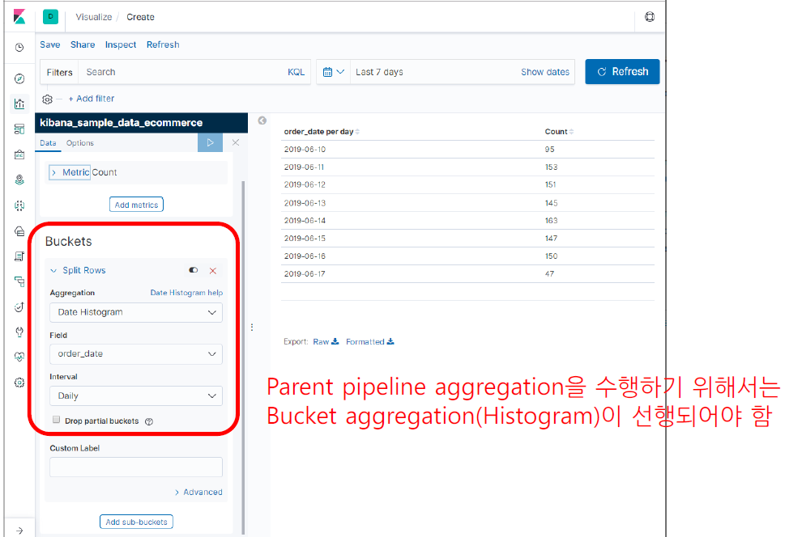

# Visualize

# Visualize 종류

# 1. Aggregations

- **Metric Aggregations** : 키바나에서 사용하는 aggregation
- **Bucket Aggregations** : 키바나에서 사용하는 aggregation
- **Pipeline Aggregations** : 키바나에서 사용하는 aggregation
- Matrix Aggregations
- Caching heavy aggregations
- Returning only aggregation results
- Aggregation Metadata
- Returning the type of the aggregation

## 1.1 Bucket Aggregation

### 1.1.1 Histogram

- **Histogram** : 동일한 interval 로 bucket을 나눔

### 1.1.1 Histogram

- Histogram 종류 2가지
  - **Date Histogram** : 기준 field가 날짜 형태
  - **Histogram** : 기준 field가 숫자 형태

### 1.1.2 Range

- Range : 사용자가 지정한 interval 로 bucket을 나눔

### 1.1.2 Range

- Range 종류 2가지
  - Date Range : 기준 field가 날짜 형태
  - Range : 기준 field가 숫자 형태
  - IPv4 : 기준 field가 IP 형태

### 1.1.3 Filter

- Filter : 지정한 기준으로 filtering해서 1개의 bucket 생성

### 1.1.4 Terms

- Terms : 지정한 field의 value로 bucket을 나눔

### 1.1.5 Significant terms

- Significant terms : 지정한 field의 value로 bucket을 나눔

## Bucket Aggregation 요약

- Histogram(날짜, 숫자)
  - 동일 interval로 bucket
- Range(날짜, 숫자, IPv4)
  - 사용자 interval로 bucket
- Filter
  - 검색 query별로 bucket
- Term(문자, 숫자)
  - 지정된 field의 값이 같은 document끼리 bucket
- Significant Terms(문자)
  - 지정된 field의 significant한 값 별로 bucket

  

# 2. Bucket Aggregation 예시

- Kibana 설치시에 기본으로 제공되는 인덱스를 활용함
  - kibana_sample_data_ecommerce

## 2.1 Data Table

### 2.1.1 bucket aggregation : Date Histogram

- 인덱스 : kibana_sample_data_ecommerce
  - Date Histogram
  - order_date
  - Daily

### 2.1.2 bucket aggregation : Histogram

- 인덱스 : kibana_sample_data_ecommerce
  - aggregation : Histogram
  - field : taxful_total_price
  - minimum interval : 100

### 2.1.3 bucket aggregation : Filter

- 인덱스 : kibana_sample_data_ecommerce
  - aggregation : filters
  - filter 1 : customer_gender : *
    - filter 1 label : 전체
  - filter 2 : customer_gender : "MALE"
  - filter 3 : customer_gender : "FEMALE"

### 2.1.4 bucket aggregation : Range

- 인덱스 : kibana_sample_data_ecommerce
  - aggregation : range
  - fields : taxful_total_price
    - 0 < 100
    - 100 < 200
    - 200 < 300
    - 300 < 무한대

### 2.1.4 bucket aggregation : Terms

- 인덱스 : kibana_sample_data_ecommerce
  - aggregation : terms
  - field : category.keyword
  - order by : (Metric: Count)
  - Order : Descending
  - size : 6

### 2.1.4 bucket aggregation : Significant Terms

- 인덱스 : kibana_sample_data_ecommerce
  - aggregation : Significant Terms
  - Field : manufacturer.keyword
  - size : 5

### 2.1.4 bucket aggregation : Terms

- 인덱스 : kibana_sample_data_ecommerce
  - aggregation : terms
  - field : category.keyword
  - order by : (Metric: Count)
  - Order : Descending
  - size : 20

 

## 2.2 Line

### 2.2.1 bucket aggregation : Date Histogram

- 인덱스 : kibana_sample_data_ecommerce
  - Aggregation : Date Histogram
  - field : order_date
  - minimum interval : Daily

 

## 2.3 Tag Cloud

### 2.3.1 bucket aggregation : Significant Terms

인덱스 : kibana_sample_data_ecommerce

- aggregation : Significant Terms
- Field : manufacturer.keyword
- size : 5

  

# 3. Metric Aggregation

- 하나의 Bucket에 속한 document 범위에서의 연산
  - Count
    - document의 개수
  - Unique Count
    - 선택된 field의 Unique한 값의 개수
  - Min, Max, Avg, Median, Sum, Std
    - 선택된 field의 Min, Max, Avg, Median, Sum, Std 값
  - Top Hit
    - 정렬 field를 기준으로 document 정렬 후 TopN 추출
  - Percentile
    - 사용자가 입력한 백분위에 해당하는 field값
  - Percent Rank
    - 사용자가 입력한 값이 속하는 백분위수
      - 점수 70 -> 백분위 : 0
      - 점수 100 -> 백분위 : 100

## 3.1 Bucket/Metric Aggregation 개념

### Bucket Aggregation

- 특정한 기준으로 document 분리
- Histogram, Range, Filter, Terms, Significant Terms, GeoHash

### Metric Aggregation

- bucket 내 document의 count, field 값으로 통계값 계산
- Count / Unique Count, Min / Max / Avg / Median / Std / Sum, Percentile, Percentile Rank, Top Hit 

### Sibling Pipeline Aggregation

- 여러 bucket의 metric 값을 모두 가지고 통계 값 계산
- Min / Max / Avg / Sum bucket

### Parent Pipeline Aggregation

- 여러 bucket의 metric 값 중 일부만 가지고 통계 값 계산
- Cumulative Sum, Derivative, Moving Avg, Serial Diff

## 3.2 Pipeline Aggregation 

### 3.2.1 Sibling Pipeline Aggregation

- Sibling Pipeline Aggregations
  - Average Bucket
  - Max Bucket
  - Min Bucket
  - Sum Bucket

### 3.2.1 Parent Pipeline Aggregation

 

 

# 4. Metric Aggregation 예시

## 4.1 Data Table

### 4.1.1 Bucket / Metric Aggregation

- 인덱스 : kibana_sample_data_ecommerce
  - Metrics
    - Metric
      - Aggregation : Count
    - Metric
      - Aggregation : Average
      - Field : taxful_total_price
    - Metric
      - Aggregation : Max
      - Field : taxful_total_price
    - Metric
      - Aggregation : Standard Deviation
      - Field : taxful_total_price
  - Buckets
    - split rows
    - Aggregation : Date Histogram
    - Field : order_date
    - Minimum interval : Daily

### 4.1.2 Sibling Pipeline Aggregation

- 인덱스 : kibana_sample_data_ecommerce
  - Metrics
    - Metric
      - Aggregation : Max Bucket
      - Bucket
        - Aggregation : Date Histogram
        - Field : order_date
        - Minimum interval : Daily
      - Metric
        - Aggregation : Sum
        - Field : taxful_total_price

### 4.1.3 Parent Pipeline Aggregation : Cumulative Sum

- 인덱스 : kibana_sample_data_ecommerce
  - Metrics
    - Metric
      - Aggregation : count
    - Metric
      - Aggregation : **Cumulative Sum**
      - Metric
        - Custom metric
        - Aggregation
          - count
  - Buckets
    - Split rows
    - Aggregation : Date Histogram
    - Field : order_date
    - Minimum interval : Daily

### 4.1.4 Parent Pipeline Aggregation : Derivative

- 인덱스 : kibana_sample_data_ecommerce
  - Metrics
    - Metric
      - Aggregation : count
    - Metric
      - Aggregation : **Derivative**
      - Metric
        - Custom metric
        - Aggregation
          - count
  - Buckets
    - Split rows
    - Aggregation : Date Histogram
    - Field : order_date
    - Minimum interval : Daily

### 4.1.5 Parent Pipeline Aggregation : Serial Diff

- 인덱스 : kibana_sample_data_ecommerce

  - Metrics

    - Metric

      - Aggregation : count

    - Metric

      - Aggregation : **Serial Diff**
      - Metric
        - Custom metric
        - Aggregation
          - count

    - Advanced : **{"lag" : 2}**

      

  - Buckets

    - Split rows
    - Aggregation : Date Histogram
    - Field : order_date
    - Minimum interval : Daily

### 4.1.6 Parent Pipeline Aggregation : Moving Avg

- **기본 이동평균은 5**

- 인덱스 : kibana_sample_data_ecommerce

  - Metrics

    - Metric

      - Aggregation : count

    - Metric

      - Aggregation : **Moving Avg** 
      - Metric
        - Custom metric
        - Aggregation
          - count

    - Advanced : **{"window" : 2}**

      

  - Buckets

    - Split rows
    - Aggregation : Date Histogram
    - Field : order_date
    - Minimum interval : Daily

