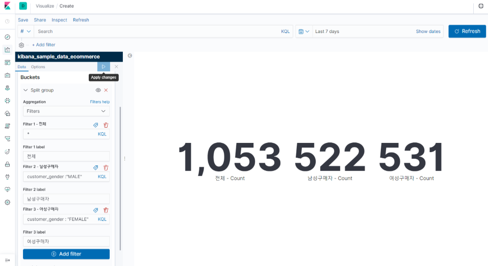
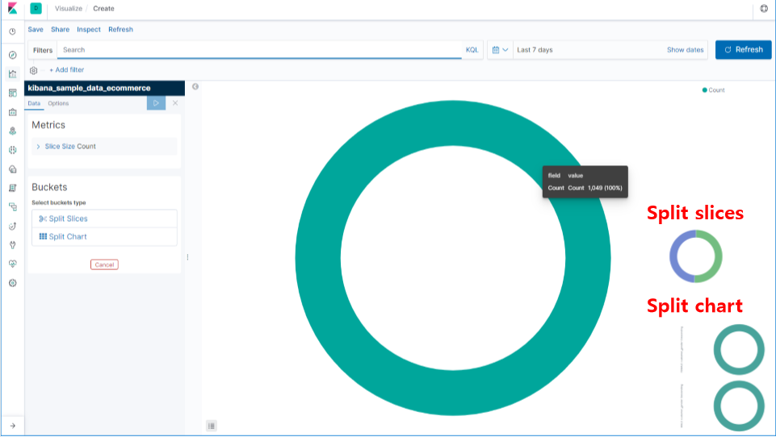

# Visualize

1. Markdown
2. Tag Cloud
3. Gauge
4. Goal
5. Metric
6. Pie

 

# 1. Markdown

# 2. Tag Cloud

## 2.1 Tag Cloud

 

 

## 2.2 Tag Cloud 예시

### 2.2.1 Tagcloud1

 

### 2.2.3 Tagcloud2

 

### 2.2.3 Tagcloud3

  

# 3. Gauge

### 3.1 Gauge

 

 

## 3.2 Gauge 예시

### 3.2.1 Gauge1

 

### 3.2.2 Gauge2

 

 

# 4. Goal

## 4.1 Goal

 

 

## 4.2 Goal 예시

 

 

# 5. Metric

## 5.1 Metric

 

 

## 5.2 Metric 예시

### 5.2.1 Metric1

 

### 5.2.2 Metric2

 

 

# 6. Pie

## 6.1 Pie

 

 

## 6.2 Pie 예시

### 6.2.1 Pie1

 

### 6.2.2 Pie2

 

### 6.2.3 Pie3

