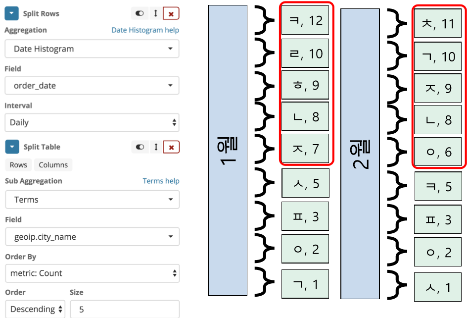

# Visualize

- Data Table
- Heat Map
- Line Chart
- Maps
- Controls

 

# 1. Data Table

## 1.1 Data Table

 

 

## 1.2 Data Table 예시

### 1.2.1 Data Table1

 

### 1.2.2 Data Table2

 

 

# 2. Heat Map

## 2.1 Heat Map

 

## 2.2 Heat Map 예시

### 2.2.1 Heat Map1

  

# 3. Line Chart

## 3.1 Line Chart

 

## 3.2 Line Chart 예시

### 3.2.1 Line Chart1

 

### 3.2.2 Line Chart2

 

### 3.2.3 Line Chart3

 

### 3.2.4 Line Chart4

 

### 3.2.5 Line Chart5

 

 

## 4. Maps

## 4.1 Maps

## 4.2 Maps 예시

### 4.2.1 Maps1

 

### 4.2.2 Maps2

 

### 4.2.3 Maps3

 

### 4.2.4 Maps4

 

### 4.2.5 Maps5

 

### 4.2.6 Maps6

 

 

# 5. Controls

## 5.1 Controls

 

## 5.2 Controls 예시

### 5.2.1 Control1

 

 

# 6. Timelion

## 6.1 Timelion

 

## 6.2 Timelion 예시

### 6.2.1 Timelion1

 

### 6.2.2 Timelion2

