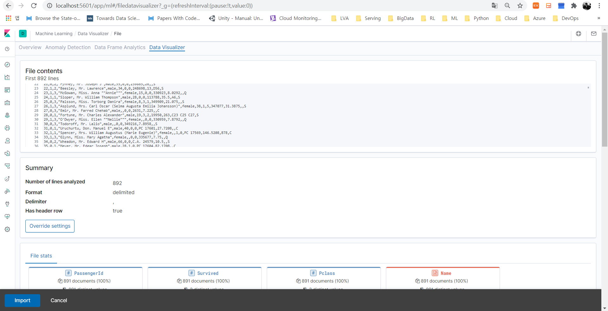
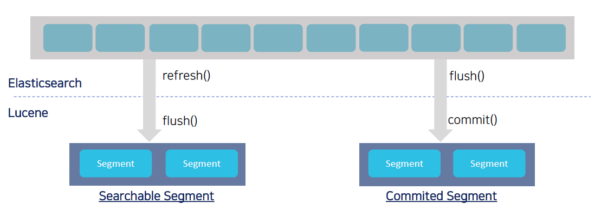
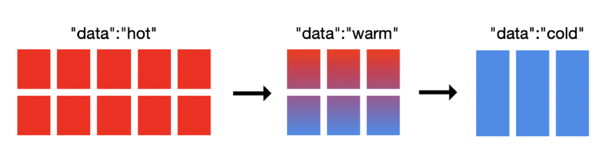

# Airflow로 Elasticsearch Management

- https://airflow.readthedocs.io/en/latest/operators-and-hooks-ref.html

# Kibana

> Elasticsearch에 대한 모니터링은 별도의 solution 혹은 다른 도구를 사용하는 것이 좋음
>
> - 단점 : alert기능이 유료....
> - ex) Grafana 등..
>
> tip) Kibana에서 csv파일을 로드하는 경우 100MB 이하의 데이터만 가능

## Kibana 에서의 데이터 처리 프로세스(csv 예시)

> 1. **CSV**
>
> 2. **Field확인**
>
>    - Time Field에 대해서 중요하게 생각함
>    - 그래서 새로운 timestamp라는 데이터타입으로 새로운 변수를 만들어냄
>
> 3. **Index를 만듦**
>
>    - Shard 개수를 지정
>
>    - mapping을 설정(Field에 대한 데이터 타입).
>
>    - Index pattern을 설정
>
> 4. **ES에 저장**
>
>    - Index에 데이터를 저장할 때 어떻게 할 것인지 Kibana가 물어보는 예시

## Index Management

> 로우 데이터는 : 15MB
>
> ES의 데이터 크기 : 31MB
>
> - 추가적인 메타정보 등의 것들이 들어가서 데이터의 크기가 커지는 것을 알 수 있음

## Discovery

> **KQL(Kibana Query Language)**
>
> @Timestamp가 없으면 확인할 수 없음
>
> 필드정보를 선택하여 top 5개를 확인할 수 있음

**필터 기능을 많이 사용**해야함

- 되도록이면 Query를 많이 날리기 보다는 Filter기능을 많이 사용하는 것이 좋음

### Filter

> add filter로 변수를 선택하고 설정해주면 됨

### KSQL

> Kibana Query Language(KQL)
>
> - https://www.elastic.co/guide/en/kibana/7.6/kuery-query.html

~~~shell
# 자동완성 지원
category.keyword : "Men's Clothing" and customer_gender :"FEMALE" 
~~~

## Visualization & Dashboard

### Lens

> 데이터를 한번 탐색해보라고 사용하는 애
>
> - 필드들을 하나씩 옮겨서 쭉 확인해보는 것도 좋음
> - Buket Aggregation, Metric Aggregation 등의 aggregation을 직접 사용하지 않고 클릭으로 확인해볼 수 있음

## Index Management

> tip) Kibana에서 Elasticsearch로 색인된 데이터를 확인하고자 할 때 Pattern pattern을 설정해야 함

## Monitoring

- index rate : 색인 성능(데이터를 넣을 때)
- search rate : 검색 성능(데이터를 검색)
- 초당 25건이라는 의미(index rate)

# DataType

> Elastic Sample Data
>
> - eCommerce
>   - 데이터 포맷, 대시보드
>
> - flight data
>
>   - Geo 포맷, 택시 위치 정보
>   - 누구를 매칭
>   - 가장 저렴한 가격
>
> - **Web logs**
>
>   - 로그 검색용으로 많이 사용했음(앞으로 만들어야할 애임)
>
>     - JSON 의 형태를 참고(30개 정도 있음)
>       - 필드에 맞는 데이터 타입을 정의(mapping)
>       - 매핑 참고
>

## Meta field

> "_" 로 시작하는 애들

- \_index: 문서가 속한 index
- \_type:_doc
  - 삭제 예정. 사용 X
- \_id : 문서 id
  - id는 일반적으로 직접적으로 설정하지 않음
  - 문서 id만 알고 있으면 삭제, 업데이트를 할 수 있음
    - 하지만 일반적으로 NoSQL에서는 삭제와 업데이트는 하지 않기 때문에 과연 의미가 있을까?
- \_version:문서 버전
  - 문서에 대한 CRUD의 결과에 따라서 버전이 올라감
- \_score : 관련성 점수
  - 문서를 쿼리할 때에 대한 score값(TF-IDF)
- \_source : 문서의 원본 JSON

## Field의 Datatype

> **tip)**
>
> - 추가되는 필드는 상관이 없음
> - 하지만 필드의 데이터 타입을 바꾸는 것은 불가능

- Text & Keyword
  - Text에 analyzer를 붙일 수 있음
  - 분석기는 종류가 많음
    - 한국 : Nori, Arirang 분석기 등.
- Geo-Point
- date
- object & Array & Nested

## RDB vs Document

> Document에 JSON을 전부 때려넣는 것
>
> RDB : 정규화 결과물에 대한 join으로 !!

- Index(Database), Mapping(Schema), Field(Columns)

## JSON Document NoSQL

> 문서의 모든 필드가 색인되어 JSON으로 들어감
>
> - 만약 지원하지 않는 데이터타입이 있으면 문제가 생기기 때문에 Mapping을 만들고 접근해야함
>   - ex) location : 위경도의 값을 text로 넣을 수 있음. 만약 색인을 mapping없이 진행하면 index를 지우고 다시 만들어되는 문제가 발생
>

- Schema Free를 지원하기 때문에 별도의 mapping이 없어도 JSON문서의 형식으로 데이터를 입력하면 검색이 가능한 형태로 색인 작업이 수행됨

## Field Data Type

> https://www.elastic.co/guide/en/elasticsearch/reference/7.7/mapping-types.html

- Core datatype
  - String : text, keyword
  - Numeric : long, Integer, short, double, float
  - Date
  - Boolean
  - Range : integer_range, float_range, date_range, ip_range
- Complex datatypes
  - Object
  - Nested
- Geo datatypes
  - lat/lon
  - polygons
- Specialised datatypes
  - IP
  - Histogram

## String

> text, keyword 2개가 존재

~~~shell
# 01. make template
PUT _template/test_template
{
  "index_patterns": [
    "test_index"
  ],
  "mappings": {
    "properties": {
      "book_name01": {
        "type": "keyword"
      },
      "book_name02": {
        "type": "text"
      }
    }
  }
}

# 02. put document
POST test_index/_doc
{
  "book_name01": " 검색엔진 완전 정복",
  "book_name02": " 검색엔진 완전 정복"
}

# 03. search "book_name01"
GET /test_index/_search
{
  "query": {
    "term": {
      "book_name01": "완전"
    }
  }
}

# 04. search "book_name02"
GET /test_index/_search
{
  "query": {
    "term": {
      "book_name02": "완전"
    }
  }
}
~~~

### Keyword

- 키워드 형태로 사용할 데이터에 적합한 데이터
- **검색 시 필터링**되는 항목
- **정렬이 필요**한 항목
- **집계(Aggregation)**해야 하는 항목

### Text(분석기가 파싱하고 검색이 가능)

- 색인시 지정된 **분석기가 데이터를 문자열로 인식하고 분석**함
- 기본적으로 **Standard Analyzer**를 사용
- 전문검색(Full Text searching)이 가능
- 텍스트 전체가 토큰화 됨
- 특정 단어 검색 가능

## Numeric

> https://www.elastic.co/guide/en/elasticsearch/reference/current/number.html

### 정수형

- 작은 타입을 선택할수록 검색 성능 반영
  - sum, average, min, max 등....
- 어떤 타입이든 저장소엔 영향이 없음
- 실제 값과 담을 수 없는 타입을 선택하면 Error

## Date

> https://www.elastic.co/guide/en/elasticsearch/reference/current/date.html

~~~shell
# Data Type - date
# 01. make mapping
PUT my_index_date
{
  "mappings": {
    "properties": {
      "date": {
        "type": "date",
        "format": "yyyy-MM-dd HH:mm:ss||yyyy-MM-dd||epoch_millis"
      }
    }
  }
}

# 02. put document
PUT my_index_date/_doc/1
{ "date": "2015-01-01" } 

PUT my_index_date/_doc/2
{ "date": "2015-01-01T12:10:30Z" } 

PUT my_index_date/_doc/3
{ "date": 1420070400001 } 

# 03. search document
GET my_index_date/_search
{
  "sort": { "date": "asc"} 
}
~~~

- JSON은 Date타입을 문자열로 처리
- 날짜는 다양한 format으로 표현 가능 "format"을 지정해야 함
- 별도로 지정하지 않으면 "yyyy-MM-ddTHH:mm:ssZ"
- 내부적으로 UTC의 millis second$단위로 저장된다.

## Geo-point

> https://www.elastic.co/guide/en/elasticsearch/reference/current/geo-point.html

~~~shell
# # Data Type - Geo point
# 01. make mapping
PUT my_index_geo
{
  "mappings": {
    "properties": {
      "location": {
        "type": "geo_point"
      }
    }
  }
}

# 02. save Document
PUT my_index_geo/_doc/1
{
  "text": "Geo-point as an object",
  "location": { 
    "lat": 41.12,
    "lon": -71.34
  }
}

PUT my_index_geo/_doc/2
{
  "text": "Geo-point as a string",
  "location": "41.12,-71.34" 
}

PUT my_index_geo/_doc/3
{
  "text": "Geo-point as a geohash",
  "location": "drm3btev3e86" 
}

PUT my_index_geo/_doc/4
{
  "text": "Geo-point as an array",
  "location": [ -71.34, 41.12 ] 
}

PUT my_index_geo/_doc/5
{
  "text": "Geo-point as a WKT POINT primitive",
  "location" : "POINT (-71.34 41.12)" 
}

# 03. search
GET my_index_geo/_search
{
  "query": {
    "geo_bounding_box": { 
      "location": {
        "top_left": {
          "lat": 42,
          "lon": -72
        },
        "bottom_right": {
          "lat": 40,
          "lon": -74
        }
      }
    }
  }
}
~~~

- 위도, 경도 등 위치 정보를 담은 데이터를 저장
- 위치 기반 데이터를 색인하고 검색 가능
- **위치 기반 쿼리가 수행가능**
  - 반경 내 쿼리
  - 위치 기반 집계
  - 위치별 정렬

## Template & Mapping API

>- https://www.elastic.co/guide/en/elasticsearch/reference/7.7/indices-templates.html
>
>- https://www.elastic.co/guide/en/elasticsearch/reference/7.7/mapping.html

~~~shell
PUT _template/template_1 # 템플릿 이름
{
  # 적용할 index이름 패턴
  "index_patterns": ["te*", "bar*"],
  # 추가적인 index setting
  "settings": {
    "number_of_shards": 1
  },
  # mapping -> schema
  "mappings": {
    "_source": {
      "enabled": false
    },
    "properties": {
      "host_name": {
        "type": "keyword"
      },
      "created_at": {
        "type": "date",
        "format": "EEE MMM dd HH:mm:ss Z yyyy"
      }
    }
  }
}
~~~

# 분산 저장소 그리고 Elasticsearch

> **샤드의 크기 고려사항**
>
> - 일반적으로 샤드의 크기를 10G ~ 20G가 기본이라고 생각함
> - 로그는 일반적으로 10G미만이라 샤드에 대해 따로 염두하지 않고 사용
>
> **인덱스 패턴 : log-***
>
> - 로그를 하나의 index에 하루 단위로 관리
>   - 인덱스가 매일같이 생성됨(날짜 기준)
>
> **예시)**
>
> - log-20200725 => 샤드 5개
> - log-20200726 => 샤드 10개(데이터가 증가하면 샤드개수를 증가)
>
> - 검색시에 인덱스 패턴으로 모든 인덱스를 검색하는 방식으로 접근!!!!

## Elasticsearch Cluster Architecture

> **Physical** : cluster, node, shard, replica
>
> **Logical** : index

## Index

> index 단위로 데이터를 처리하고 ES가 직접 노드를 분산시켜서 작업을 수행
>
> - 실제로는 각 Shard를 가르키고 있는 논리적인 네임스페이스임
> - 샤드는 루씬에서 사용되는 메커니즘인데 *데이터 검색을 위해서 구분되는 최소의 단위 인스턴스*
> - index된 데이터는 *여러 개의 shard로 분리되어서 저장*
> - 즉, 검색의 실상은 루씬이 Shard의 검색을 수행하는 것
>   - segment는 루씬의 영역

~~~shell
index.number_of_shards: 3
index.number_of_replicas: 1
refresh_interval: 30

# 대용량 처리할 떄 중요한 옵션
# 하나의 노드 당 shard의 갯수를 제한하는 것
# shard가 몰리는 현상이 있음
index.routing.allocation.total_shards_per_node : 2
~~~

**대용량 데이터 처리시에 발생하는 문제점**

- ex) node를 추가 -> 1일 단위로 index가 생성된다는 시나리오
  - 새롭게 프로비전한 노드에 shard가 몰려있을 수 있음
  - 이유 : 기존의 노드에는 이미 샤드들이 많이 존재하기 때문에 새로운 노드에 shard가 몰림(skew발생)

## Cluster & Node

> 마스터 노드는 홀수로 설정하는 것이 좋음
>
> - 실제 트래픽이 많이 몰리지 않기 때문에 초기에는 데이터노드와 마스터 노드를 함께 사용할 수 있음
> - 하지만 데이터의 크기가 커지면 무조건 분리해서 사용
>
> 데이터 노드들의 갯수를 크게 설정하는 것이 좋음
>
> Coordinate, Ingest, ML node 모두 유료임

## Shard & Replica

> ### Shard
>
> routing동작을 통해 shard에 분산 저장된다
>
> 내부적인 routing동작을 통해 shard에 분산 저장
>
> ### Replica
>
> 레플리카는 보통 1로 지정하는게 일반적. 2개로 되면 데이터의 크기가 3배로 증가
>
> 레플리카가 필요한 이유
>
> - 검색 성능(search performance) 향상
> - 장애복구(fail-over)

~~~shell
index.number_of_shards : 3  	# 원본을 3개로 쪼갬
index.number_of_replicas : 1 	# 복사본을 1개 세트
~~~

- 운영시에 하나의 인덱스가 수십테라 이상이 되면 분리해서 사용하는 것을 권장
- 검색시에 shard의 개수가 많고, 크기가 클수록 검색시간이 많이 걸림
- 검색은 모든 replica에서 병렬로 실행가능 -> 검색 성능 수평 확장(scale out) 가능

## Segment

> **루씬의 영역**
>
> - segment에 내려가기 전에 메모리에 저장
>
> - 샤드 내부에 segment가 있음
> - 세그먼트 내부에 별도의 index가 있음.
> - tip) 루씬은 분산처리 X

- ES에 데이터를 저장하면, 엘라스틱서치는 이것을
  메모리에 모아두고 새로운 세그먼트를 디스크에
  기록하여 검색을 refresh
- 그러나 세그먼트가 fsync되지 않았으므로 여전히
  데이터 손실의 위험이 남아있다. ES는 세그먼트를
  fsync하는 "flush"를 주기적으로 진행,􀀁불필요한
  트랜젝션 로그를 비움

## Hot & Warm Architecture

> Elasticsearch가 역할을 나눔(template으로 라벨 설정)
>
> - Hot 라벨 노드 : 오늘자 index shard들을 hot 라벨 노드에 분배, CPU를 많이 먹음
> - Warm 라벨 노드 : 최신에 상대적으로 먼 애들을 warm 라벨 노드에 분배(rellocate), Memory를 많이 먹음
>
> Hot 노드 : 새로운 문서가 작성된 색인을 지원
>
> Warm 노드 : 빈번하게 질의 될 가능성이 없는 일기 전용 색인을 처리하기 위함. 검색 query가 빈번하지 않지만, 양이 많은 read-only indice를 담당

search : 노드(CPU를 만이 사용)

index : 노드()

# 분석 검색엔진 그리고 Elasticsearch

> Text라고 붙는 field에 분석기를 다양하게 달 수 있음

## Full Text Searching Engine

> - https://www.elastic.co/kr/blog/found-elasticsearch-from-the-bottom-up

## Analyzer

> Analyzer는 역색인을 만들어냄
>
> - 토큰을 짜르고 분석을 수해하는 것은 루씬이 하는 것
> - analysis는 Full text를 term으로 변환하는 과정

## Analyzer 구조

> Character filter
>
> Tokenizer
>
> Token Filter

- Text field가 저장될 때 데이터에서 검색어 토큰을 저장하기 위해 여러 단계를 거침
  - 이 전체 과정을 **Text Analysis**
  - 이 과정을 처리하는 기능이 **Analyzer**

## Inverted Index

### Index

- key-value 구조를 갖는 테이블
- key-value 구조를 갖는 테이블은 HashMap이라는 자료구조와 연관이 있음. 대용량 데이터를 빠르게 탐색 할 대에 유요한 자료구조

### Forward Index

- index라고 말하는 것은 forward index를 말함

### Inverted Index

- forward index가 아닌 inverted index는 Word가 Key가 됨. 그리고 Word가 존재하는 Document들이 value가 됨. 

# Query

## mapping API

~~~shell
# 01. index create & delete
PUT test_index
DELETE test_index

# 02. check index information
GET /_cat/templates?v 
GET /_cat/indices?v 
GET /test_index/_stats 
GET /test_index/_settings 
GET /test_index/_mapping

# 03. make mapping
PUT _template/test_template_mapping_api
{
  "index_patterns": [
    "test_index_mapping_api"
  ],
  "mappings": {
    "properties": {
      "book_name": {
        "type": "keyword"
      },
      "description": {
        "type": "text"
      },
      "price": {
        "type": "integer"
      },
      "location": {
        "type": "geo_point"
      },
      "order_time": {
        "type": "date"
      }
    }
  }
}

# 04. save document
POST test_index_mapping_api/_doc
{
  "book_name": "검색엔진 완전 정복",
  "description": "이 책은 검색엔진에 관현 책이며, 완전 정복 책으로 베스트 셀러 10위이다.",
  "price": 25000,
  "location": "41.12,-71.34",
  "order_time": "2020-07-25T12:10:30Z"
}

# 05. search
GET test_index_mapping_api/_search
{
  "query": {
    "match_all": {}
  }
}

GET test_index_mapping_api/_search
{
  "query": {
    "term": {
      "book_name": "완전"
    }
  }
}

GET test_index_mapping_api/_search
{
  "query": {
    "term": {
      "description": "완전"
    }
  }
}
~~~

## Document API

> - bulk API : https://www.elastic.co/guide/en/elasticsearch/reference/current/docs-bulk.html
> - reindex API : https://www.elastic.co/guide/en/elasticsearch/reference/current/docs-reindex.html
> - analyzer API : https://www.elastic.co/guide/en/elasticsearch/reference/current/analyzer.html
> - Korean
>   - https://www.elastic.co/kr/blog/how-to-search-ch-jp-kr-part-1
>   - https://www.elastic.co/kr/blog/how-to-search-ch-jp-kr-part-2

~~~shell
# Document API
POST /books/_doc/1
{
  "title": "ElasticSearch Guide",
  "author": "Kim",
  "started": "2014-03-14",
  "pages": 250
}

GET /books/_doc/1

PUT /books/_doc/1
{ 
  "title" : "ElasticSearch Guide", 
  "author" : ["Kim", "Lee"], 
  "started" : "2014-03-14", 
  "pages" : 250 
}

DELETE /books/_doc/1

# Bulk API
POST _bulk
{ "index" : { "_index" : "books", "_id": 1 } }
{ "title" : "ElasticSearch Guide", "author" : ["Kim", "Lee", "Park"], "started" : "2020-06-14", "pages" : 250 }
{ "index" : { "_index" : "books", "_id": 2 } }
{ "title" : "Test Book", "author" : ["Park"], "started" : "2020-06-14", "pages" : 100 }

# Reindex API
# 01. save Document
POST /log-2020-07-21/_doc/1
{  
    "projectName" : "카카오",
    "logType": "web-log",
    "logSource": "장바구니",
    "logTime":"2020-07-21T06:07:49",
    "host": "host01",
    "body": "[2020-07-21T06:07:49.332Z] GET /beats HTTP/1.1 200 7691 - Mozilla/5.0 (X11; Linux x86_64; rv:6.0a1) Gecko/20110421 Firefox/6.0a1"
}

POST /log-2020-07-21/_doc/2
{  
    "projectName" : "카카오",
    "logType": "web-log",
    "logSource": "장바구니2",
    "logTime":"2020-07-21T08:07:49",
    "host": "host02",
    "body": "[2020-07-21T06:07:49.332Z] GET /beats HTTP/1.1 200 7691 - Mozilla/5.0 (X11; Linux x86_64; rv:6.0a1) Gecko/20110421 Firefox/6.0a1"
}

GET log-2020-07-21/_search

# 02. make template
PUT _template/test_template_reindex
{
  "index_patterns": [
    "log-2020-07-21-reindex"
  ],
  "mappings": {
    "properties": {
      "projectName": {
        "type": "keyword"
      },
      "logType": {
        "type": "keyword"
      },
      "logSource": {
        "type": "keyword"
      },
      "logTime": {
        "type": "date"
      },
      "host": {
        "type": "keyword"
      },
      "body": {
        "type": "text"
      }
    }
  }
}

# 03. copy index
POST _reindex
{
  "source": {
    "index": "log-2020-07-21"
  },
  "dest": {
    "index": "log-2020-07-21-reindex"
  }
}

POST _reindex
{
  "source": {
    "index": "log-2020-07-21",
    "query": {
      "term": {
        "host": "host01"
      }
    }
  },
  "dest": {
    "index": "log-2020-07-21-reindex02"
  }
}

# 04. check index & search
GET log-2020-07-21-reindex/_search
GET log-2020-07-21-reindex/_mapping

# log-2020-07-21, log-2020-07-21-reindex 인덱스에 한번에 검색 요청
GET /log-2020-07-*/_search
~~~

~~~shell
POST _analyze
{
  "analyzer": "standard",
  "text": "우리나라 좋은나라, 대한민국 화이팅"
}
~~~

