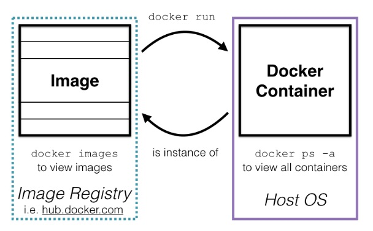

# 1. Docker Recap

## Docker

> - 리눅스 컨테이너 기술(LXC)를 이용한 어플리케이션 **패키징, 배포**를 지원하는 경량의 가상화 오픈소스 프로젝트
>
> - **Immutable Infrastructure** : OS커널과 Service 운영환경을 분리
>   - 이러한 Immutable Infrastructure의 구현체가 **Docker**
> - https://dzone.com/articles/developing-on-macos-with-docker

### Docker Image

> - 컨테이너를 만들기 위한 것
> - Layer File System으로 각 파일 시스템이 곧 이미지
> - 읽기전용(ReadOnly) 파일시스템으로 도커가 어플리케이션을 배포하는 단위

### Docker Container

> Docker Image를 실행한 상태
>
> 본질은 Process지만 VM처럼 보이는 것
>
> - Isolated된 영역에서 process를 띄운 것

## Docker Architecture

> https://www.whizlabs.com/blog/docker-fundamentals/

## Docker TIP)

> - 각각 1GB의 리소스를 갖는다고 생각해야 함(예시에서 Kibana, Elasticsearch, Logstash 3개를 사용했음)
>- 많은 컴포넌트들을 사용한다면 local 보다는 Azure VM, AWS EC2 사용하는 것으로 접근
> - https://github.com/elastic/elasticsearch/blob/master/distribution/docker/src/docker/Dockerfile

~~~shell
docker search mysql		# 이미지 검색
docker pull mysql		# 이미지 다운
docker run mysql		# 실행
docker rmi mysql		# 이미지 삭제

docker images			# 로컬에 있는 이미지 정보
docker info				# 도커 정보
docker ps				# 컨테이너 프로세스 정보

docker inspect mysql
docker logs mysql
~~~

## Docker Compose

> 여러개의 컨테이너를 동시에 띄울 때 사용
>
> - 기초적인 질문 : 그냥 docker run을 여러 번 하면?
> - 답 : 간단한 문제가 아님. 네트워크 등의 문제 등의 고려할 사항이 많음. 그냥 docker compose를 사용
> - https://github.com/torreswoo/docker-elk-pipeline/blob/master/docker-compose.yml

~~~shell
docker-compose up
docker-compose ps # docker-compose로 띄어진 컨테이너를 확인할 수 있음
docker-compose top # 컨테이너의 리소스 메모리 등을 확인할 수 있음

docker-compose logs # 컨테이너들에서 생성되는 로그들을 확인할 수 있음. 

docker-compose -f docker-compose.simple.yml up
~~~

## docker-compose.simple.yml

> yaml 파일을 간단하게 분석
>
> - https://www.elastic.co/guide/en/elasticsearch/reference/current/important-settings.html
> - https://www.elastic.co/guide/en/elasticsearch/reference/current/settings.html
>
> **recap** : Elasticsearch는 3가지의 config파일을 갖음
>
> - `elasticsearch.yml` : Elasticsearch의 configuration
> - `jvm.options` : Elasticsearch JVM setting에 대한 configuration
> - `log4j2.properties ` : Elasticsearch logging에 대한 configuration

~~~yaml
version: '3.2'

# service에서 컨테이너의 종류들을 확인하는 것
services:
  elasticsearch:
    image: elasticsearch:${ELK_VERSION}		# Elasticsearch Image정보
    ports:
      - "9200:9200"
      - "9300:9300"
    environment:
      - cluster.name=es-simple
      - "ES_JAVA_OPTS=-Xms512m -Xmx512m"
      - network.host=0.0.0.0
      - discovery.type=single-node
      - xpack.monitoring.collection.enabled=true
    networks:
      - elk

  kibana:
    image: kibana:${ELK_VERSION}
    ports:
      - "5601:5601"
    environment:
      - server.name=kibana
      - server.host="0"
      - elasticsearch.hosts=elasticsearch:9200
      - monitoring.ui.container.elasticsearch.enabled=true
    networks:
      - elk
    depends_on:
      - elasticsearch

networks:
  elk:
    driver: bridge
~~~

 

### Elasticsearch

> https://www.elastic.co/guide/en/elasticsearch/reference/current/important-settings.html
>
> https://www.elastic.co/guide/en/elasticsearch/reference/current/settings.html
>
> **recap** : Elasticsearch는 3가지의 config파일을 갖음
>
> - `elasticsearch.yml` : Elasticsearch의 configuration
> - `jvm.options` : Elasticsearch JVM setting에 대한 configuration
> - `log4j2.properties ` : Elasticsearch logging에 대한 configuration

**image** : elasticsearch:${version} -> .env

- dockerhub에서 인증을 하는 image를 사용하는 것이 좋음(100M이면 충분하다)

**ports**

- "9200:9200" : 앞의 것이 container의 포트, 뒤의 것이 localhost의 9200번 포트

- "9300:9300" : 클러스터로 연결이 될 때는 9300포트로 연결이 되기 때문에 열어놓음

**environment**: *elasticsearch config파일에 들어가는 내용*

- cluster.name=es-simple
  - "ES_JAVA_OPTS=-Xms512m -Xmx512m" # 500메가
  - network.host=0.0.0.0 # localhost를 줄때
  - discovery.type=single-node # single, multi를 설정할 때. 마스터들끼리 핑퐁을 안하는 것
  - xpack.monitoring.collection.enabled=true # kibana에서 elastic과 관련된 모니터링이 가능한 마블이 있는데 그 때 옵션들을 컬렉팅이 가능하게 설정해주는 것

 

### Kibana

- image : kibana:${ELK_VERSION} -> .env
- environment:
  - server.name=kibana
  - server.host="0"
  - elasticsearch.hosts=elasticsearch:9200
  - monitoring.ui.container.elasticsearch.enabled=true
- depend_on:
  - elasticsearch가 뜨고 난 이후에 Kibana를 띄워라(정확히 말하면 아님). 선언형으로 

## **docker-compose.yml**

> 이미지 빌드를 local에서 이미지를 만들고 설정

~~~yaml
version: '3.2'

services:
  elasticsearch:
    # elasticsearch아래의 파일로 build하겠다는 것
    # 직접 local에서 이미지를 만든다는 것
    build:
      context: elasticsearch/
      # 환경변수 받는 args
      args:
        ELK_VERSION: $ELK_VERSION
    # 내가 만든 config파일을 마운트 시켜서 사용
    # source -> target
    # target은 컨테이너 내부의 config path
    volumes:
      - type: bind
        source: ./elasticsearch/config/elasticsearch.yml
        target: /usr/share/elasticsearch/config/elasticsearch.yml
        read_only: true
      - type: volume
        source: elasticsearch
        target: /usr/share/elasticsearch/data
    ports:
      - "9200:9200"
      - "9300:9300"
    environment:
      ES_JAVA_OPTS: "-Xmx512m -Xms512m"
      discovery.type: single-node
    networks:
      - elk

  logstash:
    build:
      context: logstash/
      args:
        ELK_VERSION: $ELK_VERSION
    volumes:
      - type: bind
        source: ./logstash/config/logstash.yml
        target: /usr/share/logstash/config/logstash.yml
        read_only: true
      - type: bind
        source: ./logstash/pipeline/logstash.conf
        target: /usr/share/logstash/pipeline/logstash.conf
        read_only: true
    ports:
      - "5000:5000"
      - "9600:9600"
    environment:
      LS_JAVA_OPTS: "-Xmx256m -Xms256m"
    networks:
      - elk
    depends_on:
      - elasticsearch

  kibana:
    build:
      context: kibana/
      args:
        ELK_VERSION: $ELK_VERSION
    volumes:
      - type: bind
        source: ./kibana/config/kibana.yml
        target: /usr/share/kibana/config/kibana.yml
        read_only: true
    ports:
      - "5601:5601"
    networks:
      - elk
    depends_on:
      - elasticsearch

networks:
  elk:
    driver: bridge

volumes:
  elasticsearch:
~~~

### Dockerfile

~~~dockerfile
ARG ELK_VERSION

# https://www.docker.elastic.co/
FROM docker.elastic.co/elasticsearch/elasticsearch:${ELK_VERSION}

# Add your elasticsearch plugins setup here
# Example: RUN elasticsearch-plugin install analysis-icu
~~~

~~~dockerfile
ARG ELK_VERSION

# https://www.docker.elastic.co/
FROM docker.elastic.co/logstash/logstash:${ELK_VERSION}

# Add your logstash plugins setup here
# Example: RUN logstash-plugin install logstash-filter-json
# RUN bin/logstash-plugin install --no-verify
# RUN bin/logstash-plugin logstash-input-http
# RUN bin/logstash-plugin logstash-input-file

# https://github.com/logstash-plugins/logstash-integration-kafka
RUN bin/logstash-plugin install logstash-integration-kafka

RUN bin/logstash-plugin list 
~~~

~~~dockerfile
ARG ELK_VERSION

# https://www.docker.elastic.co/
FROM docker.elastic.co/kibana/kibana:${ELK_VERSION}

# Add your kibana plugins setup here
# Example: RUN kibana-plugin install <name|url>
~~~

### .env

~~~shell
ELK_VERSION=7.6.2
~~~

### elasticsearch, logstash, kibana yaml

> elasticsearch.yml
>
> logstash.yml
>
> kibana.yml

~~~yaml
---
## Default Elasticsearch configuration from Elasticsearch base image.
## https://github.com/elastic/elasticsearch/blob/master/distribution/docker/src/docker/config/elasticsearch.yml
#
cluster.name: "docker-cluster"
network.host: 0.0.0.0

## X-Pack settings
## see https://www.elastic.co/guide/en/elasticsearch/reference/current/setup-xpack.html
#
# xpack.license.self_generated.type: trial
xpack.security.enabled: false
xpack.monitoring.collection.enabled: true
~~~

~~~yaml
---
## Default Logstash configuration from Logstash base image.
## https://github.com/elastic/logstash/blob/master/docker/data/logstash/config/logstash-full.yml
#
http.host: "0.0.0.0"
xpack.monitoring.elasticsearch.hosts: [ "http://elasticsearch:9200" ]

## X-Pack security credentials
#
xpack.monitoring.enabled: true
# xpack.monitoring.elasticsearch.username: elastic
# xpack.monitoring.elasticsearch.password: alohang
~~~

~~~yaml
---
## Default Kibana configuration from Kibana base image.
## https://github.com/elastic/kibana/blob/master/src/dev/build/tasks/os_packages/docker_generator/templates/kibana_yml.template.js
#
server.name: kibana
server.host: "0"
elasticsearch.hosts: [ "http://elasticsearch:9200" ]
xpack.monitoring.ui.container.elasticsearch.enabled: true

## X-Pack security credentials
#
elasticsearch.username: elastic
elasticsearch.password: changeme
~~~

### logstash.conf

~~~shell
input {
	http {
  		# host => "127.0.0.1" # default: 0.0.0.0
    	port => 5000 # default: 8080
		codec => json	
	}
}

output {
	elasticsearch {
		hosts => "elasticsearch:9200"
		index => "test-logtstash-%{+yyyy.MM.dd}"
	}
}
~~~

